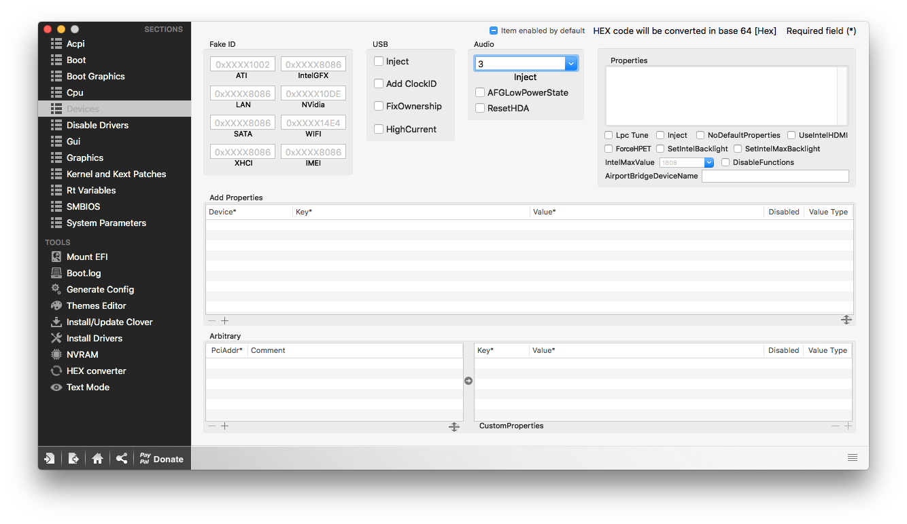

# Zintegrowane układy dzwiękowe
W tym rozdziale zajmiemy się instalacją kextów odpowiedzialnych za działanie naszej karty dźwiękowej. Ten poradnik wyjaśni Ci wszystko na temat dźwięku zintegrowanych układów dźwiękowych w systemie **macOS**.

## AppleHDA {#applehda}
**AppleHDA** - jest to natywny kext odpowiadający za dźwięk w systemie macOS. Kext ten znajduje się w `System/Library/Extensions/AppleHDA.kext`, gdzie możemy znaleźć większość systemowych kextów.
W przypadku uszkodzenia czysty kext dla każdej wersji systemu możemy znaleźć pod linkiem na Facebooku w zakładce [Dźwięk](https://www.facebook.com/notes/hackintosh-polska/zbiór-linków-z-przydatnymi-rzeczami-dla-os-x/825825704173575).

Jednym z najczęściej wykorzystywanych dziś protokołów audio jest **Intel HDA**. Znajdziemy go w większości układów dźwiękowych zintegrowanych z płytami głównymi, pozwala on też na obsługę wyjścia HDMI i DisplayPort. Jednym z największych problemów jest liczba kontrolerów i kodeków, które trzeba dla Intel HDA obsłużyć – tych ostatnich jest ponad trzysta (a w dodatku każdy kodek obsługuje wiele różnych konfiguracji).

### Kext AppleALC
Jest to jedna z łatwiejszych metod na uzyskanie działającego w 100% dźwięku w systemie macOS opartym na **AppleHDA**.

Połączenie **AppleALC + Lilu**  ładuje podstawową konfigurację dźwięku dla danego kodeku w locie. A więc nie zmienia plików systemowych i nasze pliki systemowe pozostają nienaruszone.

Niestety metoda ta nie działa na Hackintoshach z procesorami AMD. Większość sposobów odpalenia dźwięku w systemie macOS ma na celu w pełni sprawną obsługę AppleHDA, przeznaczona dla płyt głównych z chipsetami Intela (w rzeczywistości jest kilka zasobów dla chipsetów NVidii). Natomiast użytkownicy AMD zostali na łasce rozwoju VoodooHDA. Podczas gdy VoodooHDA z pewnością działa (użytkownicy AMD muszą go użyć, aby mieć wbudowany dźwięk), jest to dalekie od optymalnego rozwiązania; istnieje mnóstwo zgłoszeń o złej jakości dźwięku, szumach, a nawet niestabilności systemu.
Wiele płyt opartych na AMD, szczególnie tych tańszych, używa nietypowych kodeków, dla których nie ma po prostu wsparcia.

## Informacje o naszym kodeku audio {#informacje}
Zerknijmy jeszcze raz na naszą specyfikację, którą sporządzaliśmy w pierwszym rozdziale. Spójrzmy na sekcję kontrolera audio.

### Oznaczenie zapisu kontrolera dźwięku
Pierwsze dwie/trzy litery oznaczają producenta naszej karty, kolejny, zazwyczaj już tylko liczbowy ciąg oznacza konkretny model karty:

```
  Ca --- -> Creative
  CS --- -> CirrusLogic
  ALC --- -> Realtek
  AD --- -> AnalogDevices
  CX --- -> Conexant
  IDT --- -> IDT
  VI --- -> VIA
  HD --- -> Intel
  Radeon --- -> AMD
```

Najpopularnijesze układy spotykane to `ALC`, `CX` czy `IDT`.
Teraz znając oznaczenie, jak i model należy się upewnić czy nasza karta posiada wsparcie, zajrzyjmy pod poniższy link: [AppleALC - wspierane kodeki](https://github.com/acidanthera/AppleALC/wiki/Supported-codecs). Jeśli nasza karta widnieje na liście to już połowa sukcesu i możemy przystąpić do dalszych działań.

## Uruchomienie dźwięku za pomocą AppleALC {#applealc}
**AppleALC** - jest to rozszerzenie jądra, które umożliwia natywne wsparcie dźwięku Apple bez modyfikacji systemu. Dynamicznie ładuje wszystkie wymagane zmiany do AppleHDA.

Aktualną wersję kextu zawsze możemy znaleźć pod poniższym linkiem:
https://github.com/acidanthera/AppleALC/releases/

**Lilu** - jest to kext rozszerzający jądro o platformę dla arbitrary kextów, bibliotek i programów patchingu. Jest on wymagany w przypadku używania AppleALC.

Aktualną wersję kextu zawsze możemy znaleźć pod poniższym linkiem:
https://github.com/acidanthera/Lilu/releases/

Aby odpalić nasz dźwięk metodą AppleALC + Lilu, należy na sam początek pobrać obydwa kexty z linków umieszczonych powyżej, zamontować partycję EFI i wrzucić do folderu ``EFI/CLOVER/kexts/Others/``.


### Wybór odpowiedniego layout dla karty dźwiękowej
Spójrzmy jeszcze raz na stronę oraz znajdźmy odpowiedni layout ID dla naszej karty z tabeli.

[AppleALC - wspierane kodeki](https://github.com/acidanthera/AppleALC/wiki/Supported-codecs)

Dla przykładu szukamy karty Realtek ALC888. Karta znajduje się na liście i posiada dokładnie takie same rewizje jak karta *ALC1200*:

```
0x100101, 0x100001, 0x100202, 0x100302, layout 1, 2, 3, (4 for laptop), 5, 7, 11, 28, 29
```

Wartości `0x10...` oznaczają rewizję danego urządzenia, czyli służą do określenia, z jakimi rewizjami karty dźwiękowej ten sterownik będzie działał.

Rewizje naszej karty możemy sprawdzić za pomocą narzędzia [DPCIManager](https://sourceforge.net/projects/dpcimanager/)

Nie musicie się obawiać w przypadku ostrzeżenia `File may contain malware...`, ponieważ narzędzie korzysta z niskopoziomowego odczytu informacji, taki rodzaj odczytu powoduje, że oprogramowanie jest traktowane jako prawdopodobne malware.


Po uruchomieniu programu widzimy urządzenie audio i jego rewizje. W moim wypadku jest to `0x01000302`.


Wybieramy pierwszy numer określający Layout ID, które przyda nam się w następnym kroku.

### Sekcja Audio w configu - Layout ID
Od rewizji Clover EFI Bootlodaer w wersji 4497 została wprowadzona nowa metoda ładowania właściwości urządzeń, która wykorzystuje protokół AppleEFI, który jest używany w prawdziwych Makach. Oznacza to, że konfiguracja urządzeń jest ładowana w czasie startu `boot.efi`.

Wykorzystując nową metodę ładowania ustawień urządzenia jesteśmy w stanie załadować odpowiedni layout id dla karty dźwiękowej. Aby to wykonać potrzebujemy **adresu** urządzenia Audio. Domyślne adresy urządzeń audio to:

```
PciRoot(0x0)/Pci(0x1b,0x0) - do rodziny Broadwell
PciRoot(0x0)/Pci(0x1f,0x3) - od rodziny Skylake+
```
Znając już adres urządzenia jesteśmy w stanie skonfigurować wpis do `config.plist`

Domyślny patch dla audio dla urządzeń do rodziny Broadwell włącznie:
```
Device: PciRoot(0x0)/Pci(0x1b,0x0)
Properties Key: layout-id
Properties Value: wcześniej ustalony numer layout ID
Value type: NUMBER
```

Domyślny patch dla audio dla urządzeń od rodziny Skylake włącznie:
```
Device: PciRoot(0x0)/Pci(0x1f,0x3)
Properties Key: layout-id
Properties Value: wcześniej ustalony numer layout ID
Value type: NUMBER
```

Dodatkowo **usuwamy** wszystkie informacje w sekcji Audio w karcie *Devices*.

Po zapisaniu i ponownym uruchomieniu nasz dźwięk powinien działać.


**Drugi sposób**


Zalecamy używania nowej metody podanej powyżej.


Drugą, dość starą i czasem niedziałającą metodą zainjectowania wybranego **layout ID** jest dodanie go po prostu w odpowiednią zakładkę w configu.

Wchodzimy w Clover Configurator, otwieramy config i przechodzimy do zakładki *Devices*.

Widzimy tutaj sekcję dotyczącą dźwięku zatytułowaną **Audio**.



Wpisujemy ID dla naszej karty w puste miejsce w **Inject Audio**. Zapisujemy zmiany i uruchamiamy komputer ponownie.

## Rozwiązywanie problemów z dźwiękiem {#troubleshooting}
Zdarzają się sytuacje, w których dźwięk pomimo dobrej konfiguracji i tak nie chce zadziałać bądź nie działa prawidłowo.

W przypadku nieprawidłowego działania, dwa poniższe Fixy z zakładki **Devices** w Clover Configuratorze mogą być pomocne:

* **AFGLowPowerState**
  Należy zaznaczyć, jeśli po uśpieniu bądź dłuższej bezczynności komputera, nasz dźwięk będzie miał zdecydowanie niższą jakość. Opcja ta sprawia, że karta dźwiękowa nie będzie usypiana.

* **ResetHDA**
  Należy zaznaczyć w sytuacji, gdy dźwięk nie działa po normalnym uruchomieniu maszyny, ale po ponownym uruchomieniu funkcjonuje prawidłowo. Dzięki temu nasz kontroler będzie zainicjowany we wczesnej fazie rozruchu. Może to również wpływać w jakiś sposób na system operacyjny Windows.

### Wymagane poprawki tablic ACPI (przeznaczone głównie do laptopów)
Często powyższy zabieg nie wystarczy do uruchomienia naszej karty, jednak na to też jest sposób. Należy dodać `IRQ Fix`, `HPET Fix`, `RTC Fix` do naszego configu bądź DSDT.

Otwieramy nasz config, znajdujemy się w sekcji ACPI, w dziale Fixes. Jak sam już pewnie zauważyłeś nie ma tu nic o nazwie ``IRQ Fix``. Jednak możemy go zastąpić przez zaznaczenie czterech poniższych fixów:

* **FixHPET**
  Dodaje IRQ (0, 8, 11) do urządzenia HPET. Może również zapobiec kernel panicowi wywołanemu przez AppleIntelCPUPowerManangment.kext na starszych biosach AWARD oraz również kernel panicom związanym z brakiem urządzenia HPET. *No HPETs available...* Rozwiązanie to również pomaga w sytuacji, gdy z powodu braku urządzeń HPET dochodzi do gwałtownego restartu maszyny
* **FixIPIC**
  Usuwa IRQ (2) z urządzeń IPIC. Może również pomóc z niedziałającym przyciskiem power.
* **FixRTC**
  Wyklucza IRQ (0) dla urządzenia RTC.
* **FixTMR**
  Wyklucza IRQ (8) dla urządzenia TMR.


### Patchowanie DSDT pod audio

Od wersji AppleALC 1.2.3 dodano funkcjonalność automatycznej zmiany nazwy urządzenia Audio. Ten krok jest na chwilę obecną **niewymagany**.


Jednym z powodów braku dźwięku przy nowszych platformach może być brak wymaganej *zmiany nazwy urządzenia na HDEF*.

Żeby dźwięk działał, w ACPI MUSI być zadeklarowane urządzenie ``HDEF`` na adresie ``00:1B.00`` bądź ``00:1F.03`` (dla Skylake+).

Możemy sprawdzić nasz adres przez **IORegistryExplorer**.

http://mac.softpedia.com/get/System-Utilities/IORegistryExplorer.shtml/

Uruchamiamy pobrane narzędzie i naszym oczom ukazuje się wylistowany spis urządzeń ACPI z adresami (po prawej stronie od **@** i nazwy) oraz w prawym oknie programu - wszystkie informacje o urządzeniu.
Wyszukujemy urządzenie po adresie ``@1B,0`` bądź ``@1F,3``, następnie sprawdzamy, czy nazwa tego urządzenia to ``HDEF``, jeśli nie, przechodzimy do następnego etapu.


*Screen przedstawia przykładowego laptopa z prawidłowym adresem HDEF dla generacji Skylake(+).*

W przypadku, gdy ``HDEF`` nie jest nazwą naszej karty, musimy skorzystać z metody DSDT Patch, czyli w zakładce ACPI dokonać odpowiedniego rename dla naszej generacji.

**Rename HDAS to HDEF** - dla Skylake/Kaby Lake/Coffee Lake:
```
Comment: Rename HDAS to HDEF
Find: 48444153
Replace: 48444546
```
**Rename ALZA to HDEF** - Dla X99::
```
Comment: Rename ALZA to HDEF
Find: 414c5a41
Replace: 48444546
```
**Rename CAVS to HDEF** - Dla X299::
```
Comment: Rename CAVS to HDEF
Find: 43415653
Replace: 48444546
```


<div style="text-align:center">Screen przedstawia odpowiedni rename dla generacji Skylake(+).</div>

**Ciekawostka**

W przypadku nietypowej nazwy urządzenia bądź w sytuacji, gdy nie mamy gotowego dla nas patcha, możemy skorzystać ze wbudowanego w Clover Configurator konwertera. Narzędzie znajduje się pod nazwą **HEX converter** na bocznym pasku Clover Configuratora. Konwerter umożliwia konwersję **base64** oraz **zwykłego tekstu** na odpowiednik **HEX**.

Powracając, wpisujemy w pole **text** nazwę naszego urządzenia, np. ALZA i otrzymujemy odpowiednik HEX, o który nam chodziło.


