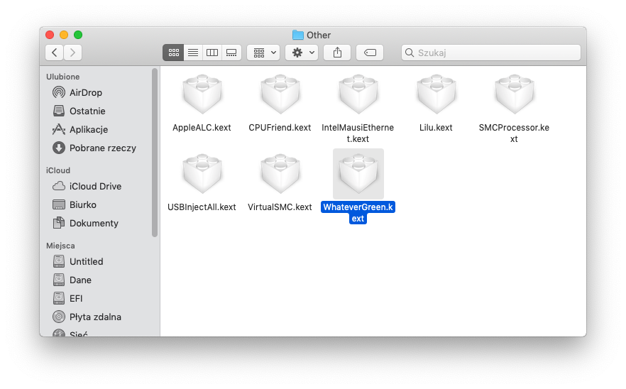
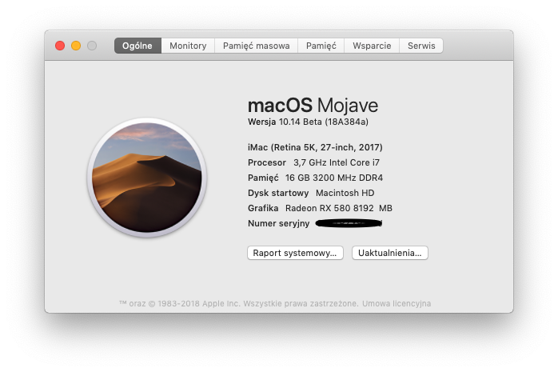
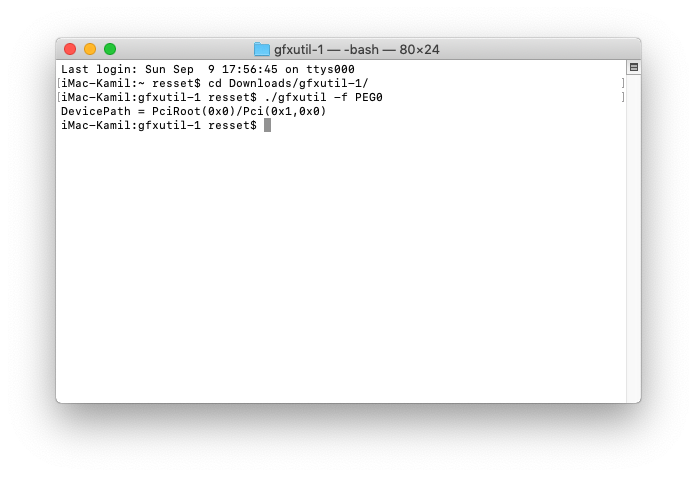
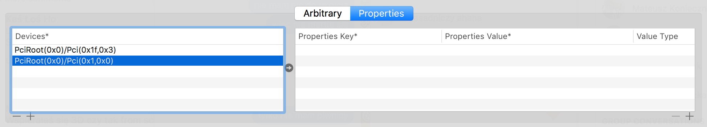
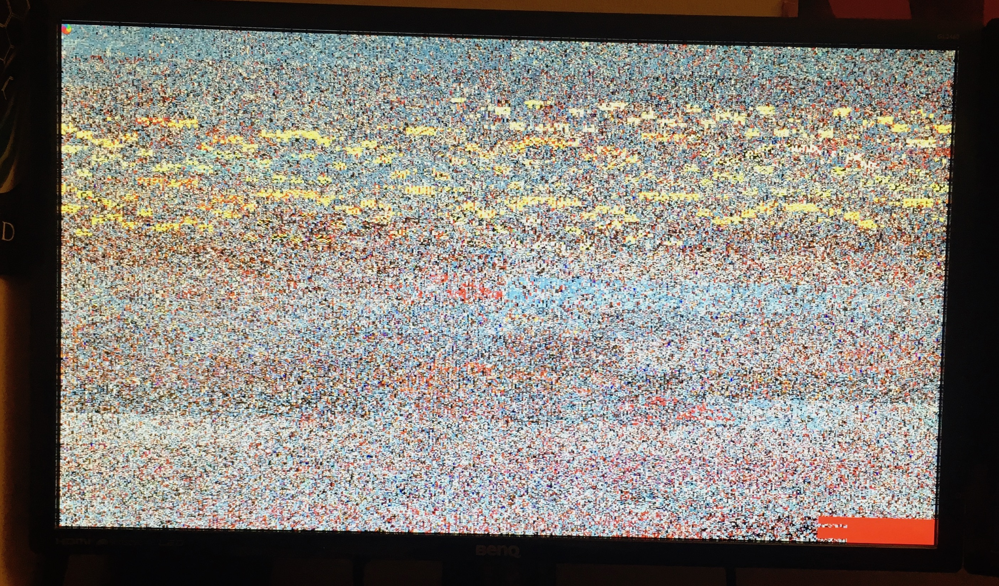
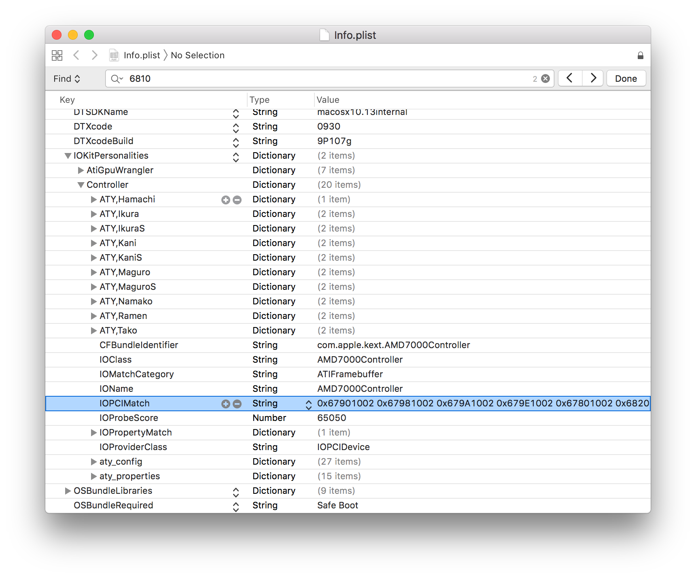
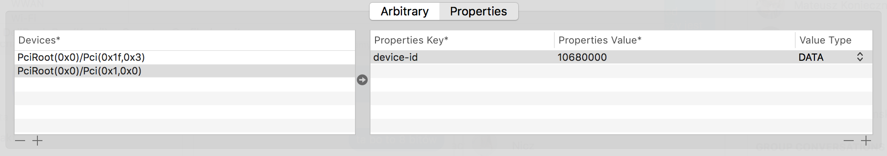
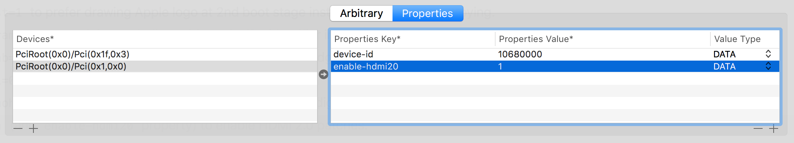
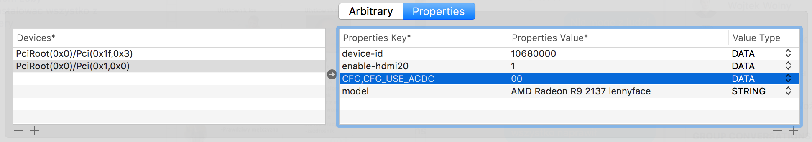

# Układy graficzne AMD
Rozdział ten pozwoli w bliższym stopniu pokazać sposoby uruchomienia kart graficznych AMD. Karty AMD są współcześnie jednymi z najbardziej kompatybilnych układów do pracy z macOS. We wcześniejszych czasach Apple miało tendencję do wydawania komputerów z różnymi wersjami kart AMD naprzemiennie z kartami Nvidii, w zależności od generacji komputera. Przykładem mogą być Macbooki Pro z 2011 roku, które w swojej opcji posiadały układ graficzny AMD Radeon HD6770M oraz Macbooki Pro Retina (2012) posiadające układ Nvidia GT650M.

We współczesnych komputerach spod znaku jabłuszka montowane są układy AMD Polaris oraz Vega co oznacza, że Apple napisało sterowniki dodające praktycznie natywne wsparcie dla tychże układów graficznych. Niestety nie wszystko jest do końca usłane różami i, mimo że wsparcie dla kart graficznych AMD jest, to czasami brakuje pewnych elementów konfiguracji tychże kart. Ten rozdział ma na celu opis pewnych niuansów oraz sposoby radzenia sobie z nimi.

## Opis techniczny {#general}
Sterowniki AMD składają się na wiele rozszerzeń kernelu. Dwa zestawy najbardziej nas interesujących są `AMD[4,5,6,7,8,9]x00Controller.kext` oraz `AMDX[3,4]000.kext`. Każdy z tych sterowników zawiera w sobie listę kontrolerów, z którymi dany sterownik współpracuje. Występowanie danego ID w tych sterownikach jest wymagane do działania, ale **nie jest wystarczające**. Występowanie danego ID pozwala sterownikowi na załadowanie się i "podpięcie" pod dane urządzenie niestety często musimy zadbać o dodatkowe kroki, aby nasza karta działała poprawnie z macOS.

Istnieją karty graficzne, których ID nie jest wpisane w sterownikach systemowych, ale można uzyskać ich działanie poprzez manualną modyfikację `Info.plist` w każdym z wyżej wymienionych sterowników (nierekomendowane), lub spoofing Device ID przez wstrzyknięcie Fake ID występującego w tych kextach za pomocą Clover EFI.

Istnieją dwa sposoby inicjalizacji sterowników AMD:
* **EFI-Init** - W oryginalnych Makach karta graficzna zawiera w sobie EFI ROM obok VBIOS, który przy starcie odpowiada za odpowiednią inicjalizację sterownika graficznego. W Hackintoshach ten sposób może być zastąpiony poprzez użycie opcji Iniekcji Graficznej typu `InjectATI=True`. Dzięki temu można zdefiniować, jaki Framebuffer będzie używany do obsługi portów karty graficznej.
* **Auto-Init** - Od wersji Mac OS X 10.7 Apple dało możliwość inicjalizacji karty graficznej na podstawie tylko jej VBIOS. Dzięki temu nie ma potrzeby używać żadnych Iniekcji z poziomu bootloadera czy podawanie Framebuffera.

Każdy ze sterowników `AMDxx00Controller.kext` posiada zakodowany na sztywno w swoim kodzie zestaw konfiguracji detekcji portów graficznych danej karty graficznej. Jest to tzw. *Framebuffer*. Określa on fizyczny link portu graficznego do układu. W zależności od karty dane te mogą się różnić. Jest to bardzo ważne, ponieważ rozbieżności we Framebufferze i VBIOS mogą skutkować czarnym ekranem bądź brakiem wykrywania ekranu na danym porcie wideo.

*Dayman*, *Galago*, *Dashimaki* to są przykładowe nazwy framebufferów. Wiele z nich jest specyficzne dla komputerów Apple, ale też są takie, które są zgodne z kartami referencyjnymi AMD. Jeżeli tylko producent karty zdecyduje na zmianę w VBIOS karty, dodanie nowego portu wideo, zmieni się również fizyczny link portu wideo do układu. Wtedy potrzebna jest zmiana kodu framebuffera, który chcemy wybrać. Oczywiście ten problem dotyczy nas, wtedy kiedy używamy `InjectATI=True`. Współcześnie macOS jest sobie sam w stanie w miarę bez problemu poradzić z inicjalizacją karty graficznej **auto-initem**. Sterownik tworzy wtedy framebuffer na podstawie VBIOSu karty graficznej.

## Lista układów graficznych {#hwlist}
Lista kompatybilnych kart graficznych AMD jest dość niejednoznacznie określona. Na rynku jest wiele kart, które są odświeżeniem starszych układów. Niemniej jednak można założyć, że wszystkie układy są w pewnym stopniu **kompatybilne**. Lista zawęża się przy mobilnych układach graficznych, ponieważ te występujące w nowych komputerach nie będą działać. AMD, tak samo, jak NVidia, wprowadziła w laptopach konsumenckich system programowego przełączania między układami graficznymi. System ten przez macOS nie jest obsługiwany, więc jesteśmy wręcz skazani na wyłączenie tej karty w ustawieniach BIOS. Wyjątkiem są laptopy - stacje robocze, w których zwykle jedynym akceleratorem graficznym jest karta AMD. W tym wypadku należy jednak pamiętać, że doprowadzenie do działania takiej karty będzie bardziej czasochłonne.

Poniżej przedstawiono ogólną listę urządzeń przetestowanych z macOS.

|Model karty| Sterownik | Wspierana wersja macOS |
|---|---|---|
|HD4xx0|AMD4000Controller.kext| 10.5.8 - 10.13.6 |
|HD 54x0, 57x0, 58x0 |AMD5000Controller.kext|10.6.8 - 10.13.6|
|HD 64x0, 67x0, 68x0 | AMD6000Controller.kext|10.7.5 - 10.13.6|
|HD 74x0, 77x0, 78x0, 79x0, R7 250(X), R9 2x0/3x0|AMD7000Controller.kext|10.8.3+|
|HD7790, R7 260(X), R7 360, R9 290(X), R9 390(X)|AMD8000Controller.kexy|10.10+|
|R9 285, 380(X) | AMD9000Controller.kext| 10.10+|
|RX 4x0, 5x0 (bez RX 550)|AMD9500Controller.kext|10.12.6+|
|RX Vega 56/64|AMD10000Controller.kext| 10.13.3+|

Część z tych kart będzie wymagać zastosowania tzw. **Fake ID** aby karta mogła być obsługiwana przez sterowniki Apple, co będzie omówione w dalszej części.

## Sterownik WhateverGreen {#weg}
**WhateverGreen** to plugin do Lilu, który na początku był stworzony do naprawiania pewnych błędów związanych z inicjalizacją kart graficznych AMD. Z czasem rozwinął się do generalnego kextu, który poprawia działanie kart graficznych AMD, Nvidia oraz Intel. Sterownik ten zawiera w sobie zestaw różnorakich fixów dla układów AMD, między innymi:
* Naprawia boot do czarnego ekranu
* Naprawia problem wybudzania na kartach AMD
* Naprawia inicjalizajcę kart AMD HD 7730/7750/7770/R7 250/R7 250X (argument `radpg=15`)
* Pozwala na ładowanie własnego framebufferu w "locie"
* Pozwala na konfigurację `aty_config`, `aty_properties`, `cail_properties` w "locie"
* Naprawia problemy z HDMI2.0 (-cdfon)
* Konfiguruje HDMI Audio

Ten sterownik jest zalecany od macOS w wersji 10.12+ aczkolwiek warto go używać w systemach od OS X w wersji 10.9.

Pierwszą rzeczą, jaką musimy zrobić to *Wyłączenie* w BIOS Compatibility Support Mode (CSM). Zostawienie tej opcji włączonej może powodować różne niezamierzone efekty typu nieładujący się ekran bądź niedziałające niektóre porty graficzne. Znajdziemy tę opcję w sekcji *Advanced/Boot* bądź włączając OS Mode na *Windows 8/10*. Każdy BIOS jest inny, więc sami musimy określić gdzie ta opcja została ukryta.


Czasami, aby wyłączyć CSM wymagane jest wgranie zmodyfikowanej wersji VBIOS z dodanym EFI GOP. Jeżeli nie mamy pojęcia jak się za to zabrać, zalecamy zapoznać się z [poradnikiem tworzenia zmodyfikowanego VBOS o EFI GOP](http://www.win-raid.com/t892f16-AMD-and-Nvidia-GOP-update-No-requests-DIY.html) oraz [poradnikiem flashowania VBIOS na karcie graficznej](https://www.techpowerup.com/forums/threads/amd-ati-flashing-guide.212849/).
Metoda ta jest zalecana dla średniozaawansowanych użytkowników i dotyczy starszych kart Radeona.


Kiedy skonfigurowaliśmy swój BIOS, pobieramy sterownik ze strony https://github.com/acidanthera/WhateverGreen/releases. Należy pamiętać, że *Lilu* również jest wymagany. Jeżeli go nie posiadamy to pobieramy go ze strony https://github.com/acidanthera/Lilu/releases.

Pobrane pliki w wersji **RELEASE** wrzucamy do ścieżki `EFI/CLOVER/kexts/Other` bądź `EFI/CLOVER/kexts/10.x` w zależności od naszej wersji systemu, jeżeli jest taka potrzeba. Domyślnie wrzucamy do `Other`.



Dzięki temu po ponownym uruchomieniu WhateverGreen powinien w locie zastosować swoje fixy i karta graficzna powinna działać. Czasami jednak to nie wystarczy i będziemy musieli zastosować dodatkowe kroki.

WhateverGreen działa, wtedy kiedy stosowany jest sposób inicjalizacji **auto-init**. Nie możemy więc w naszym configu mieć zaznaczonego **ŻADNEGO** `FixDisplay`, ani `InjectATI=Yes`




## Tuning konfiguracji z WhateverGreen {#tuning}
Czasem samo WhateverGreen nie wystarczy, aby system działał bez zarzutu. Do prostego i efektywnego tuningu konfiguracji przyda nam się nowa opcja Clover EFI *Device Properties*.

Pobieramy program terminalowy [gfxutil](https://github.com/acidanthera/gfxutil/releases). Wchodzimy w terminal, przechodzimy do ścieżki gdzie mamy zapisany program gfxutil
```
cd path/to/gfxutil_folder
```
Wpisujemy następującą komendę:
```
./gfxutil -f PEG0
```


Otrzymujemy interesujący nas *adres* karty graficznej.
```
PciRoot(0x0)/Pci(0x1,0x0)
```

Nazwa `PEG0` karty graficznej jest ściśle powiązana z konfiguracją ACPI danego komputera. Mimo że jest to najpopularniejsza nazwa to w zależności od slotu, w którym jest karta, wersji BIOS bądź i widzimisię producenta może się nazywać inaczej. W celu sprawdzenia nazwy gałęzi najlepiej użyć aplikacji **IORegistryExplorer**


Posiadając już odpowiedni adres satysfakcjonującej nas karty graficznej, musimy dodać nową opcję w sekcji *Device > Properties* naszego pliku `config.plist`. Najprościej użyć do tego aplikacji **Clover Configurator** w najnowszej wersji.

Otwieramy nasz plik `config.plist` i przechodzimy do sekcji *Devices > Properties*. Dodajemy nową linię za pomocą `+` po lewej stronie i wklejamy tam ścieżkę występowania urządzenia otrzymaną wcześniej.



Kiedy już mamy wszystko przygotowane jesteśmy w stanie dodać dodatkowe parametry konfiguracji naszej karty graficznej. Poniżej przedstawiono kilka przykładowych możliwości.

### Artefakty na kartach Cape Verde
Karty z rodziny Cape Verde (HD 7730/7750/7770/R7 250/R7 250X) na macOS cierpią na problem źle dobranych parametrów zarządzania energią. Skutkuje to artefaktami graficznymi.



Rozwiązaniem tego problemu jest użycie boot flagi `radpg=15` co powoduje, że WhateverGreen zmienia parametry zarządzania energią na te, które pozwolą na uruchomienie systemu.


Flaga `radpg=15` zmienia ustawienia dla **wszystkich** kart graficznych w komputerze. Jeżeli to nie jest zamierzony efekt warto użyć nowej funkcji Clover EFI *Device Properties* w celu zastosowania konfiguracji dla jednej karty graficznej. Interesujące nas właściwości to:
`CAIL,CAIL_DisableDrmdmaPowerGating`, `CAIL,CAIL_DisableGfxCGPowerGating`, `CAIL,CAIL_DisableUVDPowerGating`, `CAIL,CAIL_DisableVCEPowerGating`, a ich wartość musimy ustawić na `01`.


### Nie działa mi akceleracja graficzna
Jeżeli obraz na ekranie klatkuje, nie możemy ustawić rozdzielczości, nie działa odtwarzanie filmów, Dock nie jest przeźroczysty i w *Ten Mac* mamy napisane zamiast karty graficznej *Display 7MB* oznacza, że nie mamy akceleracji graficznej.
Spowodowane jest to prawdopodobnie przez to, że nasza karta graficzna nie jest rozpoznawana przez sterowniki Apple. Aby spróbować uruchomić naszą kartę warto zastosować metodę ładowania własnego Device ID "w locie".

Kiedy w sekcji *Device > Properties* dodaliśmy odpowiednią ścieżkę urządzenia mamy wiele możliwości modyfikowania parametrów konfiguracyjnych naszej karty. Jednym z parametrów, jaki możemy wykorzystać to dodanie właściwości `device-id` o wartości takiej, która występuje w sterowniku `AMDxx00Controller.kext/Contents/Info.plist` tak, aby system "myślał", że mamy inną, kompatybilną kartę graficzną i mógł załadować dla niej odpowiedni sterownik.


Fizyczny Device ID naszej karty jesteśmy w stanie zobaczyć w Clover EFI Bootloader w sekcji *Options > Graphics Injector* lub w *Ten Mac > Raport Systemowy > Grafika/Monitory*.


Załóżmy, że posiadamy kartę AMD Radeon R9 270, której PCI ID to `0x68111002` (Zapis ten oznacza Device ID i Vendor ID jako jeden 4-bajtowy ciąg heksadecymalny). Zaglądając do sterownika `AMD7000Controller.kext/Contents/Info.plist` można zobaczyć, że tego ID nie ma na liście.



Oznacza to, że system nie będzie w stanie rozpoznać urządzenia i załadować dla niego odpowiedniego sterownika.
Należy znaleźć w polu `IOPCIMatch` najbliżej pasujący PCI ID do naszego urządzenia. W tym wypadku będzie to `0x68101002`. Jest to PCI ID karty AMD Radeon R9 270X, która przez macOS jest już wspierana natywnie.

Mając wszystkie wymagane rzeczy możemy wrócić do Clover Configurator. Dodajemy za pomocą `+` po **prawej stronie** nowy klucz właściwości. Wpisujemy tam:
```
Properties Key: device-id
Properties Value: 10680000
Value Type: DATA
```


Nasza wartość się różni od tej, co wyciągnęliśmy, ponieważ jest ona napisana w zapisie **Little Endian**. W skrócie oznacza to, że Zapis zaczynamy od najniższych bajtów. Zapis od najwyższych bajtów to **Big Endian**. Tak więc `6810` będzie tłumaczony na `1068`. Klucz `device-id` zawsze powinien być reprezentacją 4-bajtowego ciągu heksadecymalnego. Tak więc aby Device ID był odpowiednio zapisany, na końcu musimy dodać `0000`. Tak otrzymaną wartość `10680000` wpisujemy jako wartość.

Po tym zabiegu karta graficzna powinna zostać wykryta i akceleracja graficzna powinna działać.

### Mam problem z wieloma monitorami
W niektórych przypadkach jest możliwe, że wiele monitorów nie działa zbyt dobrze. Można wtedy spróbować użyć flagi rozruchowej `-cdfon`, która aktywuje łatki dla HDMI 2.0. Zalecaną metodą jednak jest dodanie klucza właściwości `enable-hdmi20` o wartości `01` do *Devices > Properties* naszej karty graficznej.



W niektórych przypadkach (290, 290X i prawdopodobnie innych) Dobrym sposobem będzie użycie flagi rozruchowej `-raddvi`, która pozwala na automatyczną korekcję wykrytych connectorów. Kolejnym rozwiązaniem niekompatybilnych złącz, jest użycie klucza właściwości `connectors`, który zawiera w sobie konfigurację złącz uprzednio przygotowaną w oparciu o VBIOS karty graficznej.

Aby sporządzić sobie taką konfigurację, zalecam zapoznać się z poradnikiem [Tutaj](https://www.insanelymac.com/forum/topic/303186-how-to-modification-of-amd-fb-clover-injection/).

### Chcę zmienić coś innego w konfiguracji karty graficznej
*WhateverGreen.kext* pozwala na ogromną ilość konfiguracji karty graficznej spod czerwonej stajni. Możliwość konfiguracji `aty_config` (za pomocą prefiksu `CFG,`), `aty_properties` (za pomocą prefiksu `PP,`) oraz `cail_properties` (za pomocą prefiksu `CAIL,`) to jedna z rzeczy, na które ten sterownik pozwala. Dwoma ważnymi parametrami są `CFG_FB_LIMIT`, oraz `CFG_USE_AGDC`. Są to właściwości `aty_properties`.

`CFG_FB_LIMIT` określa twarto ilość złącz jakie posiada nasza karta graficzna. Apple ustawiło tę własność na 6 złącz, które system próbuje zainicjować nieważne, jaka jest fizyczna ilość złącz wideo. Od wersji *1.1.4* kext sam naprawia ten błąd.

`CFG_USE_AGDC` to własność, która odpowiada za implementację Applowskiego kontrolera zarządzania energią grafiki. Domyślnie jest ustawiona na 1 (Enabled). Przez to czasami monitory na złączu DisplayPort mogą nie działać po wybudzeniu. Aby zmienić jej ustawienie, wpisujemy w *Devices > Properties* nowy klucz właściwości `CFG,CFG_USE_AGDC` i wartość ustawiamy na `00` (False).

Dodatkowo jesteśmy w stanie zmienić nazwę modelu naszej karty graficznej, używając klucza `model` i własnej nazwy o typie STRING, i wiele więcej. Dobrym startem do zabawy jest [AMD FAQ WhateverGreen](https://github.com/acidanthera/WhateverGreen/blob/master/Manual/FAQ.Radeon.en.md).



## Podsumowanie
Rozdział ten w miarę szczegółowo opisał sposób radzenia sobie z kartami graficznymi z rodziny AMD. Mimo że Apple oficjalnie wypuszcza sterowniki dla tych układów, to nie zawsze jest możliwe uzyskać pełną sprawność. Dodatkowo od wersji macOS Mojave, która wprowadza wymóg wsparcia karty dla Metal API część starych kart graficznych w ogóle przestanie działać. Tyczy się to kart do szóstej serii włącznie. Czas pokaże, czy AMD dalej będzie opłacalnym wyborem. Na razie są to najlepsze karty dedykowane pod macOS.
