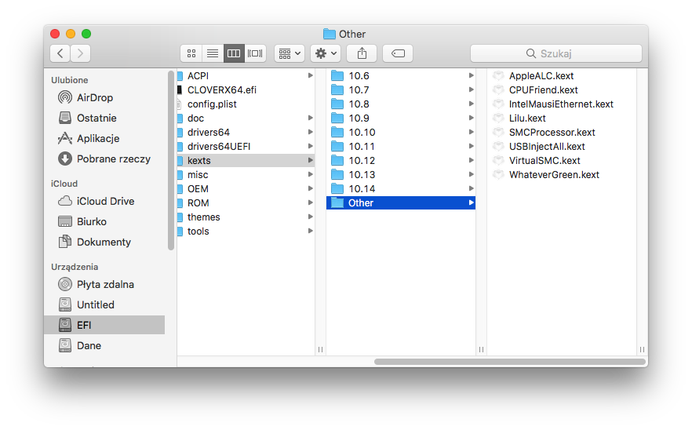
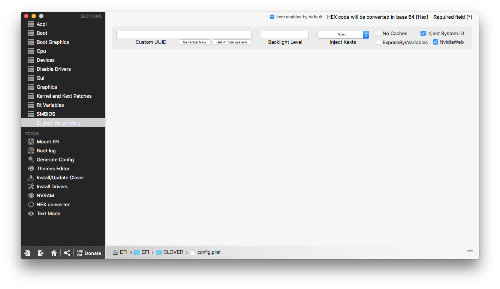
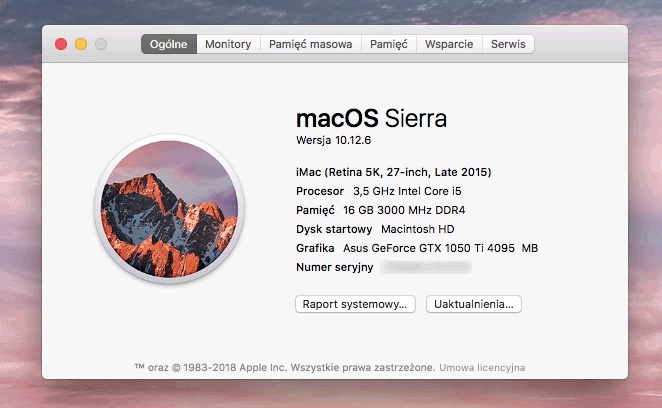
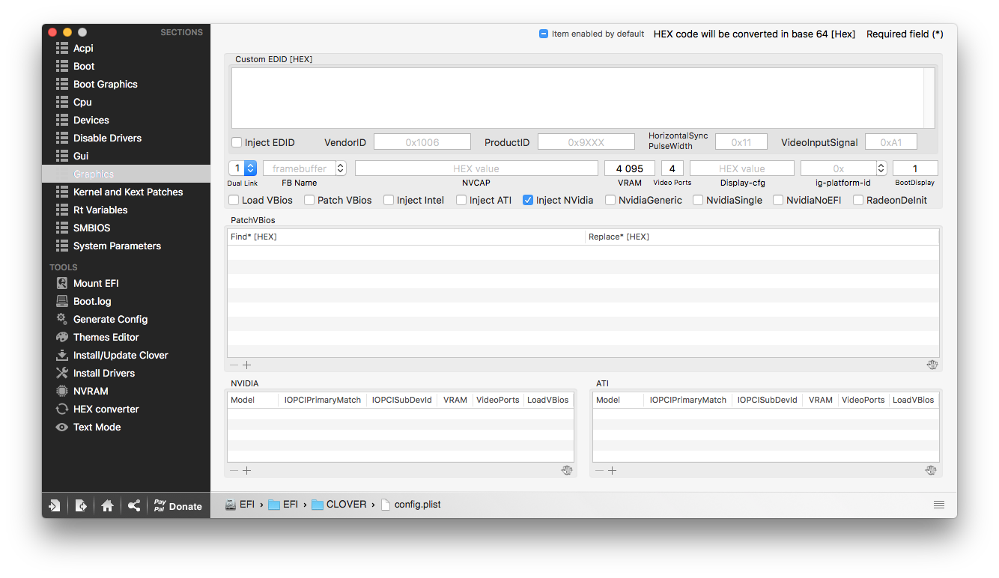

# Układy Nvidii

Karty graficzne Nvidii były od zawsze bliskie macOS'owi. Odpowiadały za renderowanie grafiki od najwcześniejszych Maców aż po rok 2014, w którym to Apple zadecydowało o przeniesieniu się na karty AMD, tracąc przy tym natywne wsparcie w jądrze dla nowszych modeli kart Nvidii. Mimo to Nvidia dalej *aktywnie wspiera* posiadaczy nowszych zielonych kart, *regularnie* udostępniając sterowniki pod macOS'a zwane WebDriverami.

## Problemy z Nvidią {#problems}

Przez wiele lat Nvidia była opcją numer jeden, jeśli chodzi o dobór karty graficznej do Hackintosha. Z biegiem czasu zamieniła się rolami z AMD, po tym, jak Apple zrezygnowało z Nvidii jako producenta kart graficznych do ich komputerów. Od tego czasu karty Nvidii borykają się z wieloma problemami.

### Wydajność układów Nvidii pod systemem macOS

Ponieważ Nvidia nie ma natywnego wsparcia w systemie Apple, dostarcza ona zewnętrzne sterowniki (wspomniane wyżej WebDrivery), mające umożliwić działanie zielonych kart graficznych w środowisku OS X.

Niestety wydajność tych sterowników pozostawia sobie wiele do życzenia. Jest ona spowodowana małym zainteresowaniem Nvidii wokół WebDriverów (trudno się w sumie nie dziwić, skoro jedynym zauważalnymi obecnie odbiorcami tego oprogramowania jest community Hackintosha, starych Maków Pro oraz użytkowników komputerów Mac z eGPU). Sprawność kart Nvidii na WebDriverach w porównaniu do Windowsowych sterowników potrafi być nawet o połowę mniejsza.

Z tego powodu **odradzamy** zakupu kart Nvidii i zamiast tego proponujemy wybór modeli AMD, mających natywne wsparcie w jądrze macOS'a.

### Brak stabilności

Głównym problemem dotykającym szczególnie tych użytkowników Hackintosha, którzy pracują nad wymagającymi mocy obliczeniowej projektami (montaże wideo, animacje 3d/2d, grafika wektorowa i rastrowa) jest brak stabilności GPU. Objawia się on podczas pracy, powodując freeze narzędzi bądź nienaprawialny czarny ekran w Adobe Premiere Pro / After Effects.

Podczas montażu naszych poradników wideo, montażyści nadal skarżą się na niestabilny sterownik renderujący CUDA, a w trakcie edycji materiałów wektorowych w Adobe Illustrator, działanie jest płynniejsze po wyłączeniu wspomagania GPU (powinno być zupełnie na odwrót).

Oczywiście nie miałoby to miejsca, gdyby Nvidia poświęcała więcej uwagi podczas produkcji tychże sterowników. Jednak na obecną chwilę obecność jakichkolwiek sterowników to jedynie dobra wola Nvidii, gdyż użytkownicy systemu Mac OS nie przynoszą producentowi praktycznie żadnych zysków.

### Przyszłościowość

Ponieważ Nvidia już więcej nie dostarcza układów graficznych do komputerów Apple, jej dalsza obecność w środowisku OS X nie jest już tak pewna, jak kilka lat temu i może się okazać, że z kolejną wersją systemu nie otrzymamy kompatybilnej kompilacji WebDriverów, bo Nvidia zrezygnuje z dostarczania tego typu aplikacji.

Już raz spotkaliśmy się z zagrożeniem rezygnacji z WebDriverów, kiedy to architektura Pascal nie miała wsparcia sterowników przez ponad rok.

Obecnie sterowniki są publikowane ze znacznym opóźnieniem w stosunku do wypuszczania nowych kompilacji macOS'a przez Apple, przez co użytkownicy hackintosha z układem Nvidii muszą czekać z aktualizacją do nowszej wersji, ze względu na brak WebDriverów.

Podsumowując, na obecną chwilę (czyli pierwszy kwartał 2018) zakup Nvidii pod Hackintosha byłby posunięciem bardzo nierozważnym i nieopłacalnym. Dlatego też, każdym zapytaniu o najlepszą i najbardziej kompatybilną specyfikację stosunkowo odradzamy kart Nvidii z wyżej wymienionych względów.

## Optimus {#optimus}

Kolejnym zagadnieniem dotyczącym mobilnych kart graficznych Nvidii jest tzw. technologia Optimus.

Jest to technologia opracowana przez Nvidię, której używa się w laptopach z dwoma kartami graficznymi - zintegrowanej Intela oraz dedykowanej Nvidii.
Pozwala na osiągnięcie lepszej pracy na baterii, dzięki efektywniejszemu wykorzystywaniu dostępnych układów graficznych. Do lżejszych zadań wykorzystywana jest mniej wydajny, lecz bardziej energooszczędny układ Intela, a do cięższych zadań Optimus uruchamia dodatkowo układ Nvidii jako wsparcie.

Niestety Apple korzysta z innej technologii przełączania grafik, przez co Optimus nie jest wspierany przez system macOS. **Dlatego też, we wszystkich laptopach mających wbudowaną technologię Optimus mobilny układ Nvidii nie będzie działać. ** Z tego powodu posiadacze laptopów z Optimusem będą zmuszeni do wyłączenia karty Nvidii i korzystania ze zintegrowanej karty graficznej Intela.

Optimus jest stosowany we większości dzisiejszych laptopów **ale** (całe szczęście) nie wszystkich. Z reguły nie korzystają z niego producenci gamingowych laptopów lub wydajnych stacji roboczych (np. Dell Precision). Oczywiście, jeśli nasz laptop nie posiada zintegrowanej karty graficznej Intela i tylko dedykowaną Nvidii to nie mamy się czego bać, bo w takim wypadku Optimus byłby bezużyteczny.

Więcej o Optimusie można wyczytać z technicznego wytłumaczenia, jakie opublikowała Nvidia na swojej stronie internetowej:

http://www.nvidia.pl/object/LO_optimus_whitepapers.html.

## Jaką mam architekturę? {#arch}

W dalszej części poradnika będziemy musieli zadecydować o wyborze metody instalacji. To, którą wybierzemy, zależy od architektury karty, którą posiadamy. Można to w prosty sposób sprawdzić, patrząc na poniższą tabelę:

| Architektura | Model karty | Sposób instalacji |
| ------------ | ----------- | ------------------- |
| Tesla | GT2xx, GT3xx | Out of Box / InjectNvidia=True + WhateverGreen |
| Fermi | GTX5xx, GTX4xx | Out of Box / InjectNvidia=True (Brak wsparcia w 10.13) + WhateverGreen |
| Kepler | GTX6xx, GTX7xx | Out of Box / InjectNvidia=True + WhateverGreen |
| Maxwell | GTX7xx, GTX8xxM, GTX9xx | Nvidia Web Drivers + WhateverGreen + NvidiaWeb=True |
| Pascal | GTX10xx | Nvidia Web Drivers + WhateverGreen + NvidiaWeb=True  |
| Turing | GTX20xx RTx20xx | **Brak wsparcia** |

Niektóre architektury nie wymagają WebDriverów, jednak ich użycie w ich przypadku również jest możliwe. Czasami zdarza się sytuacja, że natywne wsparcie w jądrze zawodzi - w takiej sytuacji możemy spróbować z użyciem WebDriverów na niewymagających tego architekturach.

## Instalacja i uruchomienie karty graficznej {#installation}

Omówiliśmy już obecne problemy kart graficznych Nvidii, ale co zrobić, jeśli już ją mamy? Możemy podjąć się uruchomienia akceleracji graficznej na Nvidii w naszym Hackintoshu. Są obecnie dwa sposoby na uruchomienie kart Nvidii w zależności od architektury karty:

### [Fermi i niżej] Clover inject

Staruszki Nvidii pamiętają jeszcze czasy natywnego wsparcia przez Apple. Karty z rodziny Fermi i niżej zwykle działają od razu po uruchomieniu systemu. Czasami niestety to nie wystarczy i wymagane jest, aby zaznaczyć w pliku `config.plist` parametr *InjectNvidia*.

Niestety Apple powoli wybija starsze karty, ucinając im wsparcie w kolejnych wersjach macOS. W macOS High Sierra 10.13 karty architektury Fermi i poniżej, nie są już wspierane.

### [Kepler+] Instalacja przy pomocy WebDrivers oraz WhateverGreen

Obecnie najpopularniejsza metoda uruchomienia kart Nvidia, a właściwie jedyna, jeśli mówimy o kartach Nvidii nowszych od architektury Fermi (czyt. GTX660 i w górę). Jest stosunkowo prosta oraz obejmuje uruchomienie pakietu instalacyjnego od Nvidii i jednego pluginu w postaci kextu.


Instalator WebDrivers na koniec instalacji poprosi nas o restart, dlatego samo uruchomienie pakietu instalacyjnego najlepiej zostawić na sam koniec.


#### WhateverGreen

WhateverGreen to plugin Lilu, eliminujący niektóre problemy kart graficznych na macOS. Ten plugin wymaga do działania `Lilu.kext` od wersji 1.2.5 w górę:

WhateverGreen znajdziemy do pobrania na oficjalnym repozytorium developera, tak samo jak Lilu:

[Link do repozytorium WhateverGreen](https://github.com/acidanthera/WhateverGreen)

[Link do repozytorium Lilu](https://github.com/acidanthera/Lilu/)

Pobieramy wymagane kexty i instalujemy do `EFI/CLOVER/kexts` ([link do poradnika o kextach](https://poradniki.hackintosh-polska.pl/install/kexts.html)):

#### Poprawki do pliku konfiguracyjnego Clovera

Przechodzimy teraz do zakładki `System Parameters`, gdzie zaznaczamy *NvidiaWeb*. To umożliwi inicjalizację WebDriverów podczas startu naszego systemu:

Po tak przygotowanym configu Clovera jesteśmy już gotowi na uruchomienie pakietu instalacyjnego sterowników Nvidii.

#### Instalacja WebDriverów

Na początek kilka słów wstępu: WebDrivery są robione pod poszczególne wersje kompilacji macOS (np. `16D32`, `17A405`, `17C205`, `17D2047`), przez co musimy pobrać odpowiedni pakiet dla naszej wersji systemu, bo inaczej przy próbie instalacji pakietu wyskoczy nam błąd o niekompatybilnej wersji macOS'a z pakietem.


Numer wersji kompilacji zmienia się **co każdy**, nawet najmniejszy, update systemu czy zabezpieczeń. Dlatego tak istotne jest wstrzymywanie się z nagłymi aktualizacjami, gdyż jeden nieprzemyślany ruch może zepsuć nam w pełni działającą konfigurację Hackintosha, z powodu niekompatybilnej konfiguracji sterowników.

Dlatego przed każdą aktualizacją systemu powinniśmy sprawdzić, czy na nowszy build systemu są już dostępne sterowniki Nvidii.


Aby sprawdzić jaką wersję kompilacji posiada nasz system, klikamy jabłuszko w górnym lewym rogu ekranu, zaznaczamy opcję "*Ten Mac...*" i w wyświetlonym oknie klikamy na numer wersji systemu, znajdującego się poniżej wielkiego napisu "*macOS*"

Aktualizujemy system operacyjny. Po udanej aktualizacji pobieramy pakiet zgodny z naszą wersją kompilacji macOS'a, dostarczony przez Nvidię i postępujemy zgodnie z instrukcją w instalatorze.

[Link do zbioru sterowników na insanelymac (macOS High Sierra)](http://www.insanelymac.com/forum/topic/324195-nvidia-web-driver-updates-for-macos-high-sierra-update-01112018/)

[Link do zbioru sterowników na insanelymac (macOS Sierra)](http://www.insanelymac.com/forum/topic/312525-nvidia-web-driver-updates-for-macos-sierra-update-01242018/)

[Link do zbioru sterowników na insanelymac (OS X El Capitan)](http://www.insanelymac.com/forum/topic/306535-nvidia-web-driver-updates-for-el-capitan-update-01242018/)

## Rozwiązywanie problemów {#troubleshooting}

Zdarzają się sytuacje, w których Nvidia odmawia współpracy. W tej sekcji można znaleźć kilka rozwiązań częstych problemów.


Istnieje wiele potencjalnych czynników niedziałającej grafiki. Niektóre metody okazały się działać na jednych konfiguracjach, a na innych okazały się zupełnie obojętne konfiguracji. Przed stosowaniem fixów zalecamy wcześniejsze przygotowanie backupowego pendrive'a z działającą konfiguracją Clovera.


### Mam czarny ekran. Co robić?

W takiej sytuacji możemy wypróbować poniższe metody:

**Uruchomienie CSM w UEFI**

W interfejsie UEFI znajduje się opcja emulacji BIOS-u, o nazwie *Compatibility Support Module* (w skrócie CSM). Aktywacja tego modułu często łagodzi problemy z Nvidią, lecz pozbawia nas paru wizualnych opcji, tj. natywna rozdzielczość podczas POST-u i bootu.

Należy **usunąć** `CsmVideoDxe-64.efi` z `drivers64UEFI` jeżeli takowe mamy w naszej konfiguracji.
Jeżeli nasz problem dalej nie jest rozwiązany należy również spróbować uruchomić CSM (Compatibility Support Mode) w UEFI.

**Atrybut `InjectNvidia=true`**


**Ta metoda nie jest zalecana.**

Ta metoda jest bez sensu i nie ma ani logicznego, ani technicznego wytłumaczenia, lecz potwierdzono jej działanie na **NIEKTÓRYCH** kartach architektury Pascal.


Uruchamiamy Clover Configurator, montujemy EFI i przechodzimy do zakładki `Graphics`, w której to ustalamy ilość portów (*VideoPorts*) i główny monitor, na którym będzie wyświetlał się Clover (*BootDisplay*). Są to przydatne ustawienia na wypadek setupu z dwoma monitorami, które warto wpisać. Możemy też zdefiniować dokładną ilość VRAM-u naszej karty, wpisując ją w pole *VRAM*, choć nie jest to wymagane do działania.

