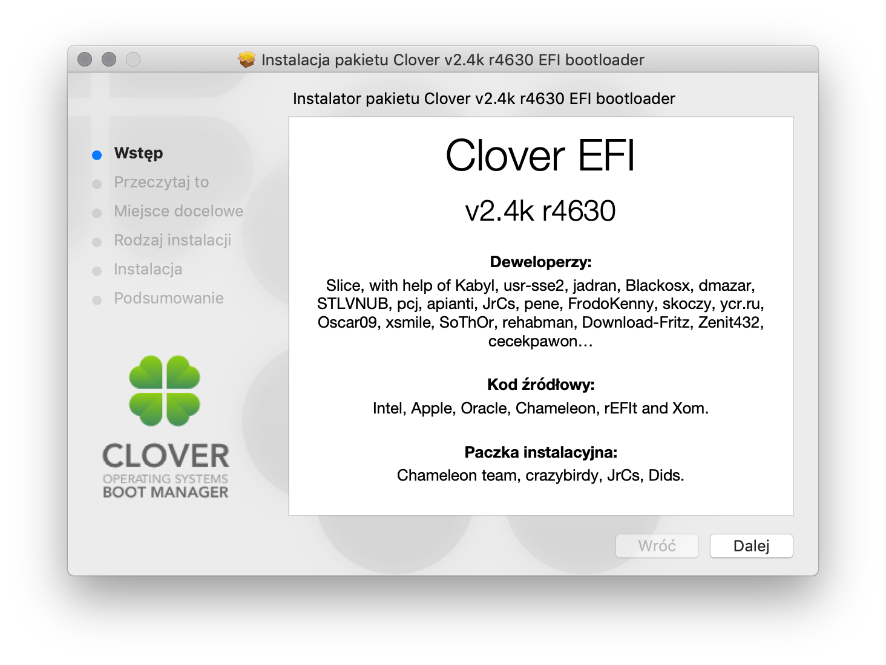
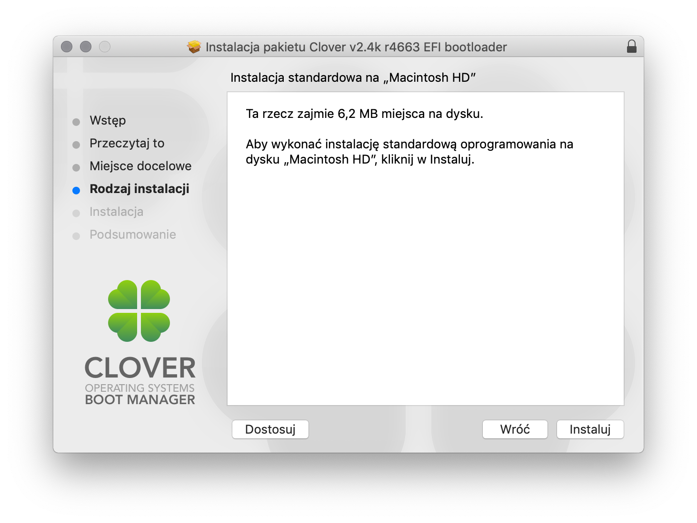
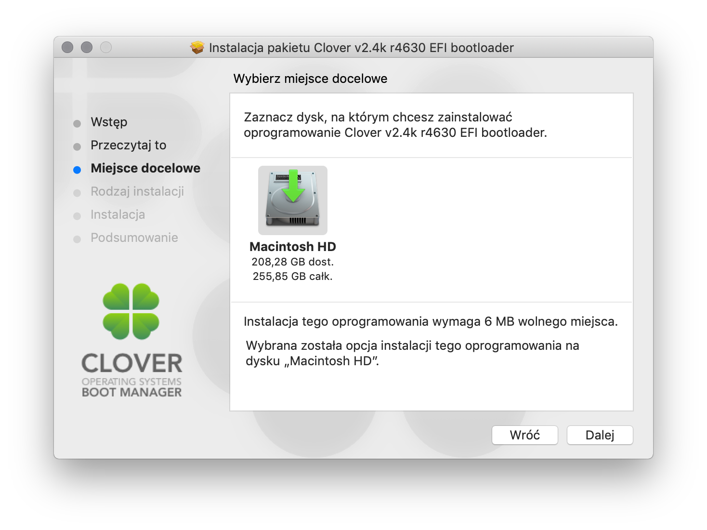
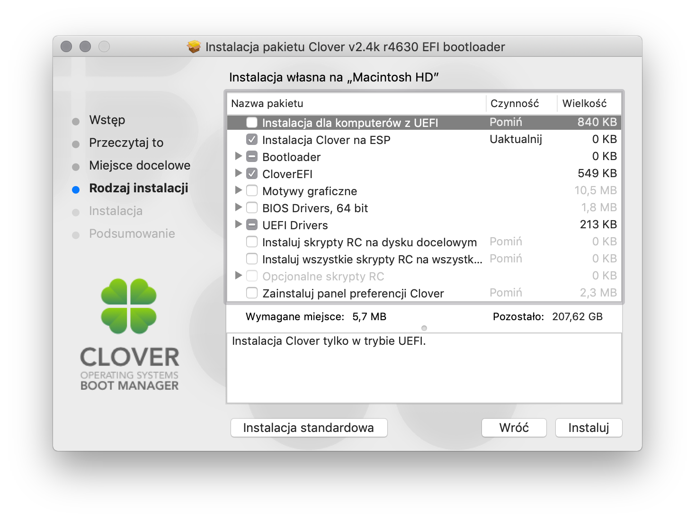
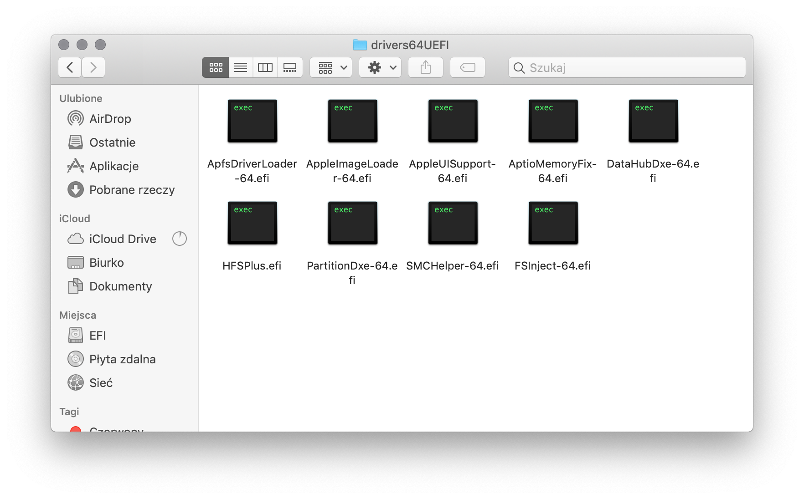
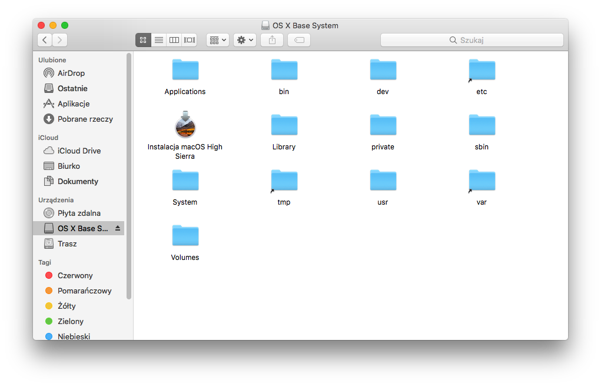
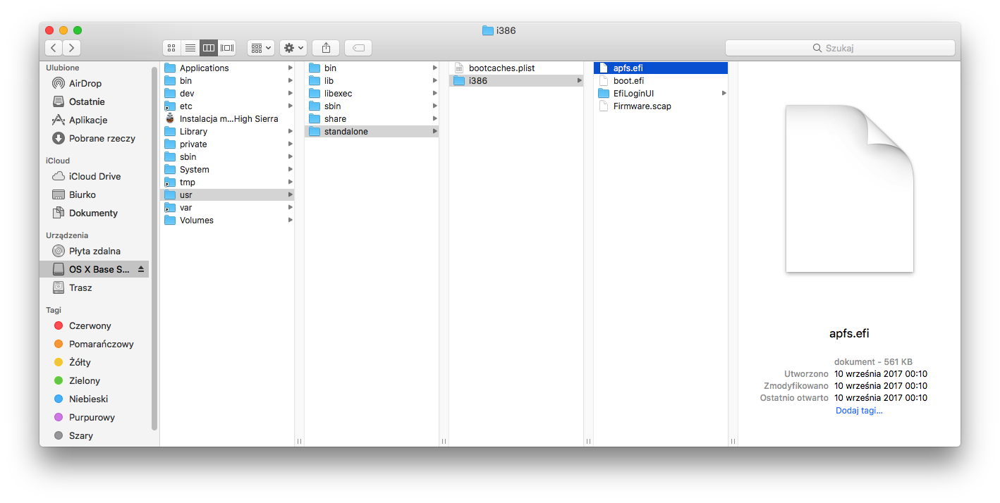
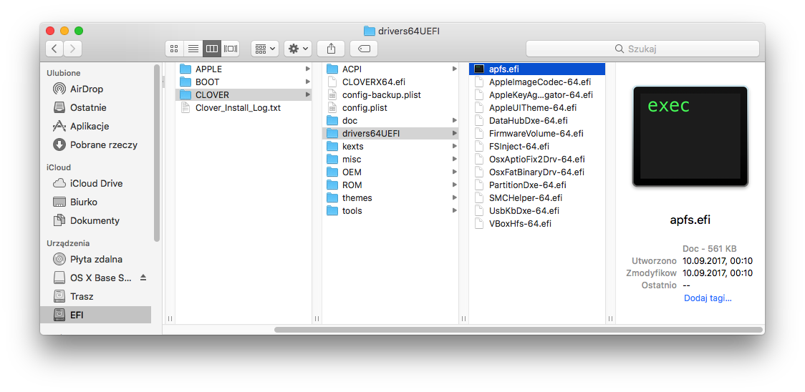

# Instalacja Clover EFI


https://www.youtube.com/watch?v=6vDYDhMsbqY


W czasie tak dość niekrótkiej drogi doszliśmy do właściwej konfiguracji jednej z ważniejszych rzeczy każdego systemu operacyjnego - bootloadera. Na początek trochę teorii.

* **Bootloader**

  Inaczej `program rozruchowy`, działający na zasadzie bootstrapu (z ang. „pull oneself up by one’s bootstraps” – podnieść się ciągnąc za własne sznurowadła) program uruchamiany jako pierwszy po zakończeniu wykonywania przez BIOS (lub UEFI) procedury POST, służący do załadowania systemu operacyjnego do pamięci operacyjnej komputera.

* **BIOS**

  `Basic Input/Output System`, zapisany w pamięci stałej zestaw podstawowych procedur pośredniczących pomiędzy systemem operacyjnym a sprzętem. Posiada on własną pamięć konfiguracji, w której znajdują się informacje dotyczące daty, czasu oraz danych na temat wszystkich urządzeń zainstalowanych w komputerze. Jest to program zapisany w pamięci ROM płyty głównej oraz innych kart rozszerzeń takich jak np. karta graficzna.

* **UEFI**

  `Unified Extensible Firmware Interface`, interfejs pomiędzy systemem operacyjnym a firmware, opracowywany jako następca BIOS-u w komputerach osobistych.Jedną z cech UEFI jest możliwość pisania dla niego sterowników. W takim wypadku sterownik jest niezależny od systemu operacyjnego. Ponadto UEFI pozwala na obsługę dysków twardych większych od 2 TB, maksymalnie 8192 EB dzięki nowej procedurze do zarządzania dyskami o nazwie GPT. UEFI ma własną powłokę systemową (UEFI Shell). Ta funkcja przeznaczona jest dla serwisantów komputerowych. Niektórzy producenci oferują własne minisystemy dla UEFI które uruchamiane są z płyty CD/DVD. Apple od roku 2006 stosuje UEFI w swoich komputerach, nie daje natomiast możliwości wejścia w jego opcje.

* **POST**

  `Power-On Self-Test`, rodzaj testu poprawności działania podstawowych podzespołów: pamięci RAM, grafiki, dysków twardych czy procesora wykonywanego przy każdym uruchomieniu lub restarcie.

* **NVRAM**

  `non-volatile random access memory`, pamięć komputerowa nietracąca zawartych w sobie informacji po zaniku zasilania. Jest używana w komputerach głównie do przechowywania ustawień (na przykład BIOS) i informacji, które muszą być trwałe. System macOS przechowuje w NVRAM wszystkie informacje, które potrzebuje do bezproblemowej pracy.

Naszym bootloaderem, który jest wykorzystywany do uruchomienia macOS na naszym komputerze to tytułowy **Clover EFI Bootloader**. Czym dokładnie jest ten program? Clover EFI to bazowany na EFI bootloader dla komputerów działających pod kontrolą BIOS jako zamiennik dla EDK2/Duet bootloader.

Dzięki niemu jesteśmy w stanie uruchomić każdy Mac OS X od wersji 10.6, Linux oraz Windows w trybie EFI na komputerach nie posiadających tego interfejsu. Głównie jest wykorzystywany do instalacji Mac OS X na komputerach PC (tzw. Hackintosh). Clover EFI jest forkiem rEFIt. Jest rozprowadzany na licencji BSD. Warto zaznaczyć, że Clover EFI to pełnoprawny bootloader, a nie emulator Apple’owskiego EFI jak Chameleon bądź Chimera. Clover EFI ma możliwość działania w dwóch trybach. `BIOS`, oraz `UEFI`. W pierwszym trybie instaluje się na MBR danego dysku przez co możemy uruchomić ten bootloader bez posiadania UEFI. Sam clover emuluje wtedy działanie EFI przez co mamy możliwość uruchamiania innych bootloaderów EFI-based (jak na przykład Windows Boot Manager). Drugi tryb pozwala na działanie Clovera i uruchamiania macOS z pełną obsługą UEFI danej płyty głównej/laptopa. Dodatkowo Clover ma opcję emulacji lub wykorzystania sprzętowego NVRAM, w zależności od konfiguracji instalatora.

Dodatkowe możliwości:

* Obsługa bootloaderów EFI-based
* Automatyczne patchowanie DSDT
* Automatyczne patchowanie Kextów on-the-fly
* Ustawianie Fake ID
* Dostęp do EFI Shell
* Wyświetlenie wielojęzykowej pomocy (F1)
* Zapisywanie logów preboot.log oraz system.log (F2)
* Zrzut tablic ACPI (F4)
* Test patchowania DSDT (F5)
* Zrzut VBIOS do /CLOVER/misc/ (F6)
* Zapisywanie zrzutów ekranu GUI (F10)
* Obsługa motywów.
* Arbitrażowa iniekcja parametrów dla urządzeń
* I wiele więcej w następnym rozdziale

Więcej informacji na temat Clover EFI można znaleźć na [InsanelyMac](http://www.insanelymac.com/forum/forum/327-clover/).
Właściwy changelog Clover EFI można znaleźć pod [tym linkiem](https://sourceforge.net/p/cloverefiboot/code/HEAD/log/?path=).

Jeżeli już mamy wstęp teoretyczny to przejdźmy do przygotowań. Co będzie nam potrzebne:

* System operacyjny macOS w wersji minimum 10.6
* Najnowsza kompilacja Clover EFI Bootloader dostępna pod [tym linkiem](https://github.com/Dids/clover-builder/releases)
* Uprzednio przygotowany pendrive z instalatorem macOS na pendrive
* Trochę cierpliwości

## Instalacja Clover EFI
Instalacja Clover EFI jest relatywnie prosta i bezproblemowa, ale wymaga zastosowania pewnych wzorców. W tej sekcji postaram się opisać wszystkie elementy instalatora, których znajomość jest mile widziana podczas osobistych eksperymentów.

Po pobraniu naszego pakietu z instalatorem Clover EFI jesteśmy przywitani tym oto oknem. Oczywiście klikamy `Dalej`:

Następnie po przejściu podstaw zostaniemy poproszeni o dokonanie wyboru pomiędzy instalacją na dysku docelowym (domyślnie systemowym), lub wybraniem innej ścieżki. Klikamy na przycisk `Zmień miejsce instalacji...` i wybieramy satysfakcjonujący nas dysk docelowy. Dla instalatora wybieramy nasz USB, dla instalacji na HDD partycję z zainstalowanym macOS.

Teraz wybieramy przycisk `Dostosuj`. Pojawi nam się rozwijana lista konfiguracji naszego bootloadera.

Teraz przychodzi fajna część zabawy. Poniżej postaram sie opisać wszystkie opcje i drivery z tej listy.

* **Instalacja Clover dla komputerów UEFI** - Zainstaluj Clover tylko w trybie UEFI
* **Instalacja Clover na ESP** - Zainstaluj Clover EFI na EFI System Partition dysku docelowego. Dysk docelowy musi być sformatowany w trybie GPT (GUID Partition Table).
* **Bootloader** - Clover EFI wymaga trzech podstawowych plików. (w skrócie): boot0 (w głównym rekordzie startowym dysku) odpowiedzialny za ładowanie boot1, boot1 (w boot sektorze partycji) odpowiedzialny za odnajdowanie boot2, boot2 (w głównym katalogu partycji) odpowiedzialny za ładowanie /EFI/BOOT/CLOVERIA32.efi lub CLOVERX64.efi, kernel etc.

  * **Nie aktualizuj sektorów MBR oraz PBR** - Nie instaluj żadnego bootloader'a (boot0X, boot1X). Jest to użyteczne dla płyt z UEFI, które nie wymagają plików bootloader'a. Jest to także przydatne kiedy nie chcesz aktualizować sektorów MBR oraz PBR
  * **Zainstaluj boot0af w sektorze MBR** - Opcja przeznaczona dla uruchamiania przez klasyczny BIOS. boot0af uruchamia aktywną partycję zdefiniowaną w MBR. Jeżeli nie ma zdefiniowanej aktywnej partycji, boot0af uruchomi pierwszą partycję EFI/FAT32/HFS (najpierw zdefiniowaną w MBR następnie w GPT) z sygnaturą PBR. Ta opcja ustawi wybraną partycję jako aktywną.
  * **Zainstaluj boot0ss w sektorze MBR** - Opcja przeznaczona dla uruchamiania przez klasyczny BIOS. boot0ss (boot0 Signature Scanning) uruchomi pierwszą partycję EFI/FAT32/HFS (najpierw zdefiniowaną w MBR następnie w GPT) z sygnaturą PBR. Jeżeli żadna partycja nie zostanie odnaleziona boot0ss uruchomi aktywną partycję zdefiniowaną w MBR. Ta opcja jest przydatna kiedy posiadasz zainstalowanego Windowsa na tym samym dysku z Mac OS X, ponieważ Windows wymaga aktywnej partycji. Ta opcja nie ustawi wybranej partycji jako aktywnej.

* **Użyj alternatywnego uruchamiania z PBR** - Instaluj alternatywny sposób uruchamiania używając PBR z opcją wyboru bootloader'a po wciśnięciu klawisza. Plik do uruchomienia = boot{wciśnięty_klawisz}
* **CloverEFI** - Wybierz wersję CloverEFI do zainstalowania.

  * **CloverEFI 64 bity SATA** - CloverEFI 64 bity przy użyciu kontrolera SATA do uzyskania dostępu do dysków. Domyślnie powinna być wybrana ta opcja.
  * **CloverEFI 64 bity BiosBlockIO** - CloverEFI 64 bity przy użyciu Bios Block I/O do uzyskania dostępu do dysków. Użyteczne kiedy używamy dysku na kontrolerze IDE.
  * **CloverEFI 64-bits BiosBlockIO for NVIDIA NForce MCP79** - CloverEFI 64 bity przy użyciu Bios Block I/O do uzyskania dostępu do dysków na chipsecie NVIDIA NForce MCP79

* **Motywy graficzne** - podstawowe motywy graficzne dla CloverEFI. Można spokojnie pominąć.
* **Drivers64** - sterowniki dla CloverEFI działającego w trybie BIOS.
  * **AppleImageCodec-64** - Sterownik pozwalający na dekodowanie formatów BMP i PNG w środowizku FileVault 2
  * **AppleKeyAggregator** - Sterownik pozwalający na obsługę wejścia w środowisku FileVault 2
  * **AppleUITheme-64** - Sterownik pozwalający na obsługę motywu środowiska FileVault 2
  * **FirmwareVolume-64** - Sterownik pozwalający na generowanie kursora w środowisku FileVault 2
  * **FSInject-64** - Sterownik umożliwiający inject kextów z folderu Clover EFI
  * **SMCHelper-64** - Sterownik pozwalający na odtworzenie niektórych kluczy SMC załadowanych przez FakeSMC z NVRAMu
  * **ApfsDriverLoader** - Sterownik do obsługi systemu plików APFS z kontenera. Więcej informacji [tutaj](https://github.com/acidanthera/AppleSupportPkg).
  * **AppleImageLoader-64** - Sterownik implementujący protokół AppleLoadImage włącznie z weryfikacją sygnatury. Pozwala na bezpieczne ładowanie Apple EFI do pamięci poprzez uwierzytelnianie jej sygnatur. Więcej informacji [tutaj](https://github.com/acidanthera/AppleSupportPkg).
  * **AppleUiSupport-64** - Sterownik implementujący obsługę środowiska FileVault 2. Zastępuje sterowniki: AppleImageCodec-64, AppleKeyAggregator-64, AppleUITheme-64, FirmwareVolume-64.
  * **GrubEXFAT-64** - Sterownik do obsługi formatu ExFAT dla GRUBa
  * **GrubISO9660-64** - Sterownik do obsługi formatu ISO9660 dla GRUBa
  * **GrubNTFS-64** - Sterownik do obsługi formatu NTFS dla GRUBa
  * **GrubUDF-64** - Sterownik do obsługi formatu UDF dla GRUBa
  * **XhciDxe-64** - Sterownik (64-ro bitowy) USB 3.0

* **Drivers64UEFI** - Sterowniki dla CloverEFI działającego w trybie UEFI.
  * **AppleImageCodec-64** - Sterownik pozwalający na dekodowanie formatów BMP i PNG w środowizku FileVault 2
  * **AppleKeyAggregator** - Sterownik pozwalający na obsługę wejścia w środowisku FileVault 2
  * **AppleUITheme-64** - Sterownik pozwalający na obsługę motywu środowiska FileVault 2
  * **DataHubDxe-64** - Sterownik (64-ro bitowy) obligatoryjnie wymagany przez Mac OS X. Zwykle jest on obecny w BIOSie ale czasami go brakuje. W takiej sytuacji zostanie wyświetlony komunikat na ekranie. Obecność tego sterownika jest zawsze bezpieczna.
  * **FirmwareVolume-64** - Sterownik pozwalający na generowanie kursora w środowisku FileVault 2
  * **FSInject-64** - Sterownik umożliwiający inject kextów z folderu Clover EFI
  * **SMCHelper-64** - Sterownik pozwalający na odtworzenie niektórych kluczy SMC załadowanych przez FakeSMC z NVRAMu
  * **ApfsDriverLoader** - Sterownik do obsługi systemu plików APFS z kontenera. Więcej informacji [tutaj](https://github.com/acidanthera/AppleSupportPkg).
  * **AppleImageLoader-64** - Sterownik implementujący protokół AppleLoadImage włącznie z weryfikacją sygnatury. Pozwala na bezpieczne ładowanie Apple EFI do pamięci poprzez uwierzytelnianie jej sygnatur. Więcej informacji [tutaj](https://github.com/acidanthera/AppleSupportPkg).
  * **AppleUiSupport-64** - Sterownik implementujący obsługę środowiska FileVault 2. Zastępuje sterowniki: AppleImageCodec-64, AppleKeyAggregator-64, AppleUITheme-64, FirmwareVolume-64.
  * **AptioInputFix** - Sterownik referencyjny do obsługi klawiatury w środowisku UEFI FileVault 2 na BIOSach AMI.
  * **AptioMemoryFix** - Sterownik (64-ro bitowy) naprawiający problem z pamięcią w trybie UEFI na BIOSach AMI Aptio. Posiada takie funkcje jak automatyczne obliczanie slide, używalnego regionu pamięci itp. Więcej informacji [tutaj](https://github.com/vit9696/AptioFixPkg)
  * **CsmVideoDxe-64** - Sterownik grafiki (64-ro bitowy) - aktywuje dodatkowe rozdzielczości w menu Clover. Bazuje na module CSM pochodzącym z UEFI BIOS. Clover może nie wystartować z tym sterownikiem oraz może powodować problemy z wybudzeniem z uśpienia.
  * **EmuVariableUefi-64** - Sterownik (64-ro bitowy) wymagany dla płyt głównych z BIOSem Phoenix w celu załadowania informacji z NVRAMu. Należy użyć tylko w przypadku kiedy nie są ładowane parametry z NVRAM!
  * **EnglishDxe-64** - Sterownik zapewniający obsługę protokołu UnicodeCollation używanego przez EFI Shell jeżeli brakuje go w UEFI.
  * **Fat-64** - Sterownik do obsługi formatu FAT w UEFI.
  * **HashServiceFix** - Sterownik zapewniający obsługę haszowania jeżeli brakuje jej w UEFI.
  * **HFSPlus** - Sterownik dodający lepszą obsługę partycji HFS stworzony przez Apple.
  * **NvmExpressDxe-64** - Sterownik zapewniający obsługę dysków NVM Express jeżeli tej obsługi nie ma.
  * **OsxAptioFix2Drv-64** - Sterownik (64-ro bitowy) naprawiający problem z pamięcią w trybie UEFI na BIOSach AMI Aptio. Wersja 2.
  * **OsxAptioFix3Drv-64** - Sterownik (64-ro bitowy) naprawiający problem z pamięcią w trybie UEFI na BIOSach AMI Aptio. Wersja 3.
  * **OsxAptioFixDrv-64** - Sterownik (64-ro bitowy) naprawiający problem z pamięcią w trybie UEFI na BIOSach AMI Aptio. Nie powinna być już stosowana.
  * **OsxLowMemFixDrv-64** - Prostsza wersja sterownika OsxAptioFixDrv, 64 bity (NIE UŻYWAĆ OBU RÓWNOCZEŚNIE).
  * **PartitionDxe-64** - Sterownik (64-ro bitowy) odpowiedzialny za mapę partycji typu: hybryda GPT/MBR lub Schemat Partycji Apple. Obecność tego sterownika jest zawsze bezpieczna.
  * **UsbKbDxe-64** - Sterownik dla klawiatury USB. Używany w środowisku FileVault 2. Nie rekomendowany.
  * **UsbMouseDxe-64** - Sterownik dla myszy USB. Nie wymagany.
  * **VBoxExt2-64** - Sterownik dodający obsługę partycji EXT2.
  * **VBoxEt4-64** - Sterownik dodający obsługę partycji EXT4.
  * **VBoxIso9600-64** - Sterownik dodający obsługę formatu ISO9600.

* **Instaluj skrypty RC na dysku docelowym** - Instaluj wszystkie skrypty RC na dysku docelowym. Dysk docelowy musi być bootlowalnym dyskiem systemowym OSX. Ta opcja musi być zaznaczona jeżeli używamy sterownika EmuVariableUefi-64 w trybie UEFI.
* **Instaluj skrypty RC na wszystkich wewnętrznych bootowalnych dyskach systemowych OS X** - Instaluj wszystkie skrypty RC na wszystkich wewnętrznych bootowalnych dyskach systemowych OSX.
* **Opcjonalne skrypty RC** - nie są zwykle wymagane.
* **Zainstaluj panel preferencji Clover** - **Nie wymagane** Instaluje panel preferencji Clover na dysku docelowym. Zawiera CloverUpdater, który poinformuje Cię o dostępnych aktualizacjach.

Tyle z opisu teoretycznego wszystkich opcji i sterowników Clovera. Teraz przejdźmy do właściwych wyborów dla danej konfiguracji. Oczywiście najlepiej jest znać to wszystko aby potem wiedzieć co zastosować w swoich eksperymentach z konfiguracją Bootloadera.

## Domyślna Konfiguracja dla Legacy/BIOS {#bios}

Domyślna konfiguracja bootloadera w trybie BIOS nie jest trudna. Trzeba pamiętać tylko o niektórych rzeczach. Między innymi:

* Sterowniki z `drivers64UEFI` się nie zainicjują więc nie musimy ich wybierać
* Najpewniej nie będzie funkcjonować NVRAM więc będzie trzeba go emulować
* Posiadając dysk sformatowany w GPT utworzy nam się tzw. `Partycja hybrydowa GPT/MBR`, to jest dysk będzie dalej w GPT, ale jedna partycja będzie miała tablicę MBR przez co możliwy jest boot z niego.
* Clover w tym trybie emuluje EFI.

Podstawowe rzeczy, które powinniśmy wybrać:

* Instalacja Clover na ESP
* Bootloader
  * Zainstaluj boot0af w sektorze MBR lub boot0ss jeżeli ta pierwsza opcja nie działa
* CloverEFI
  * CloverEFI 64 bity SATA lub BiosBlockIO w zależności od kontrolera jakiego używamy
* BIOS Drivers, 64 bit
  * FSInject-64
  * ApfsDriverLoader-64
  * AppleImageLoader-64
  * AppleUiSupport-64
  * SMCHelper-64
* Instaluj skrypty RC na dysku docelowym
* (opcjonalnie jeżeli mamy więcej niż jeden dysk z OS X) Instaluj skrypty RC na wszystkich wewnętrznych bootowalnych dyskach systemowych OS X
* (tylko jak instalujemy na dysku twardym) Zainstaluj panel preferencji Clover

Wybierając te opcje powinniśmy otrzymać zainstalowany Clover dla BIOS. Przynajmniej ja wybieram te opcje przy każdej instalacji konfiguracji clovera dla BIOS i działa :)

## Domyślna konfiguracja dla UEFI {#uefi}

Jeżeli chodzi o konfigurację dla UEFI również trzeba pamiętać o kilku ważnych rzeczach:

* Teraz sterowniki z Drivers64 nie będą ładowane
* Natywna obsługa NVRAM zwykle działa bez problemu
* Clover działa w czystym trybie UEFI, więc korzysta z interfejsu UEFI płyty głównej i niczego nie emuluje

Co powinniśmy wybrać::

* Instalacja komputerów z UEFI
* Instalacja Clover na ESP
* Bootloader, CloverEFI i drivers64 się same wyłączą do wyboru bo na UEFI nie są potrzebne
* UEFI Drivers
  * FSInject-64
  * DataHubDxe-64
  * SMCHelper-64 (W przypadku gdy używamy FakeSMC)
  * ApfsDriverLoader-64
  * AppleImageLoader-64
  * AppleUiSupport-64
  * AptioInputFix-64 - **tylko przy BIOSach AMI UEFI**
  * AptioMemoryFix-64
  * HFSPlus-64
  * VBoxHfs-64 (po wybraniu HFSPlus ten sterownik sam się usunie)
  * PartitionDxe-64

Po poprawnej instalacji przechodzimy do katalogu `/EFI/CLOVER/drivers64` lub `/EFI/CLOVER/drivers64` i nasz katalog powinien mniej więcej wyglądać tak jak na obrazku.

Dzięki temu Clover uruchomi się w trybie UEFI. Oczywiście jeżeli instalujemy Clovera na dysku twardym możliwe, że będziemy zmuszeni dodać odpowiedni wpis do naszego UEFI przez EFI shell. Opiszemy to w późniejszym czasie. `Angielską pomoc można znaleźć na ArchWiki <https://wiki.archlinux.org/index.php/Unified_Extensible_Firmware_Interface#Important_UEFI_Shell_Commands>`_ Aktualnie powinno to wystarczyć do uruchomienia Clovera jeżeli nie mamy innego systemu operacyjnego w UEFI.

## Dodawanie obsługi APFS (Apple File System) do Clover EFI {#apfs}


Instalatory Clover EFI z repozytorium *Dids/clover-builder* domyślnie zawierają w sobie sterownik pozwalający na obsługę APFS natywnie z kontenera APFS o nazwie **ApfsDriverLoader-64**. poniższy przykład na czas dzisiejszy jest **nieaktualny**.


Domyślnie Clover zawiera w sobie tylko i wyłącznie sterowniki rozprowadzane na otwartej licencji. Oznacza to, że nie uświadczymy w nim żadnych własnościowych sterowników. Przykładem wymogu posiadania własnościowego sterownika EFI jest obsługa systemu plików APFS, który Apple wprowadziło od wersji macOS High Sierra 10.13. Na szczęście sterownik ten jest domyślnie dostępny w instalatorze systemu pobranym z Mac App Store. Aby dostać się do sterownika ``apfs.efi`` musimy wykonać następujące kroki.

Klikamy nasz plik *Install macOS High Sierra.app* prawym przyciskiem myszy i wybieramy *Pokaż zawartość pakietu*. Przechodzimy do ścieżki ``Contents/SharedSupport`` i montujemy plik ``BaseSystem.dmg``. Otworzy nam się okno świeżo zamontowanego obrazu dysku.

Przechodzimy do katalogu ``usr/standalone/i386``. Znajduje się tutaj plik ``apfs.efi``. To jest właśnie sterownik dodający obsługę systemu plików APFS.

Kopiujemy ten plik do naszego świeżo zainstalowanego Clovera do katalogu ``CLOVER/drivers64`` dla Clovera w LEGACY, lub ``CLOVER/drivers64UEFI`` dla Clovera w UEFI. Gotowe. Teraz nasz bootloader będzie miał możliwość startu systemu z partycji sformatowanej w nowym systemie plików APFS.

## Podsumowanie

Clover EFI Bootloader to potężne narzędzie, którego instalacja jest relatywnie prosta w zależności nie ważne od modelu płyty głównej jaką posiadamy. Niestety to nie wszystko by można było przejść dalej - zostaje jeszcze opis i właściwa konfiguracja pliku `config.plist` Clovera, która będzie opisana w następnej części.
