# Konfiguracja pliku config.plist


https://www.youtube.com/watch?v=BK0TZb0fGLM


Poprzednie rozdziały tego poradnika pokazały nam jak przygotować konfigurację instalacji macOS oraz jak zainstalować bootloader, który pozwoli na uruchomienie tego systemu na komputerze PC. Jednakże aby system ten się uruchomił, nie wystarczy sama instalacja bootloadera. Jednym z ważnych elementów jest konfiguracja pliku konfiguracyjnego Clover Bootloader, który zwie się `config.plist` i mieści się w katalogu `EFI/CLOVER/`. Jeżeli postępowaliśmy zgodnie z tym poradnikiem, folder ten znajdować się będzie na ukrytej partycji *EFI*.

## Montowanie ukrytej partycji EFI {#efi}

**EFI System Partition (ESP)** to partycja wykorzystywana w systemach UEFI, mieszcząca się zwykle na dysku komputera. Kiedy komputer jest uruchamiany, oprogramowanie UEFI ładuje pliki zapisane na ESP takie jak bootloader w celu uruchomienia systemu operacyjnego.

Zamontowanie partycji EFI w systemie macOS może być wykonane na wiele sposobów. Ilość aplikacji i skryptów jest wyjątkowo duża. Poniżej jednak wykorzystamy metodę najbardziej uniwersalną, czyli wykorzystanie komendy wbudowanej w macOS `diskutil`.

Otwieramy nasz terminal i wpisujemy komendę:

```
$ diskutil list
```

Naszym oczom ukaże się lista aktualnie zamontowanych dysków twardych i dysków wymiennych. Wyszukujemy na tej liście naszego dysku, na którym mamy zainstalowany Clover EFI:

```
$ diskutil list
  /dev/disk0 (internal, physical):
     #:                       TYPE NAME                    SIZE       IDENTIFIER
     0:      GUID_partition_scheme                        *240.1 GB   disk0
     1:                        EFI EFI                     209.7 MB   disk0s1
     2:                  Apple_HFS Macintosh HD            239.2 GB   disk0s2
     3:                 Apple_Boot Recovery HD             650.0 MB   disk0s3

  /dev/disk1 (internal, physical):
     #:                       TYPE NAME                    SIZE       IDENTIFIER
     0:      GUID_partition_scheme                        *500.1 GB   disk1
     1:                        EFI EFI                     209.7 MB   disk1s1
     2:                  Apple_HFS Trasz                   499.8 GB   disk1s2
```

Ważnym dla nas jest `IDENTIFIER` partycji. Szukamy odpowiedniego identyfikatora naszej partycji EFI i montujemy naszą partycję za pomocą komendą:

```
$ sudo diskutil mountDisk /dev/diskXsY
```

gdzie `X` - numer dysku, `Y` - numer partycji. Dla naszego przykładu komenda będzie wyglądać następująco:

```
$ sudo diskutil mountDisk /dev/disk0s1
```

Partycja EFI powinna się pojawić w Finderze.

## Budowa pliku config.plist {#budowa}

Plik `config.plist` to plik konfiguracyjny bootloadera, który znajduje się na naszej partycji EFI, o ile zainstalowaliśmy bootloader na partycji ESP, lub w głownym katalogu partycji systemowej. Jego lokalizacja to:

```
/EFI/CLOVER/config.plist
```

Jest to plik typu ``Property List``, tak więc jego modyfikacja jest możliwa na wiele sposobów.

* **PlistEdit Pro**
  Płatny program do pobrania z [tej strony](https://www.fatcatsoftware.com/plisteditpro/). Dostępna jest 15-dniowa wersja próbna.
* **Apple Xcode**
  Najnowsza kompilacja do pobrania z Mac App Store - polecana przez bardziej wtajemniczonych Developerów.
* **Clover Configurator**
  Darmowy program konfiguracyjny napisany specjalnie dla konfiguracji pliku config.plist. Program dodatkowo posiada wiele różnych, przydatnych funkcji takich jak wygenerowanie *boot.log*, montowanie EFI, instalacja i aktualizacja Clover Bootloader. [Do pobrania z tej strony internetowej](http://mackie100projects.altervista.org/download-clover-configurator/)

W tej części poradnika skupimy się na poznaniu wszystkich opcji konfigurowalnych w pliku `config.plist`. Dokładny opis każdej opcji pliku konfiguracyjnego znajduje się na oficjalnej wiki Clover EFI Bootloader ([link do wiki](https://clover-wiki.zetam.org/configuration)). Naszym głównym programem do edycji pliku konfiguracyjnego będzie **Clover Configurator** ze względu na jego prostotę i intuicyjność.

Na początek otwórzmy sobie domyślny plik `config.plist` przez Clover Configurator. Jeżeli uprzednio zamontowaliśmy partycję EFI to pokażą nam się dostępne pliki konfiguracyjne. Wybieramy ten z katalogu `EFI/CLOVER/config.plist`.


Clover EFI to wciąż aktywnie rozwijany bootloader. Wraz z jego rozwojem będą pojawiać się nowe funkcje, stare mogą być modyfikowane lub kompletnie usuwane. Nie sugerujcie się bezpośrednio screenami poniżej. Zostały one wrzucone jedynie w celach pokazowych.


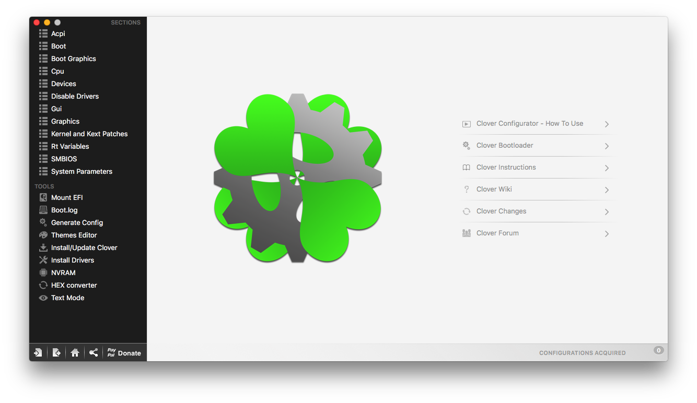
Kiedy już wybraliśmy odpowiedni plik `config.plist`, mamy możliwość przeglądania i wybrania odpowiednich opcji. Pierwszą kartę jaką ujrzymy będzie karta *ACPI*. Zawiera ona opcje modyfikujące tablice ACPI naszego komputera. Jej podstawowymi zadaniami są:

* Patche *Rename/Replace* zamieniające pewne ciągi znaków w naszym DSDT/SSDT
* *DSDT Fixes* - lub *DSDT Fix Mask*, maska binarna zawierająca podstawowe patche DSDT zaimplementowane w Clover. Zawera m. in. `ShutdownFix`, `_WAK Fix`.
* Drop określonych tablic ACPI
* Generowanie SSDT
* Ładowanie własnych SSDT w ustalonej kolejności

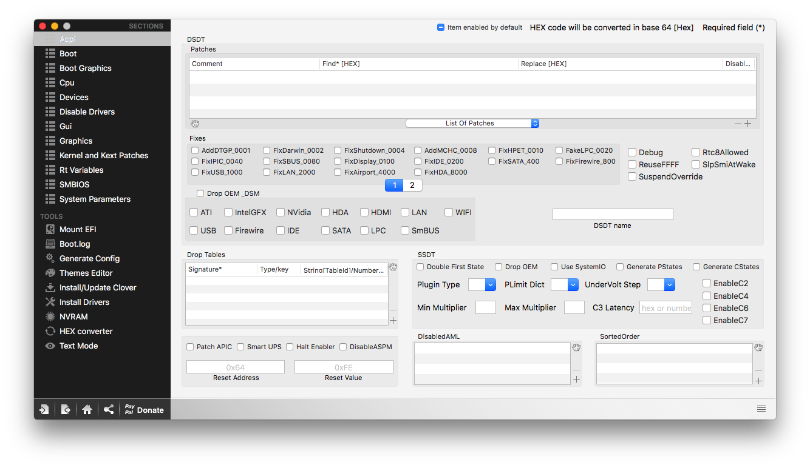

Kolejną sekcją jest Sekcja *Boot*. Zawiera ona podstawowe ustawienia rozruchu:

* Ustawienia argumentów rozruchowych z możliwością dodawania własnych
* Ustawienia Secure Boot
* Ustawienia rozruchowe *Clover EFI*
* Możliwość ustawienia detekcji XMP (eXtreme Memory Profile)

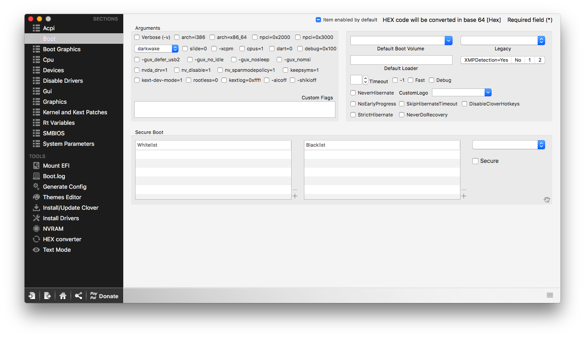

Następnie mamy sekcję *Boot Graphics*. Są tutaj podstawowe informacje związane z grafiką wyświetlaną przez *boot.efi* (logo Apple).

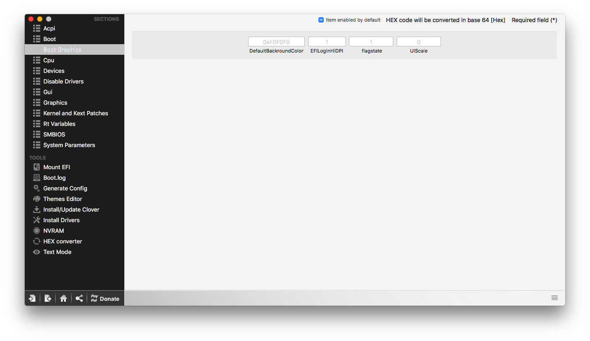

Sekcja *CPU* zawiera podstawowe informacje dotyczącze procesora:

* Częstotliwość, cpu-type, TDP, wyłączenie Turbo itp.
* Konfiguracja *HWP*, lub *Intel Speed Shift*. Więcej w następnych rozdziałach.

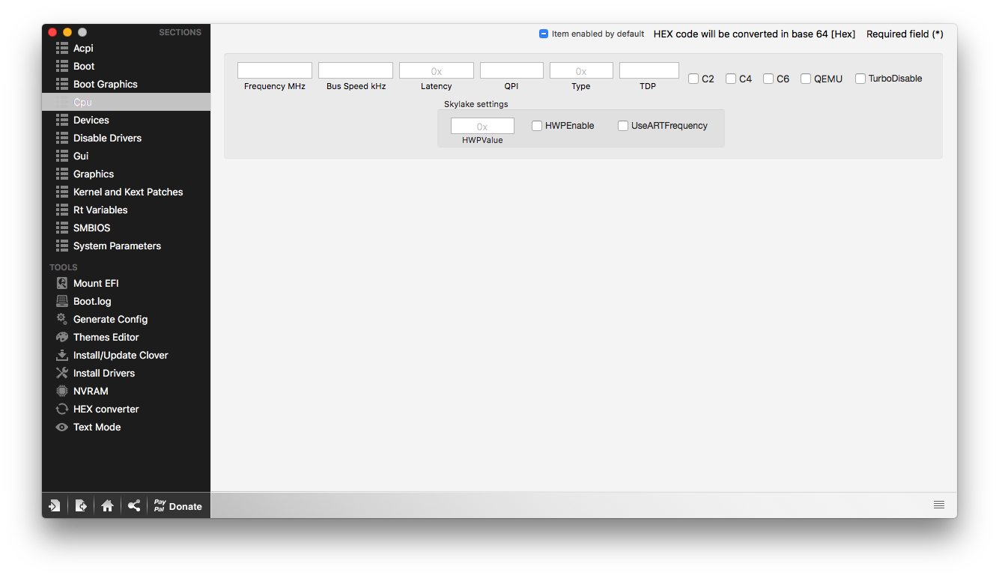

Karta *Devices* to konfiguracja wszelakich urządzeń PCI w komputerze. Tutaj można m.in.:

* Ustawić Fake ID naszego urządzenia
* Injectować audio dla naszego kodeka
* Dodać niestandardowe informacje arbitrażowe do naszych urządzeń

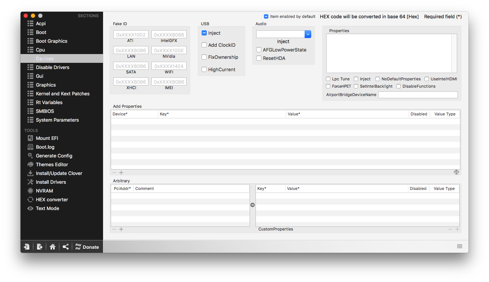

*Disable Drivers* to sekcja gdzie możemy wyłączyć ładowanie sterowników efi znajdujących się w folderach `drivers64*` w głownym katalogu Clovera. Sterowniki te nie będą ładowane ze startem bootloadera.

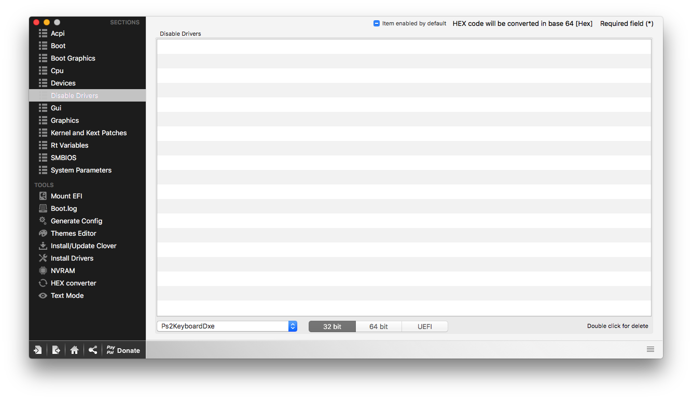


Sekcja *GUI* zawiera konfigurację interfejsu graficznego *Clover EFI*. Czyli:

* zdefiniujemy tu własne wpisy rozruchowe systemów
* ustawimy rozdzielczość i motyw bootlaodera
* włączymy wsparcie myszy w bootloaderze

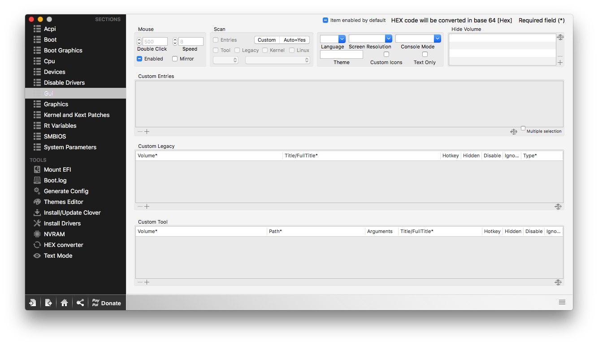

Karta *Graphics* zawiera zaawansowaną konfigurację grafiki. Obejmuje ona wszystkie karty głównych producentów. Możemy tutaj:

* ustawić iniekcję kart graficznych
* dodać własne `EDID`
* modyfikować VBIOS karty graficznej
* I kilka innych możliwości, które będą opisane w następnych rozdziałach

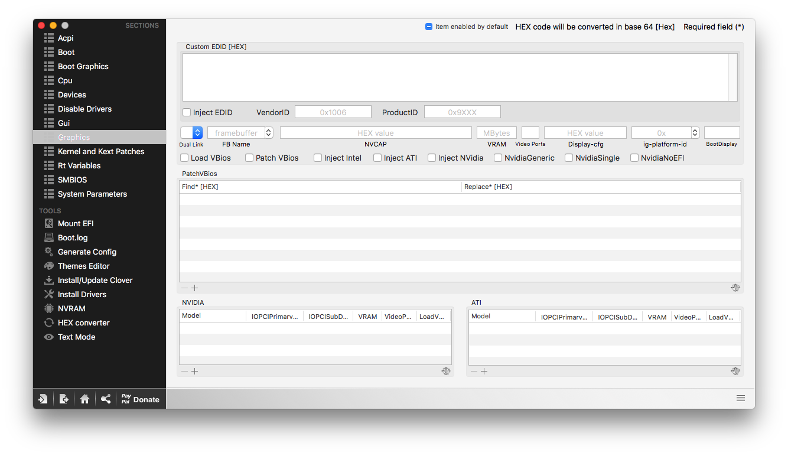

*Kernel and Kext Patches* to jedna z ważniejsztch kart jakie powinniśmy znać. Opcje tutaj pozwalają nam na patchowanie w locie kextów w macOS oraz kernelu, który ten system napędza. Możemy:

* Naprawić błąd z zablokowanym rejestrem MSR 0xE2 w zależności od zarządzania energią jakiego używamy (AppleIntelCPUPM i KernelPm)
* Naprawić błąd związany panikowaniem Local APIC
* Zmodyfikować domyślne connectory AMD
* modyfikować binarnie kexty w locie, bez potrzeby ich statycznej modyfikacji

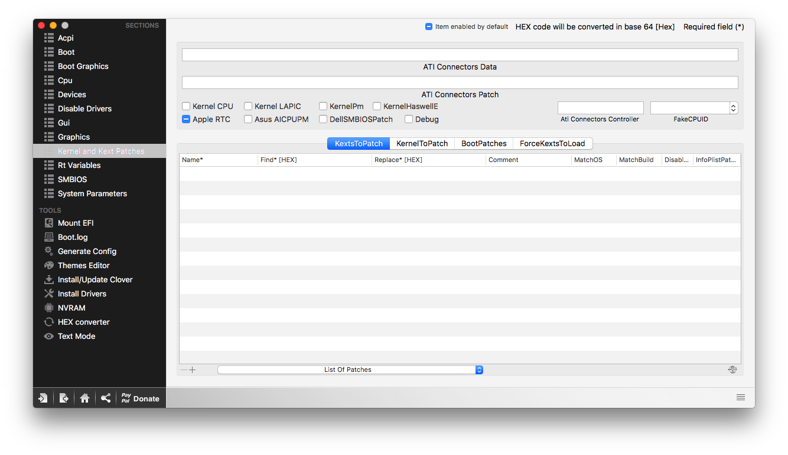

W sekcji *RtVariables* możemy ustawiać podstawowe informacje związane z konfiguracją usług Apple lub samego Clovera. Więcej w następnych rozdziałach.

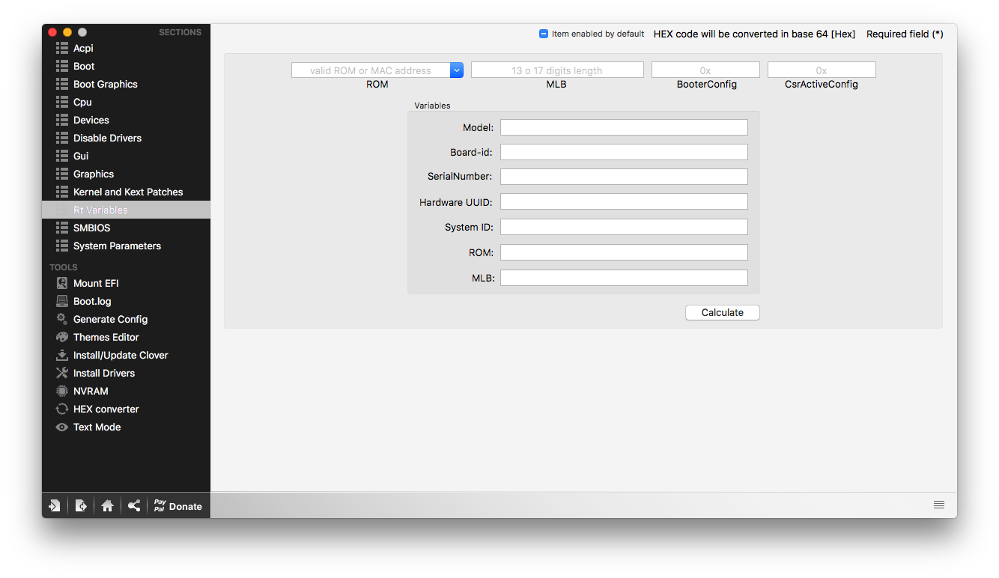

Karta *SMBIOS* zawiera wszystkie informacje o identyfikacji naszego Hackintosha jako prawdziwego Maca. Tutaj jest `Serial Number`, `BoardSerialNumber (MLB)` oraz modyfikacja identyfikacji kości RAM, jeżeli jest taka potrzeba.

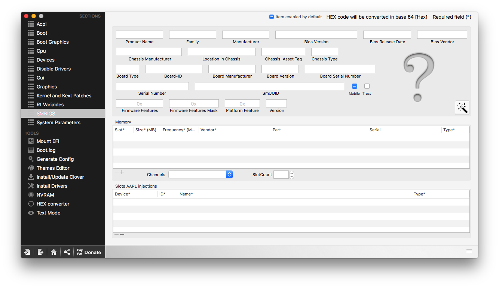

*System Parameters*, kolejna sekcja, pozwala na możliwość zmiany parametrów systemowych, które mają wpływ na działanie systemu. Tutaj można ustawić własny UUID sprzętu, jeżeli oryginalny jest nieprawidłowy, ustawić Clovera by zawsze injectował kexty znajdujące się w `clover/kexts/` oraz inne istotne elementy.

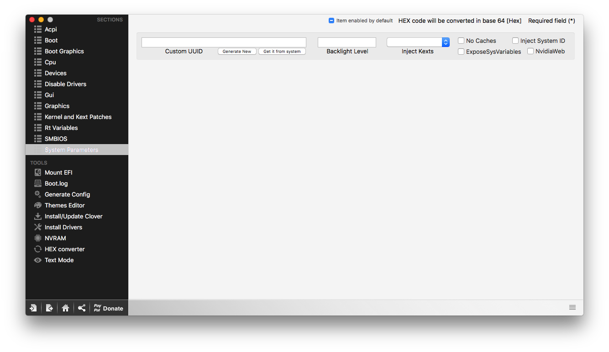

Kiedy już znamy podstawy związane z plikiem konfiguracyjnym, wypada zabrać sie za konfigurację. Poniżej przedstawiam wam, w formie listy, wybór Podstawowych rzeczy w pliku `config.plist` aby uruchomić instalator.

## Podstawowa konfiguracja do uruchomienia systemu {#basic}

Komputery spod stajni nadgryzionego jabłuszka, od początku przejścia na architekturę X86, są bazowane na procesorach marki Intel. Procesory te, z roku na rok różnią się mocą, funkcjami i wymaganą konfiguracją. Przy konfiguracji naszego pliku `config.plist` ważne jest abyśmy znali dokładnie naszą konfigurację. Dlatego sporządzenie odpowiedniej specyfikacji sprzętowej jest takie ważne. Rodziny procesorów są następujące:

* [Legacy](#legacy) - w to wchodzą procesory Intel Core 2 Duo/Quad, oraz Core iX 1 generacji, iX-XXX
* [Sandy Bridge](#sandy_bridge) - Procesory Intel Core iX 2 generacji, iX-2XXX
* [Ivy Bridge](#ivy_bridge) - Procesory Intel Core iX 3 generacji, iX-3XXX
* [Haswell](#haswell) - Procesory Intel Core iX 4 generacji, iX-4XXX
* [Broadwell](#broadwell) - Procesory Intel Core iX 5 generacji, iX-5XXX
* [Skylake](#skylake) - Procesory Intel Core iX 6 generacji, iX-6XXX
* [Kaby Lake](#kaby_lake) - Procesory Intel Core iX 7 generacji, iX-7XXX
* [Coffee Lake](#coffee_lake) - Procesory Intel Core iX 8 generacji, iX-8XXX

Każda rodzina procesorów wymaga odpowiedniego ustawienia pliku `config.plist` by pozwolić macOS na start. Poniżej przedstawiono podstawową konfigurację dla każdej rodziny.


To jest podstawowa konfiguracja, która pozwoli wam na uruchomienie samego instalatora i instalację systemu. Po instalacji będziemy musieli wykonać Post-instalację, której elementy będą szerzej opisane w następnych częściach tej dokumentacji.



Niekiedy podstawowa konfiguracja pliku *config.plist* może nie wystarczyć. Warto wtedy odezwać się na grupie z odpowiednią dokumentacją problemu.


### Konfiguracja dla komputerów Legacy {#legacy}

Zakładając, że mamy domyślny config.plist świeżo po instalacji Clovera.

**W karcie ACPI:**
Usuwamy wszystkie DSDT patches i dodajemy następujące:

```
Comment: change EHC1 to EH01
Find: 45484331
Replace: 45483031

Comment: change EHC2 to EH02
Find: 45484332
Replace: 45483032

Comment: change _DSM to XDSM
Find: 5f44534d
Replace: 5844534d
```

Zaznaczamy DSDT Fixes:

```
FixIPIC
FixShutdown
FixHPET
AddMCHC
Fix_WAK
Fix_RTC
Fix_TMR
FixHeaders
FixMutex
```

W sekcji SSDT zaznaczamy:

```
Generate PStates
Generate CStates
EnableC2-C6
```

**W karcie Boot:**
Zaznaczamy Boot Args:

```
Verbose (-v)
debug=0x100
nv_disable=1 - DO 10.12 SIERRA JEŻELI POSIADAMY KARTĘ NVIDII
kext-dev-mode=1, rootless=0 - JEŻELI URUCHAMIAMY SYSTEM DO EL CAPITAN
```

**W karcie Kernel and Kext Patches:**
Zaznaczamy:

```
AppleIntelCPUPM
```

**W karcie SMBIOS:**
Wybieramy z listy rozwijanej SMBIOS:

* ``MacPro3,1`` - dla procesora na socket 775 nie obsługującego SSE4.1
* ``iMac10,1`` - dla procesora na socket 775 obsługującego SSE4.1
* ``iMac11,1 do iMac11,3`` - dla procesora na socket 1366 w zależności od procesora
* ``MacBookPro1,1 do MacBookPro5,5`` - dla laptopa w zalezności od rodziny procesora Core 2 Duo.
* ``MacBookPro6,1 lub MacBookPro6,2`` - dla laptopa z rodziny procesora Intel Core iX 1 generacji.

I kilka razy losujemy generowany Serial Number.

**W zakładce System Parameters:**
Zaznaczamy ``InjectKexts=Yes``


### Konfiguracja dla komputerów Sandy Bridge {#sandy_bridge}

Zakładając, że mamy domyślny config.plist świeżo po instalacji Clovera.

**W karcie ACPI:**
Usuwamy wszystkie DSDT patches i dodajemy następujące:

```
Comment: change EHC1 to EH01
Find: 45484331
Replace: 45483031

Comment: change EHC2 to EH02
Find: 45484332
Replace: 45483032

Comment: change _DSM to XDSM
Find: 5f44534d
Replace: 5844534d
```

Zaznaczamy DSDT Fixes:

```
FixIPIC
FixShutdown
FixHPET
AddMCHC
Fix_WAK
Fix_RTC
Fix_TMR
FixHeaders
FixMutex
```

W sekcji SSDT zaznaczamy:

```
Generate PStates
Generate CStates
EnableC2-C6
```

**W karcie Boot:**
Zaznaczamy Boot Args:

```
Verbose (-v)
debug=0x100
nv_disable=1 - DO 10.12 SIERRA JEŻELI POSIADAMY KARTĘ NVIDII
kext-dev-mode=1, rootless=0 - JEŻELI URUCHAMIAMY SYSTEM DO EL CAPITAN
```

**W karcie Kernel and Kext Patches:**
Zaznaczamy:

```
AppleIntelCPUPM
Kernel LAPIC - dla laptopów HP
```

**W karcie SMBIOS:**
Wybieramy z listy rozwijanej SMBIOS:

* ``iMac12,1 lub iMac12,2`` - dla procesora Intel Core iX 2 generacji.
* ``MacBookPro8,1 lub MacBookPro8,2 lub MacBookPro8,3`` - dla laptopa z rodziny procesora Intel Core iX 2 generacji.

I kilka razy losujemy generowany Serial Number.

**W zakładce System Parameters:**
Zaznaczamy ``InjectKexts=Yes``

### Konfiguracja dla komputerów Ivy Bridge {#ivy_bridge}

Zakładając, że mamy domyślny config.plist świeżo po instalacji Clovera.

**W karcie ACPI:**
Usuwamy wszystkie DSDT patches i dodajemy następujące:

```
Comment: change EHC1 to EH01
Find: 45484331
Replace: 45483031

Comment: change EHC2 to EH02
Find: 45484332
Replace: 45483032

Comment: change _DSM to XDSM
Find: 5f44534d
Replace: 5844534d
```

Zaznaczamy DSDT Fixes:

```
FixIPIC
FixShutdown
FixHPET
AddMCHC
Fix_WAK
Fix_RTC
Fix_TMR
FixHeaders
FixMutex
```
Zaznaczamy w SSDT **tylko i wyłącznie** (Odznaczając inne opcje)
```
PluginType
```

**W karcie Boot:**
Zaznaczamy Boot Args:

```
Verbose (-v)
debug=0x100
nv_disable=1 - DO 10.12 SIERRA JEŻELI POSIADAMY KARTĘ NVIDII
kext-dev-mode=1, rootless=0 - JEŻELI URUCHAMIAMY SYSTEM DO EL CAPITAN
-xcpm - JEŻELI URUCHAMIAMY SYSTEM DO EL CAPITAN
```

**W karcie Kernel and Kext Patches:**
Zaznaczamy:

```
AppleIntelCPUPM
KernelXCPM - DLA macOS SIERRA i WYŻEJ
KernelPm
Kernel LAPIC - dla laptopów HP
```

**W karcie SMBIOS:**
Wybieramy z listy rozwijanej SMBIOS:

* ``iMac13,1 do iMac13,3`` - dla procesora Intel Core iX 3 generacji w zależności od procesora.
* ``MacBookPro9,1 lub MacBookPro9,2 lub MacBookPro10,1 lub MacBookPro10,2`` - dla laptopa z rodziny procesora Intel Core iX 3 generacji z zakończeniem *M* (Wysokonapięciowy).
* ``MacBookAir5,1 lub MacBookAir5,2`` - dla procesorów Intel Core iX 3 generacji z zakończeniem *U* (niskonapięciowe)

I kilka razy losujemy generowany Serial Number.

**W zakładce System Parameters:**
Zaznaczamy ``InjectKexts=Yes``


### Konfiguracja dla komputerów Haswell {#haswell}

Zakładając, że mamy domyślny config.plist świeżo po instalacji Clovera.

**W karcie ACPI:**
Usuwamy wszystkie DSDT patches i dodajemy następujące::

```
Comment: change EHC1 to EH01
Find: 45484331
Replace: 45483031

Comment: change EHC2 to EH02
Find: 45484332
Replace: 45483032

Comment: change _DSM to XDSM
Find: 5f44534d
Replace: 5844534d
```

Zaznaczamy DSDT Fixes:

```
FixIPIC
FixShutdown
FixHPET
AddMCHC
Fix_WAK
Fix_RTC
Fix_TMR
FixHeaders
FixMutex
```
Zaznaczamy w SSDT **tylko i wyłącznie** (Odznaczając inne opcje)
```
PluginType
```

**W karcie Boot:**
Zaznaczamy Boot Args:

```
Verbose (-v)
debug=0x100
nv_disable=1 - DO 10.12 SIERRA JEŻELI POSIADAMY KARTĘ NVIDII
kext-dev-mode=1, rootless=0 - JEŻELI URUCHAMIAMY SYSTEM DO EL CAPITAN
```

**W karcie Kernel and Kext Patches:**
Zaznaczamy:

```
KernelPm
Kernel LAPIC - dla laptopów HP
```

**W karcie SMBIOS:**
Wybieramy z listy rozwijanej SMBIOS:

* ``iMac14,1 do iMac14,2 oraz iMac15,1`` - dla procesora Intel Core iX 4 generacji w zależności od procesora.
* ``MacBookPro11,1 lub MacBookPro11,2`` - dla laptopa z rodziny procesora Intel Core iX 4 generacji z zakończeniem *M* lub *HQ* (Wysokonapięciowy).
* ``MacBookAir6,1 lub MacBookAir6,2`` - dla procesorów Intel Core iX 3 generacji z zakończeniem *U* (niskonapięciowe)

I kilka razy losujemy generowany Serial Number.

**W zakładce System Parameters:**
Zaznaczamy ``InjectKexts=Yes``

### Konfiguracja dla komputerów Broadwell {#broadwell}
Zakładając, że mamy domyślny config.plist świeżo po instalacji Clovera.

**W karcie ACPI:**
Usuwamy wszystkie DSDT patches i dodajemy następujące:

```
Comment: change EHC1 to EH01
Find: 45484331
Replace: 45483031

Comment: change EHC2 to EH02
Find: 45484332
Replace: 45483032

Comment: change _DSM to XDSM
Find: 5f44534d
Replace: 5844534d
```

Zaznaczamy DSDT Fixes:

```
FixIPIC
FixShutdown
FixHPET
AddMCHC
Fix_WAK
Fix_RTC
Fix_TMR
FixHeaders
FixMutex
```
Zaznaczamy w SSDT **tylko i wyłącznie** (Odznaczając inne opcje)
```
PluginType
```

**W karcie Boot:**
Zaznaczamy Boot Args:

```
Verbose (-v)
debug=0x100
nv_disable=1 - DO 10.12 SIERRA JEŻELI POSIADAMY KARTĘ NVIDII
kext-dev-mode=1, rootless=0 - JEŻELI URUCHAMIAMY SYSTEM DO EL CAPITAN
```

**W karcie Kernel and Kext Patches:**
Zaznaczamy:

```
KernelPm
Kernel LAPIC - dla laptopów HP
```

**W karcie SMBIOS:**
Wybieramy z listy rozwijanej SMBIOS:

* ``MacBookAir7,2 lub MacBookPro12,1`` - dla procesorów Intel Core iX 5 generacji w zależności od procesora.

I kilka razy losujemy generowany Serial Number.

**W zakładce System Parameters:**
Zaznaczamy ``InjectKexts=Yes``

### Konfiguracja dla komputerów Skylake {#skylake}

Zakładając, że mamy domyślny config.plist świeżo po instalacji Clovera.

**W karcie ACPI:**
Usuwamy wszystkie DSDT patches i dodajemy następujące:

```
Comment: change EHC1 to EH01
Find: 45484331
Replace: 45483031

Comment: change EHC2 to EH02
Find: 45484332
Replace: 45483032

Comment: change _DSM to XDSM
Find: 5f44534d
Replace: 5844534d
```

Zaznaczamy DSDT Fixes:

```
FixIPIC
FixShutdown
FixHPET
AddMCHC
Fix_WAK
Fix_RTC
Fix_TMR
FixHeaders
FixMutex
```
Zaznaczamy w SSDT **tylko i wyłącznie** (Odznaczając inne opcje)
```
PluginType
```

**W karcie Boot:**
Zaznaczamy Boot Args:

```
Verbose (-v)
debug=0x100
nv_disable=1 - DO 10.12 SIERRA JEŻELI POSIADAMY KARTĘ NVIDII
kext-dev-mode=1, rootless=0 - JEŻELI URUCHAMIAMY SYSTEM DO EL CAPITAN
-disablegfxfirmware
```

**W karcie Kernel and Kext Patches:**
Zaznaczamy:

```
KernelPm
Kernel LAPIC - dla laptopów HP
```

**W karcie SMBIOS:**
Wybieramy z listy rozwijanej SMBIOS:

* ``iMac17,1`` - dla procesorów stacjonarnych Intel Core iX 6 generacji.
* ``MacBookPro13,1`` - do laptopa z rodziny procesorów Intel Core iX 6 generacji w zależnosci od procesora.

I kilka razy losujemy generowany Serial Number.

**W zakładce System Parameters:**
Zaznaczamy ``InjectKexts=Yes``

### Konfiguracja dla komputerów Kaby Lake {#kaby_lake}

Zakładając, że mamy domyślny config.plist świeżo po instalacji Clovera.

**W karcie ACPI:**
Usuwamy wszystkie DSDT patches i dodajemy następujące:

```
Comment: change EHC1 to EH01
Find: 45484331
Replace: 45483031

Comment: change EHC2 to EH02
Find: 45484332
Replace: 45483032

Comment: change _DSM to XDSM
Find: 5f44534d
Replace: 5844534d
```

Zaznaczamy DSDT Fixes:

```
FixIPIC
FixShutdown
FixHPET
AddMCHC
Fix_WAK
Fix_RTC
Fix_TMR
FixHeaders
FixMutex
```
Zaznaczamy w SSDT **tylko i wyłącznie** (Odznaczając inne opcje)
```
PluginType
```

**W karcie Boot:**
Zaznaczamy Boot Args:

```
Verbose (-v)
debug=0x100
nv_disable=1 - DO 10.12 SIERRA JEŻELI POSIADAMY KARTĘ NVIDII
-disablegfxfirmware
```

**W karcie Kernel and Kext Patches:**
Zaznaczamy:

```
KernelPm
Kernel LAPIC - dla laptopów HP
```

**W karcie SMBIOS:**
Wybieramy z listy rozwijanej SMBIOS:

* ``iMac18,1`` - dla procesorów stacjonarnych Intel Core iX 7 generacji i z myślą o używaniu zintegrowanej karty graficznej.
* ``iMac18,1 do iMac18,3`` - dla procesorów stacjonarnych Intel Core iX 7 generacji.
* ``MacBookPro14,1`` - do laptopa z rodziny procesorów Intel Core iX 7 generacji w zależnosci od procesora.

I kilka razy losujemy generowany Serial Number.

**W zakładce System Parameters:**
Zaznaczamy ``InjectKexts=Yes``


### Konfiguracja dla komputerów Coffee Lake {#coffee_lake}
Zakładając, że mamy domyślny config.plist świeżo po instalacji Clovera.

**W karcie ACPI:**
Usuwamy wszystkie DSDT patches i dodajemy następujące:

```
Comment: change EHC1 to EH01
Find: 45484331
Replace: 45483031

Comment: change EHC2 to EH02
Find: 45484332
Replace: 45483032

Comment: change _DSM to XDSM
Find: 5f44534d
Replace: 5844534d
```

Zaznaczamy DSDT Fixes:

```
FixIPIC
FixShutdown
FixHPET
AddMCHC
Fix_WAK
Fix_RTC
Fix_TMR
FixHeaders
FixMutex
```
Zaznaczamy w SSDT **tylko i wyłącznie** (Odznaczając inne opcje)
```
PluginType
```

**W karcie Boot:**
Zaznaczamy Boot Args:

```
Verbose (-v)
debug=0x100
nv_disable=1 - DO 10.12 SIERRA JEŻELI POSIADAMY KARTĘ NVIDII
-disablegfxfirmware
```

**W karcie Kernel and Kext Patches:**
Zaznaczamy:

```
KernelPm
Kernel LAPIC - dla laptopów HP
```

**W karcie SMBIOS:**
Wybieramy z listy rozwijanej SMBIOS:
* ``MacBookPro15,1`` - do laptopa z rodziny procesorów Intel Core iX 8 generacji wysokonapięciowy *HK*.
* ``MacBookPro15,2`` - do laptopa z rodziny procesorów Intel Core iX 8 generacji niskonapięciowy *U*.

I kilka razy losujemy generowany Serial Number.

**W zakładce System Parameters:**
Zaznaczamy ``InjectKexts=Yes``

## Podsumowanie

Plik konfiguracyjny Clover EFI nie jest taki straszny jak się wydaje. Jak widać większość opcji dla różnych rodzin procesora jest takich samych. Warto jednak trochę na temat samej konfiguracji poczytać we własnym zakresie i wchłonąć wszystkie informacje.

Aby jednak instalacja się uruchomiła potrzebna jest jeszcze jedna rzecz, która będzie opisana w kolejnym rozdziale.
