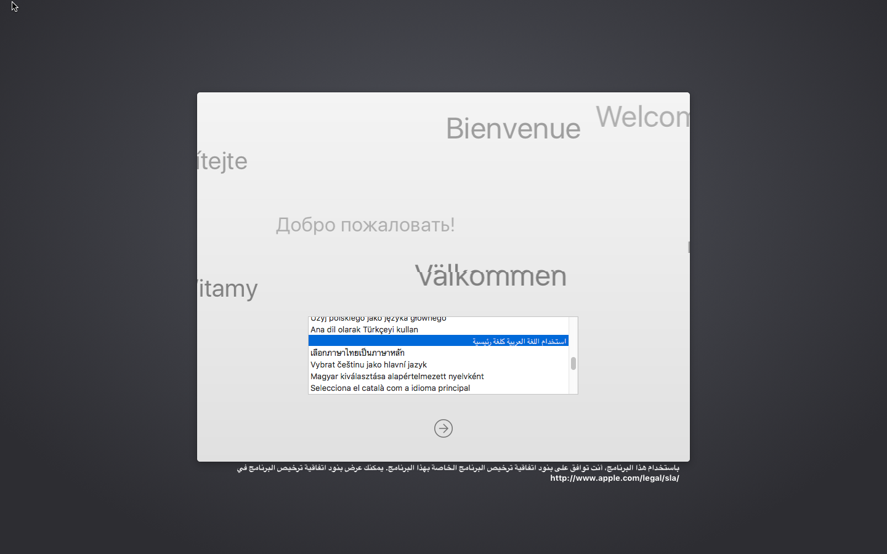
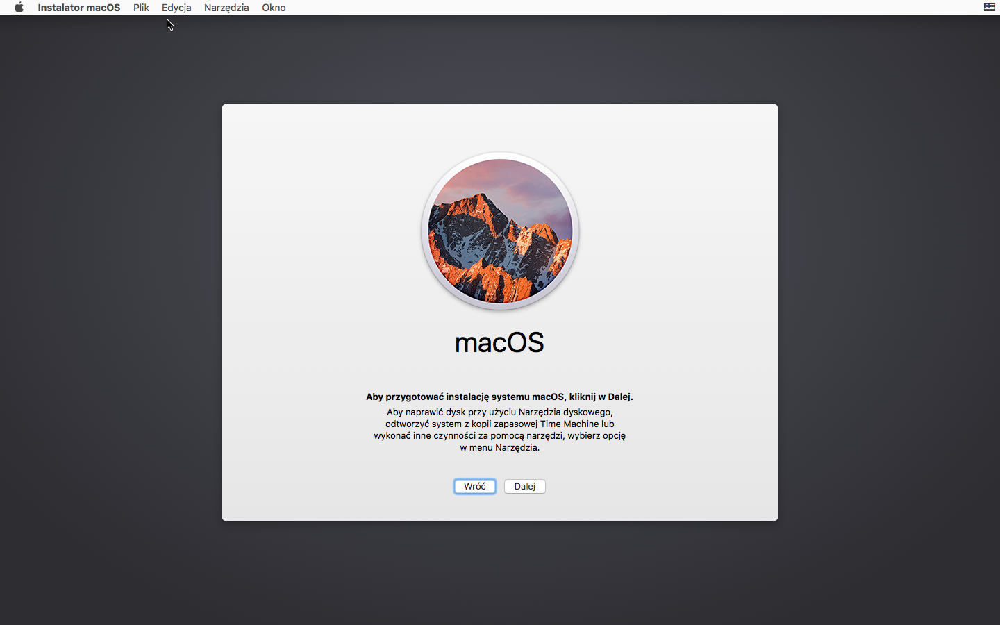
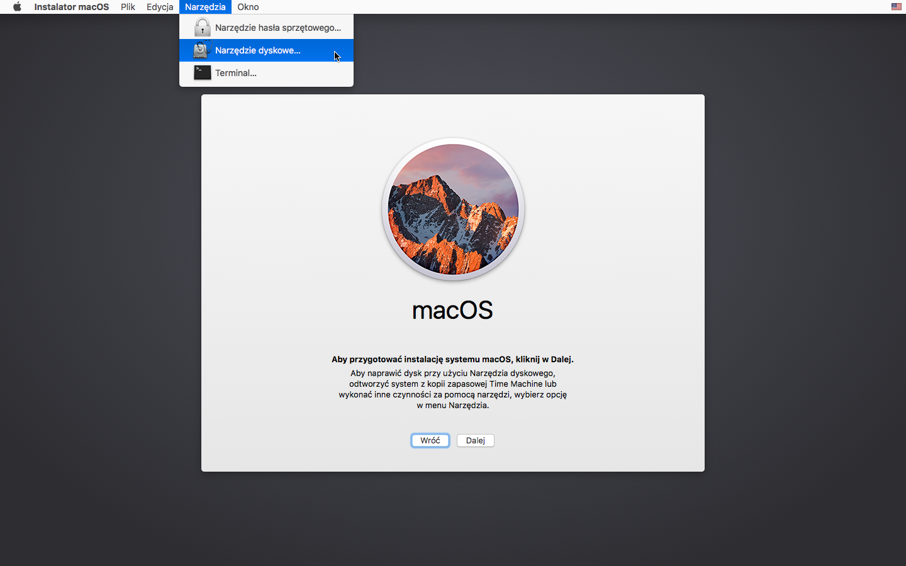
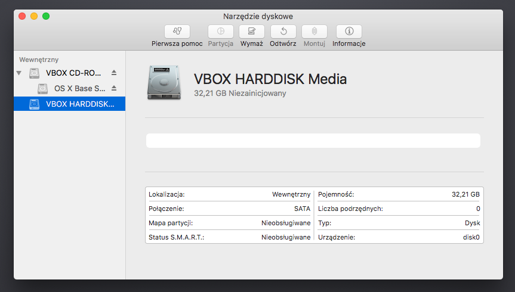
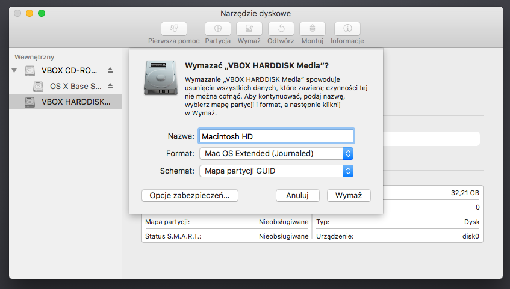
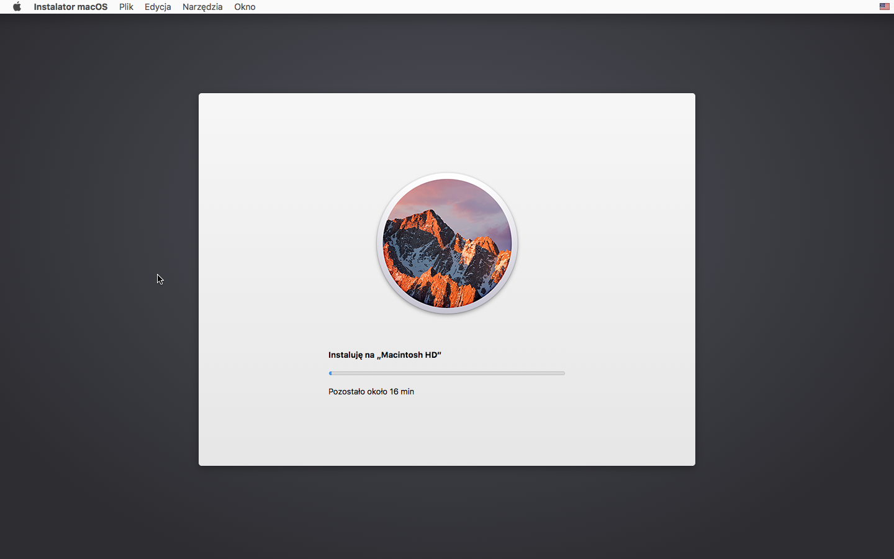
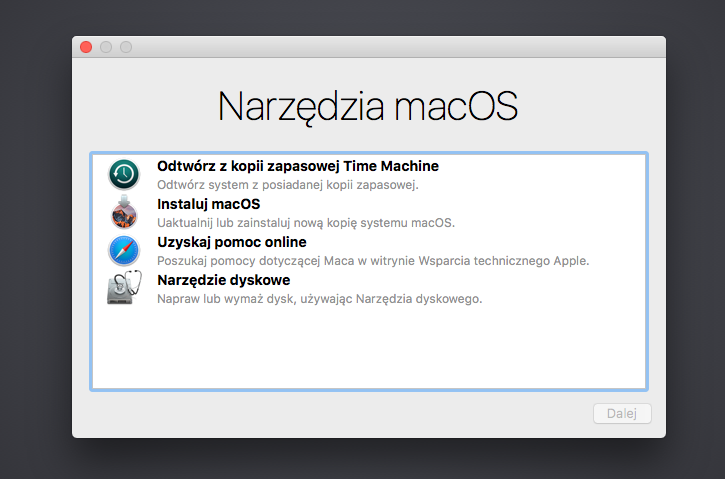
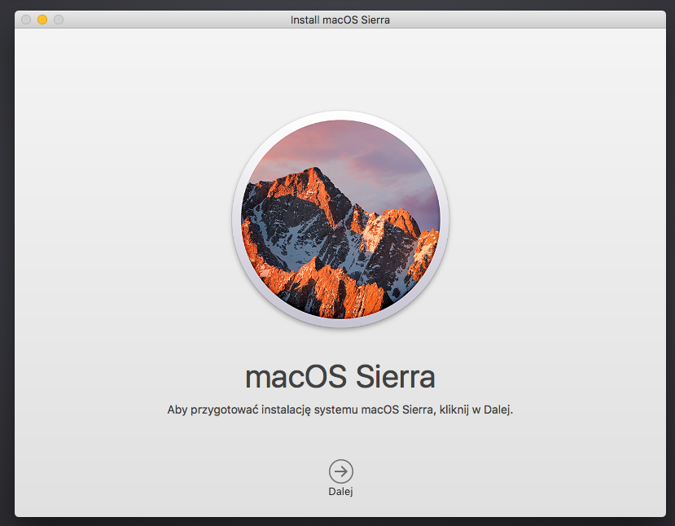
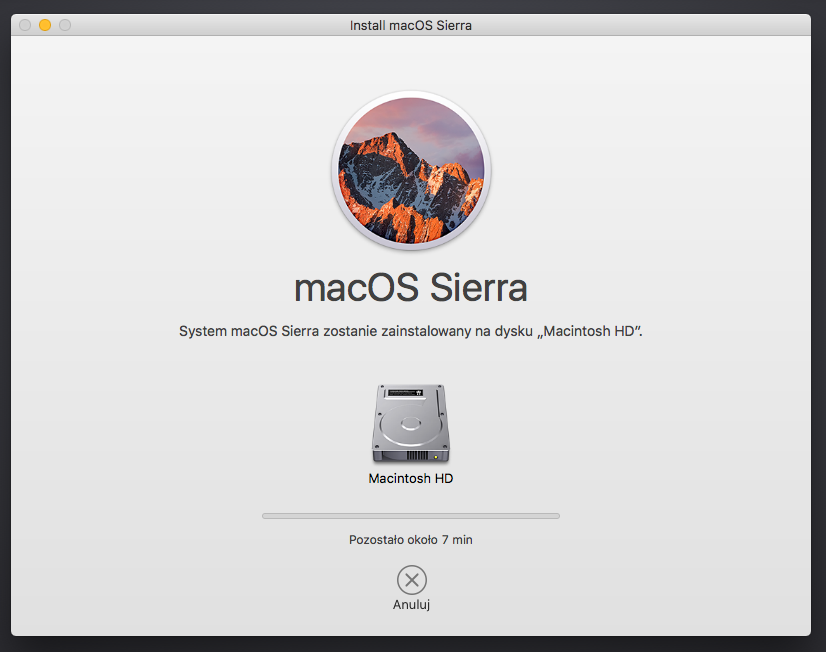
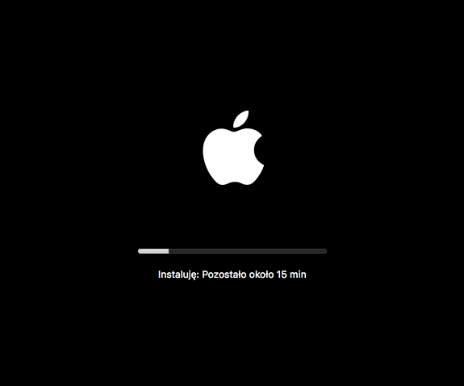

# Instalacja systemu macOS

Instalacja systemu operacyjnego nie różni się wiele od instalacji Windows. Jestem nawet w stanie powiedzieć, że instalacja macOS jest bardziej przyjazna niż instalacja Windows. W tym rozdziale postaram się przybliżyć jak zainstalować jabłkowy system operacyjny krok po kroku. Wiedząc, że istnieją dwie możliwości stworzenia pendrive instalacyjnego pokażę jak sobie radzić w  dwóch przypadkach - `createinstallmedia` oraz Metody Narzędzia Dyskowego, których przygotowanie jest opisane w następnym rozdziale.

Na pewno będziemy potrzebować:

* Utworzony pendrive z instalacją macOS
* Trochę cierpliwości


Od wersji macOS 10.13 High Sierra Apple zmieniło domyślny widok dysków w Narzędziu dyskowym. Teraz aby wyświetlić wszystkie zainicjowane dyski musimy w aplikacji zaznaczyć do *Widok > Pokaż wszystkie urządzenia*


## Instalacja macOS z pendrive skopiowanym przez Narzędzia Dyskowe {#disku}
Po uruchomieniu instalatora przywita nas wybór języka, którego mamy używać jako języka głównego. Wybór jest zasadniczo osobisty więc nie będę się tutaj rozpisywać.



Po wybraniu odpowiadającego nam języka ukaże nam się okno główne instalatora. Jeżeli mamy odpowiednio podzielony dysk twardy na partycję możemy przejśc do kolejnego etapu klikając dalej.



Jeżeli jednak nie mamy odpowiednio sformatowanego dysku twardego musimy przejść do programu *Narzędzia Dyskowe* poprzez wybranie *Narzędzia > Narzędzie dyskowe*



Pojawi nam się okno narzędzi dyskowych. Aby sformatować cały dysk wybieramy nazwę naszego dysku i kliamy *Wymaż*.



Po wybraniu odpowiedniego dysku i kliknięciu przycisku *Wymaż* naszym oczom ukaże się karta wyboru opcji formatowania dysku. Abyśmy mogli zainstalować poprawnie macOS musimy wybrać:

* Preferowaną przez nas nazwę dysku, w tym wypadku jest to *Macintosh HD*
* Format partycji *macOS Extended (Kronikowany)*
* Mapę partycji *GUID* **Główny Rekord Rozruchowy (MBR) nie jest kompatybilny z macOS!**

Kiedy już wszystko wybierzemy klikamy przycisk *Wymaż*. Możemy już zamknąć Narzędzie Dyskowe.



Po zamknięciu wrócimy do instalacji systemu. Klikamy *Dalej*, Akceptujemy postanowienia licencyjne, Wybieramy naszą sformatowaną partycję i czekamy aż nasz instalator zakończy pracę.



## Instalacja macOS z dysku Recovery {#recovery}
Po uruchomieniu naszego instalatora pojawi nam się standardowo okno wyboru języka. Wybieramy język i przechodzimy dalej. Ukaze nam sie okno o nazwie *Narzędzia macOS*. Mamy tutaj dostęp do kilku opcji. Będą nas interesować głównie dwie - *Instaluj macOS*, oraz *Narzędzie dyskowe*.



Jeżeli nie sformatowaliśmy dysku to wybieramy za pomocą myszy opcję *Narzędzie dyskowe* i postępujemy wg instrukcji formatowania dysku powyżej. Po skończonej operacji zamykamy Aplikację.

Wybieramy opcję *Instaluj macOS*. Pojawi nam się okno instalatora.



Akceptujemy postanowienia licencyjne, wybieramy dysk, na którym chcemy zainstalować Maczka.



Instalator rozpocznie pierwszą preparację instalacji. Po zakończeniu komputer uruchomi się ponownie i przejdzie do właściwej instalacji systemu. **Instalacja ta jest dwuetapowa!**



## Instalacja macOS 10.13 na dysku SSD HFS+ {#hfs}

Od wersji systemu macOS 10.14 Mojave APFS jest **domyślnym** systemem plików dla dysków HDD oraz SSD.


Problemy z APFS nie nie są ustaloną regułą. U jednych mogą wystąpić, u innych niekoniecznie. Przed zastosowaniem tego sposobu najlepiej przetestować działanie systemu pod tym systemem plików.

Jak każdy wie nowe nie zawsze znaczy lepsze. Tak jest w przypadku systemu plików APFS. Domyślnie Apple gwarantuje, że APFS będzie działać poprawnie z każdym dyskiem SSD czy to NVMe czy SATA. Niestety nie jest tak różowo jak się wydaje. Problemy APFS to głównie:

* spowolnienia bądź zacięcia systemu
* wolny czas bootowania systemu
* źle funkcjonujący TRIM na dysku nie-Apple
* brak statusu/odświeżania baterii w laptopach

I wiele więcej.

Rozwiązaniem w tym wypadku jest użycie domyślnego systemu plików macOS Extended, czyli HFS+. Problemem jest to, że instalator macOS domyślnie konwertuje naszą partycję do APFS. Z odsieczą przychodzi Terminal i aplikacja terminalowa `startosinstall`.

Wymagania:

* Dysk SSD sformatowany na GUID z partycją HFS+
* Pendrive instalacyjny macOS 10.13 wykonany metodą `createinstallmedia`
* Podtawowa znajomość terminala

Uruchamiamy instalator macOS 10.13 i po sformatowaniu naszego dysku przez Disk Utility otwieramy Terminal. Aby to zrobić zamykamy Disk Utility i uruchamiamy Terminal wybierając na górnym pasku *Narzędzia > Terminal*.

Wpisujemy w terminalu komendę
  ```bash
/Volumes/"Image Volume/Install macOS High Sierra.app"/Contents/Resources/startosinstall --volume /Volumes/targetVolume --converttoapfs NO --agreetolicense
```
Gdzie `targetVolume` to nazwa naszej partycji sformatowanej pod HFS+.

Po tym zabiegu instalator powinien zacząć przygotywać pliki instalacyjne bez obawy o konwersję do APFS. Komputer uruchomi się ponownie i zacznie się właściwa instalacja systemu.
