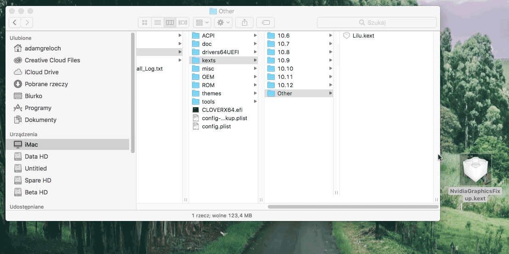
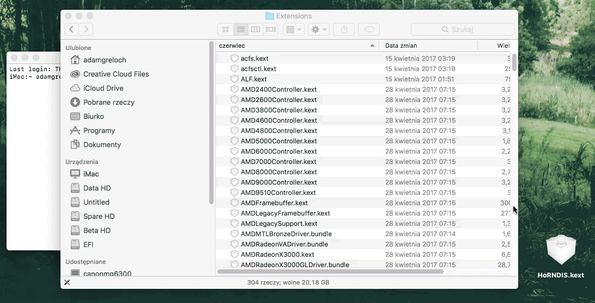
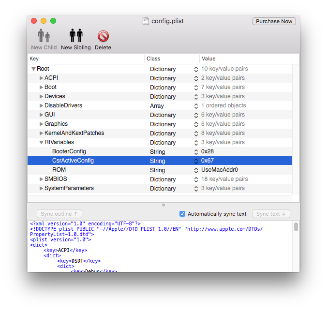

# Kexty

Po w pełni przygotowanym bootloaderze nadszedł czas na urozmaicenie naszego Hackintosha w niezbędne do działania rozszerzenia dodające między innymi wsparcie dla niestandardowych urządzeń tj. wszelkie karty graficzne, sieciowe, dźwiękowe, porty USB itd.

Mowa tutaj o **kexcie** - dynamicznie ładowanym rozszerzeniu jądra systemu operacyjnego. W działaniu jest bardzo podobny do rozszerzeń stosowanych w Windowsie, czyli tzw. sterowników. Oba te rozszerzenia należą do grupy ładowalnych modułów jądra (z ang. **loadable kernel module**, w skrócie LKM) a ich funkcją jest rozszerzanie kernela o dodatkowe funkcje takie jak np. wsparcie dla urządzeń o których była mowa powyżej.

W tym rozdziale poradnika będzie poruszane sporo teorii systemu macOS od wewnątrz, dlatego postanowiłem dodać parę dodatkowych informacji, które nieco wyjaśniają działanie danych elementów.

Odnośniki, które przeniosą nas do kontynuacji o danym temacie, wykraczającej poza podstawowy proces stawiania Hackintosha, będzie można znaleźć w trakcie czytania rozdziału.

**Nie są one kluczowe dla instalacji Hackintosha, lecz mogą zaciekawić i wytłumaczyć działanie pewnych mechanizmów systemu pod interfejsem graficznym.**

## Wprowadzenie do kextów {#wprowadzenie}
Zanim przejdziemy do części instalacji kextów, warto dowiedzieć się kilku kluczowych informacji odnośnie ich typów oraz jak je rozróżniać.

Każdy kext składa się z ściśle określonych elementów. Wszystkie razem dają kextowi instrukcje funkcjonowania, przydzielają mu określone funkcje i dają zasoby do wykorzystania:

* **Information Property List**

  Lista własności kexta. Jest to niezbędna część każdego kextu, czyli plik `Info.plist`. Opisane są tam między innymi własności, przeznaczenie oraz działanie kexta oraz jego zawartości. Ponieważ kexty mogą być ładowane podczas wstępnego rozruchu systemu, kiedy przetwarzanie danych jest ograniczone, lista własności musi zostać sformatowana w XML i nie może zawierać komentarzy.

* **Executable**

  Skompilowany kod wykonawczy kexta. Jest on odpowiedzialny za zdefiniowanie punktów wejścia, które umożliwiają ładowanie i wyłączanie kexta. W tej części znajduje się cały kod kexta, czyli funkcje o które zostanie rozszerzone jądro.

* **Resources**

  Miejsce na zasoby. To wszelkiego typu zasoby potrzebne do funkcjonowania kextu tj. firmware dla urządzenia. Obecność `Resources` zależy od potrzeb kextu - niektóre potrzebują zewnętrznych zasobów, niektóre nie.

Ze względu na to, że kexty mają różne zastosowania i funkcje oraz że jedne zawierają pewne części, których drugie nie posiadają, możemy je podzielić na dwa typy. Są to:

* **Dummy kext**

  Inaczej *codeless kext*. Jest to typ kexta niezawierający kodu wykonawczego. Jego główną rolą jest przypisywanie urządzeniom już aktualnie istniejące kexty i rozbudowanie listy własności o dodatkowe urządzenia.

  Aby zobrazować jego działanie powiedzmy, że mamy drukarkę. Jak wiemy, ilość modeli drukarek jest ogromna, przez co Apple nie jest w stanie uwzględnić każdego z nich w kexcie odpowiedzialnym za obsługę drukarek w swoim systemie. Za to prawie wszystkie drukarki są kompatybilne z **ogólnym sterownikiem** (*z ang. generic driver*) do drukarek w macOS'ie, ale system nie ma instrukcji mającej na celu przywołanie tego sterownika przy podłączeniu naszej drukarki.

  Z pomocą przychodzi `dummy kext`, który jest z reguły dołączany do drukarki. Modyfikuje on `Info.plist` ogólnego sterownika tak, aby kext uwzględniał naszą drukarkę i ładował się po jej podłączeniu. Dzięki temu możemy używać naszej drukarki, korzystając z domyślnego kexta w systemie.

* **Pełne rozszerzenie jądra**

  Pełne rozszerzenie, posiadające `Info.plist`, kod wykonawczy oraz, w zależności od potrzeb, miejsce na zasoby. Jego główną rolą jest rozszerzenie jądra o dodatkowe, nieuwzględnione wcześniej w systemie, wsparcie dla niestandardowych urządzeń, których nie można przypisać za pomocą `Dummy Kexta` do już istniejącego sterownika, ze względu na brak wsparcia/kompatybilności jego określonych funkcji.

  Załóżmy, że jesteśmy w posiadaniu klawiatury PS/2. macOS nie wspiera natywnie peryferii korzystających z portu PS/2, dlatego aby korzystać z takiej klawiatury, musimy zainstalować pełny kext umożliwiający korzystanie z urządzeń PS/2.

## Instalacja kextów {#installation}

Przechodzimy do praktycznej części rozdziału. Dowiemy się teraz jakie są sposoby instalacji rozszerzeń oraz jak z nich skorzystać. Istnieją trzy główne metody instalacji kexta do dwóch możliwych miejsc:

* **Clover inject**

  To najwygodniejsza metoda instalacji kextów bez większego wysiłku. Wystarczy zamontować partycję EFI i wrzucić kexty do folderu `/EFI/Clover/kext/[wersja macOSa lub folder Other]`.

  

* **Klasyczna instalacja do /S/L/E lub /L/E**

  Ta metoda opiera się na sposobie instalacji kextów tak jak na prawdziwych komputerach typu Mac. Cały myk polega na wrzuceniu kexta do specjalnego folderu wewnątrz plików systemowych (bądź do folderu `/Library/Extensions`, w którym znajdują się pozostałe kexty) na naszym dysku, naprawie uprawnień i przebudowie cache'u. Brzmi skomplikowanie, lecz wcale takie nie jest:

  

  1. Kexta wrzucamy do folderu, w którym znajdują się wszystkie kexty systemowe, czyli `/System/Library/Extensions`.

  2. Wrzucone przez nas kexty mogą mieć niepoprawne (za niskie lub za wysokie) zezwolenia dostępu. Chcemy uniknąć sytuacji w której nasze kexty mogą zostać zmodyfikowane bez naszej wiedzy, lub takiej w której nikt nie ma wystarczających uprawnień aby je odczytać i uruchomić.

    Komendy `chmod` oraz `chown` poradzą sobie z tym bez problemu:
```
$ sudo chmod -R 755 kextfile.kext
$ sudo chown -R root:wheel kextfile.kext
```

  3. Przebudowa kextcache to ostatni i najważniejszy krok instalacji. Bez przebudowy cache'u nasz kext nie będzie działać. Wykonujemy ją więc przy użyciu komendy `kextcache`:
```
$ sudo kextcache -system-prelinked-kernel
$ sudo kextcache -system-caches
```
lub
```
sudo kextcache -i /
```

* **Instalacja do /S/L/E przy użyciu Kext Utility**

  Istnieje łatwiejsza metoda instalacji kextów do  `/S/L/E`. Wykorzystuje ona bardzo praktyczne narzędzie o nazwie *Kext Utility*. Można je pobrać stąd:
  http://cvad-mac.narod.ru/index/0-4

  Użycie jest banalne. Wystarczy tylko przeciągnąć kexta do okna narzędzia lub przeciągnąć plik kexta na ikonke KU. Jeśli nie podamy kextu do instalacji, KU wykona naprawę uprawnień i odświeży kernelcache.

  


## Wybór sposobu instalacji {#choice}
Podane wyżej sposoby różnią się od siebie pod paroma względami. W tym momencie naistotniejszym z nich jest moment ładowania kextów, które zainstalowaliśmy. Bowiem kexty, które mają zostać załadowane przy użyciu *Clover inject*, ładują się wcześniej od tych wrzuconych do `S/L/E`. Clover ładuje wszystkie kexty zawarte w `EFI/CLOVER/kexts` jeszcze przed samą inicjalizacją rozruchu macOS'a. Dopiero w pewnym etapie rozruchu naszego systemu załadowywane są kexty z `S/L/E`.

Musimy o tym pamiętać podczas instalacji kextów `dummy`, których **nie można** instalować poprzez *Clover inject*. Kexty `dummy` wymagają pełnego rozszerzenia systemowego znajdującego się w `S/L/E` do poprawnego funkcjonowania. Wrzucając `dummy kexta` do `EFI/CLOVER/kexts` sprawiamy, że będzie załadowany przed danym kextem w `S/L/E`, którego miał na celu rozbudować. `Dummy kext` załadowany przed kextem do rozbudowania nie ma czego rozbudować, więc tak naprawdę nie działa i nie pełni zamierzonej funkcji. Dlatego też kexty typu `dummy` musimy instalować *klasyczną metodą instalacji kextów w systemie macOS*.

## Które kexty instalować {#kextlist}

Co prawda ten rozdział stawia na uniwersalność, ale warto wspomnieć o doborze kextów. Oczywiście podstawą jest *FakeSMC* (o którym więcej szczegółów można znaleźć w liście popularnych kextów poniżej), bez którego macOS nie uruchomi się na naszym komputerze. Zalecamy instalację go poprzez *clover inject*.

Na początek przydatny będzie również sterownik karty sieciowej LAN, o którym będzie mowa w następnych rozdziałach.

Istnieje wiele popularnych i często używanych kextów przy instalacji Hakcintosha. Niektóre z nich są uniwersalne, czyli można je zainstalować na każdym komputerze, a niektóre są nam potrzebne w zależności od tego jaką specyfikację komputera posiadamy. Warto znać nazwy i zastosowanie kextów przed ich instalacją, dlatego postanowiliśmy przygotować bazę zawierającą takie informacje.


Są to podstawowe i w miarę uniwersalne kexty, które warto posiadać. Dobór reszty kextów zależy od naszej specyfikacji komputera, także zanim weźmiemy się za instalację reszty, warto przeczytać ich dokumentację w oficjalnym repozytorium.



Przed instalacją każdego kexta warto zapoznać się z jego dokumentacją znajdującą się w jego oficjalnym repozytorium


| Nazwa| Kategoria| Opis |
|----|-----|
| *FakeSMC* 	| Emulacja SMC 	| **Podstawowy kext bez którego uruchomienie macOS'a na komputerze PC jest niemożliwe.** FakeSMC emuluje Kontroler Zarządzania Systemem (SMC - z ang. System Management Controller). Zadaniem tego kontrolera jest m.in. kontrola temperatur i power management. Komputery klasy PC nie posiadają takiego kontrolera, dlatego potrzebna jest jego emulacja. **Repozytorium:** https://bitbucket.org/RehabMan/os-x-fakesmc-kozlek lub https://sourceforge.net/projects/hwsensors3.hwsensors.p/ 	|
| *VirtualSMC* | Kext i Plugin Lilu | Plugin Lilu zapewniający zaawansowaną emulację kontrolera SMC w wersji 2. Zastępuje całkowicie FakeSMC. **Repozytorium** https://github.com/acidanthera/VirtualSMC |
| *VoodooPS2Controller* 	| Wsparcie urządzeń PS/2 	| **Kext rozszerzający jądro systemu o wsparcie dla peryferii używających standardu PS/2.** Jest często wymagany w przypadku laptopów, gdyż większość touchpadów i klawiatur montowanych w laptopach nadal używa PS/2. **Repozytorium:** https://bitbucket.org/RehabMan/os-x-voodoo-ps2-controller	|
| *Kexty do kart sieciowych* 	| LAN | **Sterowniki do kart sieciowych.** Kart jest wiele, dlatego instalację kextów sieciowych pokryjemy w następnych rozdziałach. |
| *FakePCIID* | Emulacja PCI-ID 	| **Zadaniem tego kexta jest przypisywanie alternatywnych identyfikatorów do urządzeń PCI, aby umożliwić ich poprawne działanie na Hackintoshu.** Jest używany do uruchomienia kart graficznych Intela opartych na architekturze Haswell. Repozytorium: https://bitbucket.org/RehabMan/os-x-fake-pci-id |
| *USBInjectAll* | Wsparcie USB | Kext zapewnia inicjalizację wszystkich portów USB dostępnych w komputerze. Właściwa konfiguracja będzie opisana w następnych rozdziałach. **Repozytorium:** https://bitbucket.org/RehabMan/os-x-usb-inject-all/downloads/ |
| *AppleALC* 	| Audio | **Rozszerzenie jądra systemu umożliwiające działanie dźwięku dla niewspieranych oficjalnie kodeków.** Jest rozbudowywany przez wielu użytkowników dodających wsparcie dla różnorakich kodeków. Repozytorium: https://github.com/acidanthera/AppleALC |
| *AirportBrcmFixup* | Plugin Lilu | Plugin zawierający łatki dla różnych modeli kart Wi-Fi firmy Broadcom. **Repozytorium:** https://github.com/acidanthera/AirportBrcmFixup |
| *BrcmPatchRAM* 	| Wsparcie dla kart Bluetooth Broadcom 	| Kext dodający wsparcie dla urządzeń Bluetooth Broadcom. **Repozytorium:** https://bitbucket.org/RehabMan/os-x-brcmpatchram 	|
| *Lilu* 	| Platforma arbitrary | **Kext rozszerzający jądro o platformę dla arbitrary kextów, bibliotek i program patchingu.** Dokładny opis będzie znajdować się w przyszłych rozdziałach. **Repozytorium:** https://github.com/acidanthera/Lilu |
| *WhateverGreen* | Plugin Lilu | Plugin wprowadzający patche dla kart graficznych NVIDIA/Intel/AMD **Repozytorium:** https://github.com/acidanthera/WhateverGreen |
| *HibernationFixup* | Plugin Lilu | Plugin naprawiający problemy z obsługą hibernacji na Hackintoshu. **Repoytorium:** https://github.com/acidanthera/HibernationFixup |

Wybór odpowiednich kextów jest ściśle powiązany ze specyfikacją sprzętową posiadaną przez nas. Natomiast istnieje grupa kextów, która jest **wymagana** bez względu na posiadane podzespoły.

Podstawowa lista dla komputerów stacjonarnych:

* FakeSMC.kext (lub VirtualSMC.kext)
* Lilu.kext
* WhateverGreen.kext
* USBInjectAll.kext (lub FakePCIID.kext + FakePCIID_XHCIMux.kext **do generacji Haswell**)
* AppleALC.kext
* Odpowiedni kext dla Ethernetu

Podstawowa lista dla laptopów:

* FakeSMC.kext (lub VirtualSMC.kext)
* Lilu.kext
* WhateverGreen.kext
* USBInjectAll.kext (lub FakePCIID.kext + FakePCIID_XHCIMux.kext **do generacji Haswell**)
* AppleALC.kext
* Odpowiedni kext dla Ethernetu
* VoodooPS2Controller.kext

## Dodatkowe informacje {#bonus}

### info.plist - Z czego się składa?

Plik `Info.plist` zawiera kilka niezbędnych elementów do poprawnego funkcjonowania. Są to elementy typowe dla pakietów (bundle), będącymi fundamentalną technologią w macOS, używanymi do przechowywania kodu i zasobów. W końcu kext to tak naprawdę ładowalny pakiet zawierający rozszerzenia. Tymi niezbędnymi elementami listy własności są:

- `CFBundleIdentifier` - używany do identyfikowania kextu oraz lokalizowania go zarówno na dysku jak i w kernelu. Na dysku może znajdować się dowolna ilość kextów o tym samym identyfikatorze, ale tylko jeden z nich może zostać załadowany do kernela. Wartość identyfikatora jest zapisywana w formacie `reverse-DNS` (np. *org.rehabman.voodoo.driver.PS2Controller*).
- `FBundleExecutable`- określa nazwę kodu wykonywawczego, jeśli kext takowy posiada.
- `CFBundleVersion` - wskazuje na wersję kexta, która musi trzymać się ścisłego wzoru dzięlącego numer wersji na trzy części np. 2.1.3. Pierwsza część reprezentuje ostatnie główne wydanie wprowadzające większe zmiany, druga część reprezentuje znaczącą rewizję, ale nie aż tak jak główne wydanie, a trzecia część reprezentuje ostatnie małe poprawki np. bug fixy.
- `OSBundleLibraries` - zawiera listę bibliotek (które również są kextami, tak na marginesie), z którymi kext ingeruje i powiązuje się
- `IOKitPersonalities` - jest używany przez sterownik I/O dla automatycznego ładowania kexta kiedy jest potrzebny

Wszystko co pozwala odróżnić i poznać przeznaczenie kextów znajduje się w `Info.plist`. Bez listy własności żaden kext nie jest w stanie funkcjonować.

### S/L/E czy EFI/CLOVER/kexts?

Każdy kiedyś będzie musiał stanąć przed dylematem: instalować do `/S/L/E` czy do `/EFI/CLOVER/kexts`? Obie z tych opcji mają swoje wady i zalety i postanowiłem je tu zamieścić.

Jak już wcześniej wspomniałem, obie opcje różnią się momentem ładowania kextów. Instalacja do `/S/L/E` sprawia, że instalowane przez nas kexty ładują się podczas inicjalizacji systemu a zatem dużo później od tych w `/EFI/CLOVER/kexts`. Dlaczego tak się dzieje? Otóż sposób ładowania kextów poprzez Clovera czyli tzw. *clover inject* ładuje kexty znajdujące się w folderze `/kexts` **przed** samą inicjalizacją rozruchu systemu, czyli przed ładowaniem przez system jakichkolwiek plików potrzebnych do jego inicjalizacji (uruchomienia). Tak jak wspomniałem jest to bardzo istotne w przypadku kextów *dummy*, które nie mogą być instalowane do `/EFI/CLOVER/kexts`.

Drugą istotną różnicą jest szybkość ładowania. Ładowanie kextów znajdujących się w `/S/L/E` trwa stosunkowo krócej niż tych w `/kexts`, jeśli instalujemy macOS'a na dysku HDD. Osobiście mogę potwierdzić, że w przypadku dysków SSD różnica jest praktycznie zerowa i kexty ładowane przy użyciu obu sposobów ładują się niemal natychmiastowo bez żadnej różnicy, dlatego nie ma się czym martwić.

* **Clover inject:**
  * szybka i stosunkowo prosta instalacja
  * łatwiejsze zarządzanie instalowanymi kextami
  * zachowanie SIP (system integrity protection - kexty przetrwają aktualizację do nowszej wersji i nie zostaną nadpisane)
  * wydłuża czas bootowania na dyskach HDD
  * nie można instalować kextów dummy tą metodą


* **System/Library/Extensions:**
  * krótszy czas bootowania na dyskach HDD
  * możliwość instalacji kextów dummy
  * kexty mogą być nadpisane przy aktualizacji (SIP)
  * instalacja jest bardziej złożona niż clover inject

Podsumowując:
*Clover inject* pod większością względów wypada lepiej. My również uważamy tę metodę jako najlepszą i używamy jej w większości przypadków. Pozwala zachować integralność SIP, jest łatwiejsze w obsłudze i gdy pomylimy się w doborze kextów, zawsze możemy uruchomić system używając naszego pendriva z Cloverem, na którym nie instalowaliśmy kextów sprawiających problemy.

### System Integrity Protection (SIP)

Ochrona Integralności Systemu (*z ang. System Integrity Protection*, w skrócie SIP) jest to rozwiązanie mające na celu zwiększyć bezpieczeństwo systemu poprzez ograniczenie uprawnień superusera (konto root/administrator systemu) co uniemozliwia wyrządzanie szkód w systemie przez niechciane oprogramowanie.

Niestety, nasze kexty również są traktowane jako *niechciane* oprogramowanie, ponieważ są niepodpisane, przez co próba instalacji ich wewnątrz plików systemowych jest traktowana jako atak malicious software'u. Aby temu zaradzić należy dodać zmienną ''CsrActiveConfig'' do naszego pliku konfiguracyjnego Clovera. Są trzy działające zmienne:

| Wartość | Skutek |
|:----:|:----|
| 0x0| Wartość pozostawiająca SIP włączone                                                    	|
| 0x3 | Wartość pozostawiająca SIP włączone, ale umożliwiająca ładowanie niepodpisanych kextów 	|
| 0x67 | Wartość wyłączająca większość blokad SIP - do 10.12 |
| 0x3E7 | Wartość dezaktywująca wszystkie blokady SIP (kompletna dezaktywacja)(Wymagane od 10.13) |

`CsrActiveConfig` znajduje się w elementarzu `RtVariables`:



Po wykonaniu powyższych kroków nie powinniśmy mieć już więcej problemów z instalacją kextów wewnątrz `/System/Library/Extensions`.
