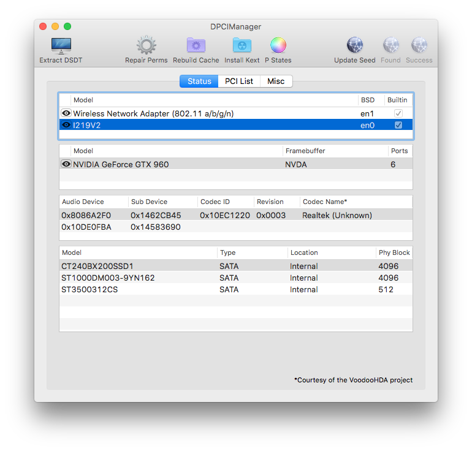

# Sieć LAN
Podczas tworzenia swojego Hackintosha może się zdarzyć, że musimy wejść na naszą stronę, by sprawdzić kolejny element poradnika. Wchodzimy w Safari, ale niestety nie działa nam internet.

W tym rozdziale opiszemy wam jak sobie z tym radzić.

## Rozpoznawanie karty sieciowej {#rozpoznawanie_karty}
*Jeśli znasz już dokładny model Twojej karty sieciowej, możesz pominąć ten krok*

[DPCIManager](https://sourceforge.net/projects/dpcimanager/) pozwoli nam określić, jaką kartę sieciową mamy zainstalowaną.
Po uruchomieniu *DPCIManager* otwiera nam się okno z zakładką *Status* wraz z modelem naszej karty.



W moim przypadku jest to **I219V2**, czyli zintegrowana karta sieciowa **Intela**.

W przypadku, gdy te informacje nam nie wystarczają, możemy skorzystać z drugiej zakładki **PCI LIST**.

Aby wczytać urządzenia w tej zakładce, należy wcisnąć **Update Seed** oraz **Update IDs**.


  W przypadku błędu, należy przenieść DPCIManager do innej lokalizacji i powtórzyć działanie.


Na liście znajdujemy naszą kartę i jej model.


## Zintegrowane Karty LAN
Do najpopularniejszych modeli możemy zaliczyć:
```
  Realtek Ethernet Controller
  Intel Ethernet Connection
  Atheros Ethernet Controller
```
Układ sieciowy | Sposób uruchomienia | Link do kextu
:------------: | :-----------------: | :-----------:
Realtek 8111/8168 | [Przejdź](#realtek) | [Realtek RTL8111.kext](https://www.insanelymac.com/forum/files/file/88-realtekrtl8111-binary/)
Realtek RTL810X | [Przejdź](#realtek) | [RealtekRTL8100.kext](https://www.insanelymac.com/forum/files/file/259-realtekrtl8100-binary/)
Intel Ethernet Connection | [Przejdź](#intel) | [IntelMausiEthernet.kext](https://www.insanelymac.com/forum/files/file/396-intelmausiethernet/) lub [AppleIntelE1000e.kext](https://www.insanelymac.com/forum/files/file/505-appleintele1000ekext/)
Atheros AR816x, AR817x, Killer E220x, Killer E2400, Killer E2500 | [Przejdź](#atheros) | [AtherosE2200Ethernet.kext](<https://www.insanelymac.com/forum/files/file/313-atherose2200ethernet/)
Atheros AR8131, AR8132, AR8151, AR8152 | [Przejdź](#atheros) | [AtherosL1cEthernet.kext](https://www.insanelymac.com/forum/files/file/374-atherosl1cethernetkext/)
Marvell Yukon 88E8040| --- | Nie działa
Marvell Yukon 88E8056| [Przejdź](#marvell) | [Marvell Yukon 88E8056](https://www.insanelymac.com/forum/files/file/455-marvell-yukon-88e8056-1011/)
Marvell Yukon 88E8059| --- | Nie działa
Broadcom BCM57XX | [Przejdź](#broadcom) | [FakePCIID](https://bitbucket.org/RehabMan/os-x-fake-pci-id/src/master/)


### Realtek Ethernet Controller - RTL810X/RTL8111/8168 {#realtek}
Realtek jest jednym z często spotykanych układów odpowiedzialnych za obsługę sieci w naszych komputerach.
Do poprawnego działania tego układu wystarczy wrzucenie odpowiedniego kextu do naszego EFI.

W przypadku, gdy mamy kartę sieciową Realteka RTL810X - pobieramy [Realtek's RTL810X Network Kext](https://www.insanelymac.com/forum/files/file/259-realtekrtl8100-binary/)

Gdy natomiast mamy kartę Realteka RTL8111/8168 - pobieramy [Realtek's RTL8111/8168 Network Kext](https://www.insanelymac.com/forum/files/file/88-realtekrtl8111-binary/)

W oby dwóch przypadkach wrzucamy kext do ``EFI/CLOVER/Kexts/Others/``.


  Zawsze wybieramy wersję kextu z folderu RELEASE. Jednakże, DEBUG jest przydatny kiedy chcemy sprawdzić działanie sterownika podczas troubleshootingu, ponieważ pokazuje on więcej informacji. Jeżeli ktoś ma jakiś problem, to właśnie najlepiej jest użyć kextu DEBUG i szukać w logach systemowej konsoli.


Po restarcie, sieć powinna działać bez problemu.

### Intel Ethernet Connection {#intel}
Intel poza procesorami również produkuje m. in. karty sieciowe.
Układów na których intel opiera obsługę sieci jest zdecydowanie więcej od wcześniej wspomnianego Realteka, jednak w tym wypadku mamy tylko jeden kext.

Główne układy, dla których IntelMausiEthernet.kext powinien działać bezproblemowo:
```
  IntelMausiEthernet.kext
  - 5 Series
    - 82578LM
    - 82578LC
    - 82578DM
    - 82578DC
  - 6 and 7 Series
    - 82579LM
    - 82579V
  - 8 and 9 Series
    - I217LM
    - I217V
    - I218LM
    - I218V
    - I218LM2
    - I218V2
    - I218LM3
  - 100 Series
    - I219V
    - I219LM
    - I219V2
    - I219LM2
    - I219LM3
```
Pobieramy [IntelMausiEthernet](https://www.insanelymac.com/forum/files/file/396-intelmausiethernet/) oraz wrzucamy analogicznie do ``EFI/CLOVER/Kexts/Others/``.

Po restarcie, sieć powinna również działać bez problemu.


  IntelMausiEthernet.kext jest to ulepszony i zmodyfikowany starszy AppleIntelE1000e.kext, który również w przypadku starszych platform może nam uratować życie. Tylko do systemu High Sierra.


[AppleIntelE1000e - Download Link](https://www.insanelymac.com/forum/files/file/505-appleintele1000ekext/)

### Atheros Ethernet Controller {#atheros}
W przypadku Atheros sprawa jest równie prosta, ponieważ również wystarczy wrzucić odpowiedni dla nas kext. W tym wypadku, tak samo jak w przypadku Realteka, są dwa kexty dla odopowiadających im kart.

**AtherosL1cEthernet**.kext - Atheros AR8131, AR8132, AR8151, AR8152 PCI-E Ethernet.
[AtherosL1cEthernet - Download Link](https://www.insanelymac.com/forum/files/file/374-atherosl1cethernetkext/)

**AtherosE2200Ethernet**.kext - Atheros AR816x, AR817x, Killer E220x, Killer E2400 oraz Killer E2500.
[AtherosE2200Ethernet - Download Link](<https://www.insanelymac.com/forum/files/file/313-atherose2200ethernet/)

Wybieramy odpowiedni dla nas kext i tak jak w przypadku dwóch poprzednich, również wrzucamy go do ``EFI/CLOVER/Kexts/Others/``.


  Nie używaj ALXEthernet.kext. Jeśli masz kartę Atheros i używasz kextu ALXEthernet, może to powodować różnorakie problemy, nieraz wydające się zupełnie niezwiązane z tym, ale mogą one być właśnie przez to. Częstymi problemami spowodowanymi tym kextem są problemy ze sleepem jak i kernel panici.


### Marvell Yukon {#marvell}
Oczywiście to nie wszystkie karty jakie istnieją, lecz najczęściej spotykane. Marvell jest kolejnym przykładem już rzadziej spotykanych, aczkolwiek dalej istniejących kart wśród użytkowników hackintoshy.

Dla jednych z najczęściej spotykanych układów **Marvell Yukon**'a możemy wyróżnić **88E8056**.

Jego uruchomienie jest również proste co powyższych kart, wystarczy sciągnąć  [Marvell Yukon 88E8056](https://www.insanelymac.com/forum/files/file/455-marvell-yukon-88e8056-1011/) i wrzucić go do ``EFI/CLOVER/Kexts/Others/``.

### Broadcom BCM57XX {#broadcom}
Czyli kolejna mniej spotykana, ale dość popularna seria kart Broadcom'a. Te karty odpalamy używając dwóch kextów, **FakePCIID.kext** oraz **FakePCIID_BCM57XX_as_BCM57765.kext**. Oba znajdziemy w poniższym archiwum.
[FakePCIID - Download Link](https://bitbucket.org/RehabMan/os-x-fake-pci-id/src/master/)

Po pobraniu, wrzucamy kexty do  ``EFI/CLOVER/Kexts/Others/`` oraz restartujemy sprzęt.

## Rozwiązywanie problemów {#troubleshooting}
Bardzo często usługi Apple, takie jak App Store, FaceTime czy iMessage na Hackintoshach działają nieprawidłowo i pokazują komunikaty związane z problemami z siecią.

W tej części poznamy kilka sposobów na naprawienie problemów z działaniem tych usług.
### EN(X) zamiast EN0
Najczęstszym powodem niedziałających usług takich jak App Store jest po prostu złe ustawienie karty sieciowej jak i SMBIOS.
Jeśli chodzi o kwestię SMBIOS, to należy mieć wygenerowane poprawne oraz niepowtarzalne wartości. Więcej o generowaniu odpowiednich wartości będzie w następnych poradnikach.

Na sam początek sprawdźmy czy nasza karta jest poprawnie przypisana w systemie.

Przechodzimy kolejno **Apple -> Ten Mac -> Raport Systemowy -> Sieć**.


W tym oknie widzimy informację o naszych kartach sieciowych, widzimy nazwę **Ethernet** oraz nazwę interfejsu (Nazwa BSD urządzenia).


  Karta Ethernet zawsze musi być podpięta na interfejsie EN0. W przypadku innego interfejsu usługi Apple mogą nie działać, bądź działać niepoprawnie.


W przypadku gdy karta nie jest na EN0 musimy dokonać drobnej korekcji przez zresetowanie usług sieciowych.

W tym celu otwieramy **Terminal** (Lauchpad -> Others -> Terminal) i w tym miejscu wpisujemy jedną z poniższych dwóch komend:
```
  sudo rm /Library/Preferences/SystemConfiguration/NetworkInterfaces.plist

  sudo rm -rf /Library/Preferences/SystemConfiguration
```
Powyższe komendy polegają na usunięciu obecnie działającej konfiguracji połączeń sieciowych. Pierwsza komenda usuwa główny plik konfiguracyjny usług sieciowych, druga zaś wszystkie informacje jakie są w systemie o sieci. Po usunięciu oraz ponownym uruchomieniu MacOS sam wygeneruje sobie nowe pliki.

Kolejno wykonujemy restart systemu. Po tej czynności możemy sprawdzić w Raporcie Systemowym czy nasze zmiany zostały zaaplikowane.

### Obsługa Ethernet pomimo braku interfejsu sieci przewodowej
W przypadku, gdy nasz notebook nie posiada kontrolera Ethernet jest to bardzo ważnym krokiem.
Większość usług może bez tego nie funkcjonować poprawnie, pomimo że system domyślnie MAC bierze sobie z interfejsu Thunderbolt. Aczkolwiek zabieg ten ma emulować weryfikację poprzez fikcyjny Ethernet.
Jednak nie mamy takiego interfejsu, co zrobić?

### Metoda "pustej karty"

Metoda ta polega na zainjectowaniu do systemu kext'u, który będzie udawał kartę ethernet, tak jakby była w komputerze.

Pobieramy [Null Ethernet Kext](https://bitbucket.org/RehabMan/os-x-null-ethernet/downloads/) oraz wrzucamy kext z RELEASE, do pozostałych kextów w ``EFI/CLOVER/Kexts/Others/``.

Poza kextem widzimy w folderze, który pobraliśmy więcej plików:
```
  NullEthernetInjector.kext
  patch.txt
  ssdt-rmne.aml
```
Pliki te odpowiadają za injectowanie NullEthernet'u oraz nadanie mu fałszywego MAC Address.

Istnieją 3 metody na zrobienie tego::

  - Edycja NullEthernetInjector.kextu
  - Patchowanie DSDT (dorzucenie patch'a z pliku patch.txt)
  - Edycja ssdt-rmne.aml

Zajmijmy się ostatnią - moim zdaniem najlepszą metodą.

Jedyną część którą musimy wyedytować za pomocą [Maciasl - Download](https://bitbucket.org/RehabMan/os-x-maciasl-patchmatic/downloads/), jest linia odpowiedzalna za MAC Address naszej karty sieciowej. Odszukujemy odpowiednią linię:
```
    Device (RMNE)
    {
      Name (_ADR, Zero)  // _ADR: Address
      Name (_HID, "NULE0000")  // _HID: Hardware ID
      Name (MAC, Buffer (0x06)
    {
         0x11, 0x22, 0x33, 0x44, 0x55, 0x66
    })
```
*Co właściwie robi nasze stworzone SSDT?*

**Powyższe SSDT dodaje urządzenie ACPI (RMNE), które pozwala na załadowanie się kextu i emulowanie sieci Ethernet.**

Widzimy ciąg HEX ``0x11, 0x22, 0x33, 0x44, 0x55, 0x66``, w którym jest zapisany adres.
Powyższy ciąg jest odpowiednim adresem MAC ``11:22:33:44:55:66``.

Generujemy zgodny ze standardem Apple adres MAC za pomocą [generatora online](https://www.miniwebtool.com/mac-address-generator/)  , zapisujemy używając powyższego zapisu. Następnie kompilujemy SSDT, jako **ACPI Machine Language Binary** i wrzucamy do ``CLOVER\EFI\ACPI\patched\``.


  [Dla ciekawskich link](http://www.coffer.com/mac_find/?string=apple), w którym jest opisane jak dany prefiks firmy Apple jest rozpoznawany w systemie.


Kolejno przechodzimy do wcześniejszej części poradnika i ustawiamy fałszywy ethernet jako **EN0**.
