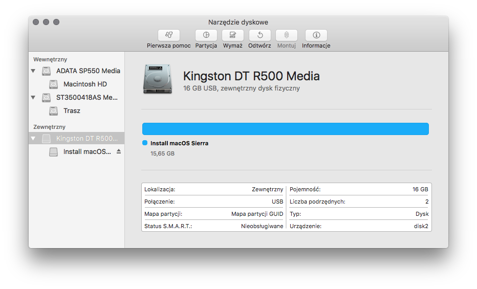

# Kopiowanie Instalacji macOS na pendrive


https://www.youtube.com/watch?v=Cw9nkTvGHNs


Tworzenie instalacji macOS'a jest dość prostym zabiegiem. Istnieje wiele możliwości, procedur, programów wspomagających tę procedurę jak i również gotowych skryptów. Nie będę sądził za różnorakie procedury jakie zastosujecie podczas swojej konfiguracji, jednakże przedstawię wam dwie najlepsze metody tworzenia takowego pendrive. Metody te nie wymagają od was użycia jakichkolwiek skryptów oraz innych programów osób trzecich. Są to metody korzystające z wbudowanego polecenia ``createinstallmedia`` oraz Narzędzia Dyskowego macOS.

Na pewno będą nam potrzebne:

* Dostęp do systemu macOS (maszyna wirtualna też wchodzi w grę)
* Pobrany najnowszy plik instalatora systemu z `AppStore` (lub 10.7 minimum)
* Odwołując się do poprzedniego punktu potrzebujemy również ważny Apple ID
* Pendrive minimum 16 GB, najlepiej prędkości USB 3.0
* Cierpliwość i dobre chęci.


Od wersji macOS 10.13 High Sierra Apple zmieniło domyślny widok dysków w Narzędziu dyskowym. Teraz aby wyświetlić wszystkie zainicjowane dyski musimy w aplikacji zaznaczyć do *Widok > Pokaż wszystkie urządzenia*


## Przygotowanie i wstępne formatowanie pendrive {#pendrive}

Pierwsze formatowanie pendrive, mimo, że brzmi groźnie jest bezpieczną procedurą przygotowawczą. Wystarczy nam pendrive oraz system macOS/OS X. Podpinamy pendrive do portu USB a następnie włączamy program `Narzędzie Dyskowe`.



Wybieramy nasz cały pendrive (nazwa danego urządzenia) i klikamy na przycisk `Wymaż`.

Wybieramy odpowiednie parametry:

* Nazwa: Własna nazwa woluminu - **Do zapamiętania! - nazwa będzie potrzebna później**
* Format: Mac OS Extended (kronikowany) - wymóg
* Schemat: Mapa partycji GUID - wymóg

Po odpowiedniej konfiguracji klikamy przycisk `Wymaż`.


Możemy teraz przystąpić do dalszej części, czyli wybrać jedną z dwóch metod utworzenia instalacji.

### Kopiowanie instalacji za pomocą komendy createinstallmedia {#createinstallmedia}


Opcja ta jest dostępna dla plików instalatora pobranych przez AppStore od minimum systemu 10.9! Jeżeli masz system niższy przejdź do kopiowania za pomocą Narzędzia Dyskowego!

**Aby ten sposób działał na Hackintoshu wymagane jest posiadanie działającej obsługi NVRAM! Jezeli nie wiesz co to jest zapraszam do artykułu na Wikipedii ([link](https://pl.wikipedia.org/wiki/Nieulotna_pami%C4%99%C4%87_o_dost%C4%99pie_swobodnym)). Bez tego twój instalator nie skończy konfiguracji!**


Od wersji OS X 10.9 Apple zaczęło do każdego pakietu aplikacji instalatora dodawać program ``createinstallmedia``, który, jak nazwa wskazuje, pomaga przy przygotowaniu pendrive instalacyjnego systemu. Przy tworzeniu pendrive instalacyjnego Hackintosha również ta komenda się nam przydaje. Pomaga znacznie uprościć proces tworzenia bootowalnego medium rozruchowego.

Aplikacja ta jest zawarta w pakiecie instalacyjnym każdego instalatora:

```
Installer.app/Contents/Resources/createinstallmedia
```

Jeżeli mamy plik `Install macOS Sierra.app` to ścieżka do naszej aplikacji będzie wyglądać tak::

```
Install macOS Sierra.app/Contents/Resources/createinstallmedia
```

Tyle z wprowadzenia do hierarchii katalogów w instalatorze. Przejdźmy do właściwych argumentów tej komendy.

Podstawowa składnia komendy wygląda następująco:

```
$ Installer.app/Contents/Resources/createinstallmedia --volume /Volumes/NAME --applicationpath Installer.app --nointeraction
```

Gdzie argumenty:

* ``--volume`` odnosi się do aktualnie zamontowanego woluminu w `/Volumes`
* ``--applicationpath`` definiuje ścieżkę do pliku `Installer.app`
* ``--nointeraction`` wymusza działanie w trybie cichym, czyli nie wymaga ingerencji użytkownika

Przykładowe komendy dla instalatora danej wersji systemu w katalogu `/Applications` oraz pendrive zamontowanym jako `/Volumes/USB` wyglądają następująco:

Dla OS X Mavericks:

```
sudo /Applications/Install\ OS\ X\ Mavericks.app/Contents/Resources/createinstallmedia --volume /Volumes/USB --applicationpath /Applications/Install\ OS\ X\ Mavericks.app --nointeraction
```

Dla OS X Yosemite:

```
sudo /Applications/Install\ OS\ X\ Yosemite.app/Contents/Resources/createinstallmedia --volume /Volumes/USB --applicationpath /Applications/Install\ OS\ X\ Yosemite.app --nointeraction
```

Dla OS X El Capitan:

```
sudo /Applications/Install\ OS\ X\ El\ Capitan.app/Contents/Resources/createinstallmedia --volume /Volumes/USB --applicationpath /Applications/Install\ OS\ X\ El\ Capitan.app --nointeraction
```

Dla macOS Sierra:

```
sudo /Applications/Install\ macOS\ Sierra.app/Contents/Resources/createinstallmedia --volume /Volumes/USB --applicationpath /Applications/Install\ macOS\ Sierra.app --nointeraction
```

Dla macOS High Sierra:

```
sudo /Applications/Install\ macOS\ High\ Sierra.app/Contents/Resources/createinstallmedia --volume /Volumes/USB --nointeraction
```

Teraz praktyka. Aby wykonać pendrive instalacyjny za pomocą tej metody uruchamiamy aplikację `Terminal`. Wiedząc, że nasz instalator jest w `/Applications` oraz nasz pendrive nazywa się `USB` wpisujemy komendę do terminala z uwzględnieniem ``sudo``.


Program będzie pracować przez jakiś czas. Polecam w tym czasie napić się gorącej herbaty.

## Kopiowanie instalacji za pomocą Narzędzia Dyskowego {#disk_util}


Od premiery macOS High Sierra nie można skopiować instalacji za pomocą metody narzędzi dyskowych. Aby przygotować pendrive instalacyjny macOS High Sierra należy użyć komendy ``createinstallmedia``.


Ta metoda jest przez nas rekomendowana z powodu kilku istotnych kwestii. Dzięki tej metodzie tworzymy pendrive instalacyjny, **a nie pendrive Recovery z możliwością instalacji systemu**. Pozwoli nam to zainstalować system jednoetapowo tzn. restart po instalacji systemu zaprowadzi nas od razu do jego początkowej konfiguracji. Dodatkowo system zainstaluje się nawet bez obsługi NVRAM, co pozwala na późniejszą spokojną konfigurację bootloadera. Dzięki ręcznemu kopiowaniu plików instalatora mamy możliwość modyfikacji kextów systemowych, co czasami przydaje się w ustawianiu niesformych konfiguracji.

Oczywiście ten sposób jest dłuższy oraz bardziej czasochłonny, więc polecam dokładnie przeanalizować wszystkie kroki.

Na początku trochę teorii. Pliki ``.app`` w rozumieniu Apple są plikami wykonywalnymi. Dodatkowo te pliki są swoistymi katalogami, przechowującymi właściwy plik wykonywalny w katalogu ``MacOS`` oraz dodatkowe pliki do obsługi programu w innych katalogach. Jesteśmy w stanie wejść w plik ``.app`` i przejrzeć jego właściwą zawartość. Aby to zrobić klikamy `Prawym Przyciskiem Myszy (PPM)` na Instalator i wybieramy `Pokaż zawartość pakietu`. Następnie wchodzimy do katalogu ``Contents``. Tutaj znajduje się właściwa zawartość instalatora.


Interesuje nas folder ``SharedSupport``, który zawiera plik ``InstallESD.dmg``. Montujemy plik obrazu, klikając na niego dwukrotnie lewym przyciskiem myszy:


Otworzy nam się nowe okno z zamontowanego obrazu ``InstallESD.dmg``. Niestety, tutaj pojawia się problem - nie widzimy wszyskich interesujących nas plików. Pliki te są najzwyklej w świecie ukryte. Aby je wyświetlić w Finderze, musimy użyć poniższego zestawu komend w terminalu. Tyczy się to każdej wersji systemu:

```
$ defaults write com.apple.finder AppleShowAllFiles YES
$ killall Finder
```


Voila! Właśnie pojawiły się dodatkowe ukryte pliki.


Teraz naszym celem jest plik ``BaseSystem.dmg``. To jest właściwy instalator, który będziemy chcieli odtworzyć na naszym pendrive. Klikamy na plik `PPM` i wybieramy `Otwórz`. Po krótkiej chwili nasz obraz się zamontuje.


Teraz uruchamiamy narzędzie dyskowe. Mając poprawnie sformatowany pendrive wybieramy partycję na naszym urządzeniu, na którym chcemy mieć nasz instalator. Przyciskamy kombinację klawiszy `Command + Shift + R`, lub w przypadku wersji Narzędzia Dyskowego z macOS Sierra przycisk `Odtwórz`. Z listy rozwijanej `Odtwórz z:` wybieramy `OS X base System` i klikamy `Odtwórz`.


Teraz dla celów wygody odmontowujemy obraz `OS X Base System` za pomocą przycisku Eject obok partycji pod `Obrazy Dysków`.

To jeszcze nie wszystko. Niestety zajęta pamięć po odtworzeniu naszego obrazu to zaledwe ~1GB. To dość mało w porównaniu do pliku instalatora, który ma ponad 4,5GB. Dzieje się tak, ponieważ na naszym dysku brakuje kilku fundamentalnych elementów - do przekopiowania zostało ``BaseSystem.dmg`` i ``BaseSystem.chunklist`` do głównego katalogu pendrive, oraz folderu ``Packages`` w `System/Instalation`.

Wracamy do `OS X Install ESD` i kopiujemy pliki ``BaseSystem.dmg`` oraz ``BaseSystem.chunklist`` do głównego katalogu pendrive, czyli `OS X Base System`.


Następnie wchodzimy do katalogu `System/Installation`. Usuwamy stamtąd plik ``Packages`` i zastępujemy go całym folderem ``Packages`` z Głównego katalogu `OS X Install ESD`.


Po zakończonej procedurze kopiowania plików nasz pendrive jest gotowy do dalszej konfiguracji.


**Uwaga dla systemów 10.7/10.8**
Jeżeli macie plik .app z tą wersją systemu skopiujcie dodatkowo do katalogu głównego pendrive plik ``mach_kernel``.


Aby ponownie ukryć ukryte pliki wystarczy wywołać ponownie komendy w terminalu ze zmienionym parametrem `YES` na `NO`, czyli:

```
$ defaults write com.apple.finder AppleShowAllFiles NO
$ killall Finder
```
