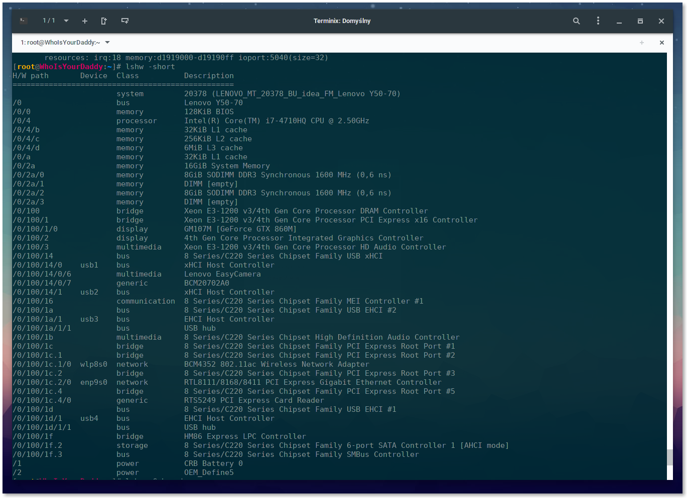

# Poznaj swoją specyfikację


https://www.youtube.com/watch?v=U-fkUlg2iyA


Po wprowadzeniu oraz przebrnięciu przez jakże to ciekawą historię systemu należy zabrać się za zasadniczą rzecz, mianowicie aby poprawnie skonfigurować zainstalowany system, czy po prostu poprawnie przygotować pendrive instalacyjny z Clover musimy **dokładnie** poznać naszą specyfikację i wszystkie kontrolery, które się na nią składają. Tyczy się to komputerów stacjonarnych jak i laptopów.

## Wstęp i schemat {#start}

Jak się najprościej przekonać czy nasz komputer będzie współgrać z Hackintoshem? W bardzo prosty sposób - wystarczy umiejętność posługiwania się [wyszukiwarką Google](https://www.google.com/). Tam znajdziemy wszystkie potrzebne nam informacje, którymi następnie wypełnimy poniższy schemat:

```
Płyta główna (lub model laptopa):
Procesor:
Karta graficzna:
RAM:
Karta sieciowa ethernet:
Wi-Fi:
Kontroler audio:
```

Teraz wypadałoby wyciągnąć wszystkie informacje ramieszczone tutaj. Jak to zrobić? Bardzo prosto!

## Specyfikacja na Windows {#windows}

Windows jest o tyle prostym narzędziem, że zawsze znajdzie się na to aplikacja, która pozwoli na zczytanie całej specyfikacji. Co będzie nam potrzebne:

* [Program AIDA64](http://www.aida64.com/downloads)
* Podstawowa znajomość działania komputera
* Umiejętność rozróżniania podzespołów komputera
* Podstawowa wiedza informatyczna

Pobieramy instalator próbnej wersji programu **AIDA64 Extreme**. Po pobraniu instalujemy program z domyślnymi ustawieniami. Po instalacji uruchamiamy program. naszym oczom powinno się ukazać główne okno programu.


jak już program się poprawnie uruchomił możemy przejść do właściwej identyfikacji swoich podzespołów w komputerze. Na szczęście ten program w wersji trial spokojnie nam wystarczy.

Aby sprawdzić pierwszy element, `Płyta główna (lub model laptopa)` przechodzimy do zakładki `Komputer > DMI`. Dla PC spisujemy wartość z `Płyta Główna`, dla Laptopa spisujemy pole `Wersja`. Tak więc jak już sprawdziliśmy jaki model płyty głównej mamy możemy spokojnie wpisać tę nazwę do listy.


`Płyta główna (lub model laptopa): Lenovo Y50-70`

Kolejnym krokiem jest `Procesor`. Aby odczytać tę wartość najlepiej przejść z głównego menu do `Płyta Główna > Procesor`. Tam znajdziemy wszystkie informacje na temat naszego procesora. Nas interesuje model.


`Procesor: Intel Core i7-4710HQ`

Następne pole to `Karta graficzna`. Do odczytania karty graficznej wracamy do głównego menu programu AIDA64 i przechodzimy do `Ekran > Karta Wideo PCI / AGP`. Spisujemy stąd **WSZYSTKIE FIZYCZNE** karty graficzne, pomijając akceleratory 3D. Czasem program może nie pokazywać wszystkich kart graficznych zainstalowanych w komputerze, dlatego czasem warto sprawdzić karty graficzna za pomocą wbudowanego narzędzia `Menadżer urządzeń`.


`Karta graficzna: Intel HD Graphics 4600 oraz NVIDIA GeForce GTX 860M`

RAM jest praktycznie najprostszym elementem do sprawdzenia. Potrzebne nam jest całościowa pojemność, taktowanie, typ pamięci i ilość fizycznych gniazd pamięci. Aby to sprawdzić przechodzimy z głównego menu do `Płyta Główna > SPD`. Znajdują się tam wszystkie informacje o naszej pamięci RAM. Spisujemy wartości Rozmiar modułu \(suma ze wszystkich gniazd\), Szybkość pamięci, typ pamięci i ilość gniazd DIMMx.


`RAM: 16 GB (2x 8 GB) DDR3-1600 1600MHz DDR3 SDRAM 2 gniazda`

Informacje o polach `Karta sieciowa ethernet` oraz `Wi-Fi` znajdują się w `Sieć > Sieci PCI / PnP`. Spisujemy stamtąd wszystkie karty sieciowe. Karty sieci bezprzewodowej \(Wi-Fi\) można poznać po specyficznym symbolu sieci radiowej. Jeżeli nasz komputer nie posiada karty Ethernet bądź Wi-Fi wpisujemy w jedno z tych pól `brak`.


`Karta sieciowa ethernet: Realtek RTL8168/8111 PCI-E Gigabit Ethernet Adapter`
`Wi-Fi: Broadcom BCM4352 802.11ac Wireless Network Adapter`

Ostatnie już pole to `Kontroler audio`. Aby zidentyfikować kodek naszej karty dźwiękowej wybieramy `Multimedia > Dźwięk PCI / PnP`. Pomijamy wszystko co ma w nazwie HDMI, resztę wpisujemy do listy.


`Kontroler audio: Realtek ALC283`

Takim właśnie sposobem nasza specyfikacja została skończona. Dzięki temu wiemy już jakie podzespoły posiada nasz komputer i jesteśmy w stanie powiedzieć co będzie działać, a co nie wyszukując odpowiednie informacje w sieci lub pytając się bardziej obeznanych ludzi w temacie.

```
Płyta główna (lub model laptopa): Lenovo Y50-70
Procesor: Intel Core i7-4710HQ
Karta graficzna: Intel HD Graphics 4600 oraz NVIDIA GeForce GTX 860M
RAM: 16 GB (2x 8 GB) DDR3-1600 1600MHz DDR3 SDRAM 2 gniazda
Karta sieciowa ethernet: Realtek RTL8168/8111 PCI-E Gigabit Ethernet Adapter
Wi-Fi: Broadcom BCM4352 802.11ac Wireless Network Adapter
Kontroler audio: Realtek ALC283
```

Przy laptopach o ekranach rozdzielczości większej niż 1920x1080 polecam dopisać pole `Rozdzielczość ekranu wbudowanego`. Jest to bardzo ważna informacja, ponieważ wymagane są inne modyfikacje tzw. IOKit by uruchomić skalowanie Retina dobrze znane z macbooków. Więcej w dalszej części kursu. Na przykład

```
Płyta główna (lub model laptopa): Lenovo Y50-70
Procesor: Intel Core i7-4710HQ
Karta graficzna: Intel HD Graphics 4600 oraz NVIDIA GeForce GTX 860M
RAM: 16 GB (2x 8 GB) DDR3-1600 1600MHz DDR3 SDRAM 2 gniazda
Karta sieciowa ethernet: Realtek RTL8168/8111 PCI-E Gigabit Ethernet Adapter
Wi-Fi: Broadcom BCM4352 802.11ac Wireless Network Adapter
Kontroler audio: Realtek ALC283
Rozdzielczość ekranu wbudowanego: 3840x2160 UHD
```

## Specyfikacja na GNU/Linux {#linux}

Niestety na GNU/Linux nie ma tak łatwo. Nie mamy dostępu do AIDA64 więc sporządzenie listy podzespołów będzie relatywnie trudniejsze. Na szczęście istnieje mnóstwo alternatywnych aplikacji, których nie będę omawiał i skupię się na komendzie terminalowej, czasem wbudowanej, czasem wymagającej instalacji z repozytorium. Mianowicie mówię o komendzie `lshw`. Program ten de facto zbiera wszystkie informacje na temat naszego komputera i wszystko składa do kupy we w miarę przyjemnej dla oka tabeli. Należy pamiętać, że komendę zaleca się używając `sudo` lub konta **Roota**.

Aby otrzymać większość informacji o naszym komputerze wystarczy wywołać polecenie `lshw -short`. Program zbierze wszystkie informacje i pokaże tabelę, z której spiszemy praktycznie wszystko to co nas interesuje. Interesują nas klasy \(Class\) `bus, processor, display, memory, network`.



Jeżeli jednak potrzebujemy więcej informacji, lub nie umiemy się odnaleźć w tym spisie możemy poprosić `lshw` aby odwołał się tylko do pojedynczej klasy. W tym wypadku możemy użyć parametru `-C`. Na przykład

```
# lshw -C nazwa_klasy
```

Aby odwołać się do klasy `bus` by otrzymać informacje o płycie głównej wystarczy wywołać polecenie

```
# lshw -C bus
```

i spisać informacje z początku listy pod nazwą `core`.


Aby pobrać informacje o CPU wystarczy wpisać w terminal polecenie

```
# lshw -C procesor
```

I podać informacje z pola  `product` lub `version`.


By pobrać informacje o kartach graficznych zawartych w naszym PC wpiszemy polecenie

```
# lshw -C display
```

Należy podać `product` wszystkich kart graficznych.


Informacje o RAM wyciagniemy poprzez wpisanie komendy

```
# lshw -C memory
```

Podajemy wszystkie informacje z gałęzi `memory`, tj.:

* `size`
* ilość galęzi `bank`
* `size` poszczególnych banków pamięci **Dopóki nie są **`Empty`
* `clock` poszczególnych banków pamięci **Dopóki nie są **`Empty`
* `description` poszczególnych pbanków pamięci **Dopóki nie są **`Empty`


Teraz wypadałoby pobrać informacje o kartach sieciowych. Zrobimy to poleceniem

```
# lshw -C network
```

Wybieramy informacje z pola `product` w zależności od pola `description` - czy jest to `Wireless interface`, czy `Ethernet Interface`.


Z dźwiękiem niestety będziemy musieli się trochę pogimnastykować. Będizemy potrzebować dwóch rzeczy: Nazwy kodeku i Vendor ID. Aby uzyskać te informacje będziemy musieli zlokalizować odpowieni plik w katalogu `proc/asound/`. Zacznijmy po kolei. Aby uzyskać informaje o naszych kartach dźwiękowych w komputerzerze musimy wywołać polecenie

```
# cat /proc/asound/cards
```

Dzięki temu uzyskamy taki output:


Nie zwracając uwagi na \[HDMI\] znajdujemy, że karta dźwiękowa, która nas interesuje jest na miejscu `1`. Teraz będziemy mogli spokojnie wyciągnąć wszystkie nas satysfakcjonujące informacje. W terminalu wywołujemy kolejno komendy

```
# cat /proc/asound/cardX/codec#Y | grep Codec
# cat /proc/asound/cardX/codec#Y | grep "Vendor Id"
```

Gdzie `X` to miejsce karty dźwiękowej \(w naszym wypadku 1\), a `Y` to numer kodeku, który zwykle jest 0 lub 1 w zależności od systemu i konfiguracji. Zwykle najlepiej upewnić się jakie ma się pliki `codec#Y` za pomocą komendy

```
# ls /proc/asound/cardX/
```


Jeżeli już wiemy gdzie jest konfiguracja naszej karty dźwiękowej możemy przejść do wywołania właściwych komend:


To wszystko. Po zakończonych czynnościach nasza lista powinna wyglądać mniej więcej tak

```
Płyta główna (lub model laptopa): Lenovo Y50-70
Procesor: Intel(R) Core(TM) i7-4710HQ
Karta graficzna: GM107 [GeForce GTX860M] oraz 4th Gen Core Processor Integrated Graphics Controller
RAM: 16 GiB DDR3 (2x 8 GiB SODIMM DDR3 1600MHz) - bank0, bank2 - zajęte, bank1, bank3 - empty
Karta sieciowa ethernet: RTL8111/8168/8411 Express Gigabit Ethernet Controller
Wi-Fi: BCM4352 802.11ac Wireless Network Adapter
Kontroler audio: Realtek ALC3239 : 0x10ec0283
```

Tak samo jak przy Windows, Przy laptopach o ekranach rozdzielczości większej niż 1920x1080 polecam dopisać pole `Rozdzielczość ekranu wbudowanego`.

To wszystko. Mam nadzieję, że przybliżyłem wam sposoby sporządzania listy konfiguracji sprzętowej. Na pewno należy pamiętać o tym, że nie można bagatelizować tak elementarnej rzeczy jaką jest **Poprawna Specyfikacja Sprzętowa**. Własnie m. in. na jej podstawie wyszukujemy kompatybilne sterowniki oraz rozwiązania na niedziałający sprzęt. Oczywiście w wolnej chwili polecam wgłębić się i zrobić sobie bardziej szczegółową listę urządzeń peryferyjnych takich jak urządzenia USB, LPC, urządzenia PCI itp. Do listowania urządzeń PCI najlepszy jest program bashowy `lspci`, który jest praktycznie dostępny na każdym GNU/Linux oraz na jednej z nowszych kompilacji Windows 10 zwanej `Anniversary Update`, która zawiera w sobie instalację `Bash on Ubuntu on Windows`. Zapiszcie sobie gdzieś swoją listę, ponieważ podczas tego kursu będziemy się jeszcze nie raz do niej odnosić.
