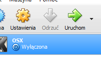

# Rozdział 2 - Wirtualna maszyna


https://www.youtube.com/watch?v=YWuXSTOJNnE


System macOS jest dostępny za darmo do pobrania w sklepie Mac App Store. Niestety, aby go zainstalować trzeba posiadać fizyczny dostęp do już zainstalowanego systemu spod szyldu jabłuszkowego. Co jeżeli w żaden sposób nie mamy możliwości dostępu do komputera z Maczkiem? Trzeba skonfigurować maszynę wirtualną.

Na chwilę obecną najlepszymi programami są:

* VMware Workstation Player (darmowe do użytku niekomercyjnego)
* Oracle VirtualBox (darmowe do użytku niekomercyjnego)

Oba te programy wspierają instalację systemu macOS i wszystko zależy od waszej preferencji.

Co na pewno będzie potrzebne:

* Komputer klasy PC z systemem Windows lub Linux w wersji 64-bitowej
* Procesor Intel obsługujący wirtualizację i Intel VT-x. **Procesory AMD nie są wspierane**
* Obraz `.iso` systemu macOS. Do pobrania z [naszego Google Drive](https://drive.google.com/open?id=0B_oQImkByFdmOTI3X0lnVnY5djg>).
* Cierpliwość i dobre chęci :)

Jeżeli już wszystko mamy gotowe można przystąpić do działania.

## Instalacja macOS na VMware {#vmware}
Na sam początek będziemy potrzebować kilka dodatkowych plików, które są ogólnodostępne na internecie:

* [Instalator oprogramowania VMware Workstation Player](https://www.vmware.com/products/workstation-player/workstation-player-evaluation.html)
* [Najnowsze narzędzie VMware Unlocker](https://github.com/DrDonk/unlocker)

Po pobraniu wymaganych plików uruchamiamy nasz instalator na komputerze. Program instalujemy z domyślnymi opcjami.


Podczas pierwszego uruchomienia zostaniemy zapytani o klucz produktu. Wybieramy "Use VMware Workstation Player for free for non-commercial use", dzięki czemu instalujemy program za darmo do użytku niekomercyjnego. Po pierwszym uruchomieniu pojawi nam się okno główne programu.


Po pierwszym uruchomieniu zamykamy VMware Workstation Player poprzez zamknięcie programu z zasobnika systemowego. Wchodzimy do naszego katalogu z pobranym narzędziem VMware Unlocker i uruchamiamy plik ``win-install.bat`` lub ``lnx-install.sh`` w zależności od systemu operacyjnego.


Należy pamiętać o tym, że w obu wypadkach potrzebne są uprawnienia administratora/roota. Na Windows wystarczy kliknąć na plik PPM i wybrać `Uruchom jako administrator`. Po wykonaniu odpowiednich kroków pokaże wam się ekran wiersza poleceń. Nie zamykajcie go dopóki nie skończy pracy:



Na Linux sprawa wygląda nieco inaczej. Jak już korzystacie z linuxa, to wiecie, że najlepszym sposobem na uruchamianie skryptów SH jest Terminal. Uruchamiamy terminal i za pomocą komendy `cd` przechodzimy do katalogu z unlockerem. Nadajemy uprawnienia uruchamiania dla pliku `lnx-install.sh` i uruchamiamy plik z `sudo`. Np.:
```
 $ cd ~/path_to_unlocker_folder
 $ chmod +x ./lnx-install.sh
 $ sudo ./lnx-install.sh
```
Jak już wykonamy wszystkie kroki z VMware Unlocker możemy przystąpić do właściwej zabawy. Uruchamiamy VMware Workstation Player i przechodzimy do Menu Głównego (Home). Wybieramy tam `Create a New Virtual Machine`. Nie będziemy się wgłębiać w specyfikację i dokładniejszą konfigurację, ponieważ nie jest nam to po prostu potrzebne.


W tym kroku możemy wybrać link do pliku ISO systemu operacyjnego, który będziemy chcieli zainstalować. Oczywiście dla osobistej wygody możemy od razu wybrać link do pliku ISO z systemem macOS, który pobraliśmy wcześniej. Po wyborze lokalizacji pliku ISO klikamy `Next >`.


Następne okno to wybór systemu operacyjnego, który chcemy zainstalować. Dzięki użytemu VMware Unlocker pojawiła nam się dodatkowa opcja `Apple Mac OS X`, a więc zaznaczamy tę właśnie opcję. Z rozwijanej listy poniżej wybieramy system operacyjny odpowiadający wersji naszego ISO. W tym wypadku będzie to `macOS 10.13`.


Dalej możemy wybrać sobie własną nazwę i niestandardową lokalizację plików wirtualnej maszyny. Wybieramy tutaj wszystko wg. własnego upodobania i klikamy `Next >`.

W następnym oknie wybieramy rozmiar wirtualnego dysku i to, czy mamy przechowywać dysk jako jeden plik  lub jako wiele oddzielnych plików. Rekomendowane jest zostawienie wszystkiego na domyślnych ustawieniach. Klikamy `Next >`, sprawdzamy poprawność wszystkich opcji. Jeżeli wszystko jest poprawne to wybieramy `Customize Hardware...`.

W nowym oknie przechodzimy do karty `Processors` i zaznaczmy `Virtualize Intel VT-x/EPT or AMD-V/RVI`. Klikamy Close i Finish. Maszyna Wirtualna jest gotowa.


Pojawi nam się okno wirtualnej maszyny. Jako, że jest ona już skonfigurowana, możemy bez problemu uruchomić naszą maszynę i przejść przez proces instalacji systemu.


Jeżeli wystąpią jakiekolwiek problemy z konfiguracją, polecam zajrzeć w *Dodatkowe Noty*.
Znajduje się tam również instrukcja jak zainstalować VMware Tools po zakończonej instalacji systemu dla lepszego komfortu (krótkotrwałej) pracy na maszynie wirtualnej.

## Instalacja macOS na VirtualBox {#vbox}
VirtualBox to darmowe narzędzie od Oracle, służące do wirtualizacji komputerów i przeznaczone dla komputerów o architekturze x86 z systemami Linux, Windows, macOS.

Instalacja systemu na VirtualBox działa trochę inaczej. VirtualBox domyślnie pozwala na uruchomienie jabłkowego boot.efi, jednakże późniejsza próba uruchomienia instalatora kończy się na Kernel Panic związanym z DSMOS (Don't Steal Mac OS) lub ładowanie zatrzyma się na tekście "DSMOS has arrived".

Problem leży w tym, że VirtualBox podczas uruchamiania OS X pobiera z systemu hosta informacje z SMC i SMBIOS naszego komputera t.j. `Productname`, `Board-ID` i nektóre klucze SMC. Oznacza to  tyle, że domyślnie żaden komputer, prócz komputera Apple, nie odpali systemu OS X na VirtualBox. Oczywiście wszystko da się przejść, ale zacznijmy od początku.

Co będzie nam potrzebne:

* [Aplikacja VirtualBox odpowiednia dla naszego systemu x64](https://www.virtualbox.org)
* Znajomość obsługi wiersza poleceń lub Bash

Gdy już dowiemy się jak działa VirtualBox, możemy przejść do instalacji i konfiguracji. Pobieramy plik instalacyjny dla naszego systemu operacyjnego. Program instalujey z domyślnymi opcjami:


Po zakończeniu instalacji pojawi nam się główne okno programu. Aby utworzyć nową maszynę wybieramy przycisk `Nowy`. Pojawi nam się kreator nowej maszyny wirtualnej. W pierwszym kroku wybieramy System, który chcemy zainstalować. Niech będzie to `Mac OS X 10.11 El Capitan`. W polu `Nazwa` wpisujemy nazwę maszyny.


Dla późniejszej wygody nie używamy znaków przystankowych, znaków specjalnych, polskich znaków i spacji.



W następnym kroku wybieramy rozmiar pamięci. Możemy zostawić domyślny preferowany rozmiar, lub zwiększyć go, w zależności od potrzeb. Minimalna rekomendowana ilość RAMU to 2048 MB. Kolejny przystanek to wybór dysku. Jeżeli nie mamy wcześniejszych dysków wirtualnych z OS X to wybieramy `Stwórz wirtualny dysk twardy` i klikamy `Utwórz`.


W następnym oknie wybieramy typ dysku wirtualnego. Domyślnie jest to `.VDI`, który jest domyślnym typem pliku dla VirtualBox. W zależności od tego czy chcemy wykorzystywać w przyszłości ten dysk z innymi programami do wirtualizacji, wybieramy odpowiedni dla nas typ pliku. Domyślnie polecam zostawić standardową opcję.


W ostatnim oknie będziemy musieli podjąć decyzję, czy chcemy aby nasz dysk był przechowywany dynamicznie lub statycznie. Rekomendowane jest zostawienie domyślnej opcji, gdyż jest praktyczniejsza.


Po kliknięciu `Utwórz`, nasza maszyna powinna się pojawić w oknie głównym programu. Teraz została końcowa konfiguracja maszyny wirtualnej i instalacja systemu. Zaznaczamy naszą maszynę wirtualną i klikamy opcję `Ustawienia`.



W zakładce *System* odznaczamy `Stacje dyskietek`. W karcie `Procesor` ustalamy liczbę procesorów/rdzeni jaką chcemy naszej wirtualnej maszynie przydzielić.


W zakładce Grafika wybieramy pamięć przydzieloną dla naszej wirtualnej maszyny. Wybieramy maksymalną ilość, czyli `128MB`.


Teraz przechodzimy do zakładki *Pamięć*. Klikamy na napęd płyt, który aktualnie pokazuje `Brak`. Pod polem `Parametry` klikamy na ikonę płyty i wybieramy `Wybierz plik wirtualnego dysku optycznego`. Wybieramy nasz plik z obrazem `.iso`, który wcześniej pobraliśmy i klikamy `Open`. Klikamy `OK` i nasza maszyna jest już prawie gotowa do uruchomienia.


Jak było wspomniane wcześniej, VirtualBox pobiera wymagane informacje do odpalenia OS X z SMC naszego komputera. Jak wiadomo, komputer PC nie jest wyposażony w SMC (więcej o tym kontrolerze [tutaj](https://en.wikipedia.org/wiki/System_Management_Controller)), więc nie ma opcji żeby wirtualizowany przez nas macOS odpalił się teraz w jakikolwiek sposób.

Aby umożliwić wirtualizację macOS na komputerze PC, musimy do pliku konfiguracyjnego VirtualBox dodać odpowienie ustawienia `DMI` z realnego Maca, tj:

* ProductName - Nazwa produktu, np. `iMac13,2`, `MacbookPro11,2` itp.
* SystemVersion
* Board-ID - Identyfikator płyty głównej, np. `Mac-FC02E91DDD3FA6A4` dla `iMac13,2`.
* DeviceKey
* opcja `GetKeyFromRealSMC`

Jeżeli rozumiemy już co jest nam potrzebne, możemy przejść do części praktycznej. Zamykamy **WSZYSTKIE** okna VirtualBox. Otwieramy wiersz poleceń jako administrator `(PPM > Uruchom jako administrator)` i przechodzimy do głównego katalogu VirtualBox. Jeżeli program został zainstalowany z domyślnymi ustawieniamy wystarczy, że wpiszemy:
```
cd C:\Program Files\Oracle\VirtualBox
```
Dzięki temu powinniśmy się znaleźć w głównym katalogu VirtualBoxa.


Teraz jak już jesteśmy w katalogu VirtualBoxa, możemy po kolei zmodyfikować potrzebne nam ustawienia i wywołać poniższe komendy. Zmieniamy odpowiednio:

* `Machine_name` - nazwa maszyny wirtualnej jaką zdefiniowaliśmy podczas jej tworzenia
* `ProductName` - jw.
* `Mac-BOARDID` - tak jak w przypadku Board-ID

Schemat komend z których będziemy korzystać:

```bash
VBoxManage setextradata "Machine_name" "VBoxInternal/Devices/efi/0/Config/DmiSystemProduct" "ProductName"
VBoxManage setextradata "Machine_name" "VBoxInternal/Devices/efi/0/Config/DmiSystemVersion" "1.0"
VBoxManage setextradata "Machine_name" "VBoxInternal/Devices/efi/0/Config/DmiBoardProduct" "Mac-BOARDID"
VBoxManage setextradata "Machine_name" "VBoxInternal/Devices/smc/0/Config/DeviceKey" "ourhardworkbythesewordsguardedpleasedontsteal(c)AppleComputerInc"
VBoxManage setextradata "Machine_name" "VBoxInternal/Devices/smc/0/Config/GetKeyFromRealSMC" 1
```
Przykład

Powiedzmy, że nasz komputer ma procesor Intel Core i7-3770K. Po spojrzeniu do dokumentacji Intela wiemy, że ten procesor jest procesorem 3 generacji - Ivy Bridge. Tak więc najlepszym Odpowiednikiem będzie dla niego `iMac13,2`, ponieważ to był jeden z komputerów Apple z procesorem Ivy Bridge. Po przeszukaniu internetu dojdziemy do wniosku, że `Board-ID` dla `iMac13,2` to `Mac-FC02E91DDD3FA6A4`.

W tym wypadku zestaw komend będzie wyglądać następująco:

```
VBoxManage setextradata "OSX" "VBoxInternal/Devices/efi/0/Config/DmiSystemProduct" "iMac13,2"
VBoxManage setextradata "OSX" "VBoxInternal/Devices/efi/0/Config/DmiSystemVersion" "1.0"
VBoxManage setextradata "OSX" "VBoxInternal/Devices/efi/0/Config/DmiBoardProduct" "Mac-FC02E91DDD3FA6A4"
VBoxManage setextradata "OSX" "VBoxInternal/Devices/smc/0/Config/DeviceKey" "ourhardworkbythesewordsguardedpleasedontsteal(c)AppleComputerInc"
VBoxManage setextradata "OSX" "VBoxInternal/Devices/smc/0/Config/GetKeyFromRealSMC" 1
```
Kiedy już uporaliśmy się z komendami po kolei wywołujemy je w Wierszu poleceń.


Teraz możemy spokojnie włączyć VirtualBox i odpalić naszą maszynę wirtualną. Po jakimś czasie przywita nas instalator systemu.


W GNU/Linux sprawa jest o tyle prostsza, że po instalacji VirtualBox komenda `VBoxManage` jest od razu domyślnie dostępna z poziomu Terminala. Dalej cała procedura wygląda analogicznie tyle, że nie musimy już szukać katalogu z zainstalowanym VirtualBox.

## Dodatkowe noty {#notes}

### Błąd wirtualnej maszyny dla VMware 11+


Podczas konfiguracji wirtualnej maszyny możemy się natknąć na takowy błąd. W tym wypadku jest na to tylko jedno rozwiązanie - do pliku VMX (Virtual Machine configuration file) musimy dodać specjalną opcję
```
smc.version = "0"
```
Aby pozbyć się tego błędu na Windowsie, musimy użyć edytora tekstu [Notepad++](https://notepad-plus-plus.org). Pobieramy stamtąd plik instalacyjny w zalezności od naszej architektury systemu oraz instalujemy program.


W eksploratorze plików wchodzimy do katalogu wirtualnej maszyny, który wcześniej sobie zdefiniowaliśmy. Szukamy pliku `macOS 10.12.vmx` jeżeli zostawiliśmy wszystko domyślnie, lub `nazwa_maszyny.vmx`. Wybieramy `PPM > Edit with Notepad++`.

Schodzimy na koniec pliku i dodajemy opcję
```
smc.version = "0"
```


Zapisujemy plik i uruchamiamy ponownie wirtualną maszynę. Teraz spokojnie powinna się włączyć.

Na Linux sprawa jest nieco łatwiejsza. Oczywiście wystarczy nam tylko i wyłącznie terminal. Za pomocą terminala przechodzimy do katalogu z naszą maszyną wirtualną. Przy pomocy shellowego edytora tekstowego, takiego jak `nano` modyfikujemy plik `.vmx`. Na przykład:
```
$ cd ~/path_to_vm_folder
$ nano macOS.vmx
```
Zjeżdżamy na sam koniec pliku i tak samo jak w przypadku Windows dodajemy opcję
```
smc.version = "0"
```
Zapisujemy plik i uruchamiamy naszą wirtualną maszynę.

### Instalacja VMware Tools na maszynie wirtualnej
macOS na wirtualnej maszynie niestety nie jest na tyle wydajny by na nim komfortowo pracować. Brakuje mu na przykład takich funkcji jak:

* Brak akceleracji graficznej QE/CI
* Brak obsługi zmiany rozdzielczości - jedyna rozdzielczość to 1024x768

Jedną z opcji, która jest w stanie w małym stopniu poprawić pracę z maszyną wirtualną jest instalacja tzw. pakietu narzedzi dla wirtualnej maszyny dystrybuowanej razem z programem do wirtuallizacji. W wypadku VMware Workstation jest to VMware Tools. VirtualBox na chwilę obecną nie zawiera dostępnych narzędzi gościa dla macOS.

Dzięki tym narzędziom możliwości maszyny wirtualnej są rozszerzone o:

* Możliwość ustawienia dynamicznej rozdzielczości, jak i pełnego ekranu
* Lepsza integracja systemu gościa z systemem hosta
* Możliwość konfiguracji folderów współdzielonych
* I wiele więcej

Koniec przynudzania, zabierzmy się do roboty. Zwykle programy do wirtualizacji Windows/Linux nie mają wgranych plików ISO z dodatkami gościa. Sprawa się ma na przykład z VMware Workstation. Na szczęście problem ten załatwia Vmware Unlocker, który podczas wykonywania komendy `win-install.bat` pobiera plik darwin.iso i kopiuje go do głównego katalogu VMware. Jednakże jeżeli nie chcemy szykać danego pliku wystarczy, że wrócimy do folderu z VMware Unlocker i przejdziemy do katalogu `/tools/`. W folderze będzie znajdować się plik `darwin.iso`. Wystarczy go po prostu zamontować w napędzie wirtualnej maszyny i uruchomić system-gość.


### Zmiana rozdzielczości maszyny wirtualnej na VirtualBox
Pracę na wirtualnej maszynie VirtualBox jesteśmy w stanie poprawić na wiele sposobów za pomocą wcześniej wspomnianego programu `VBoxManage`.

Dzięki temu można między innymi zmienić rozdzielczość maszyny wirtualnej. Niestety domyślnie jesteśmy w stanie ustawić jedną z sześciu rozdzielczości:

* 0 - 640x480
* 1 - 800x600
* 2 - 1024x768
* 3 - 1280x1024
* 4 - 1440x900
* 5 - 1920x1200

Na Windows oczywiście wszystkie operacje musimy wykonywać w Wierszu poleceń uruchomionym w trybie `Administratora` i być w głównym katalogu VirtualBox. Na Linux wystarczy po prostu przekopiować komendę. Opisywana komenda wygląda tak:
```bash
VBoxManage setextradata "Machine_name" VBoxInternal2/EfiGopMode N
```
Gdzie:

* `Machine_name` - nazwa maszyny macOS
* `N` - liczba w przedziale (0, 1, 2, 3, 4, 5) w zależności od preferowanej rozdzielczości


### CPU spoof na VirtualBox w celu wyeliminowania niektórych problemów
Na niektórych komputerach, na przykład tych na procesorach rodziny Haswell i nowszych możecie się spotkać z problemami VirtualBoxa. Zwykle wtedy pomaga spoofing CPU. Na Windows oczywiście wszystkie operacje musimy wykonywać w Wierszu poleceń uruchomionym w trybie `Administratora` i być w głównym katalogu VirtualBox. Na Linux wystarczy po prostu przekopiować komendę. Przykładowe komendy, które możecie przetestować:

CPU Spoof Lynnfield i5 750 CPU:
```bash
VBoxManage modifyvm "Machine_name" --cpuidset 00000001 000106e5 06100800 0098e3fd bfebfbff
```
CPU spoof Ivy Bridge CPU:
```bash
VBoxManage modifyvm "Machine_name" --cpuidset 00000001 000306a9 04100800 7fbae3ff bfebfbff
```
lub:

```bash
VBoxManage modifyvm "El_Capitan" --cpuidset 00000001 000306a9 00020800 80000201 178bfbff
```
### Injekcja dodatkowych informacji z SMBIOS dla VirtualBox
Czasem dobrym, ale opcjonalnym rozwiązaniem jest dodanie dodatkowych informacji z SMBIOS do maszyny wirtualnej VBoxa przez komendę `VBoxManage`. Zmieniamy odpowiednio:

* `Serial_Number` - Numer seryjny
* `Board_Serial_Number` - numer seryjny płyty głównej - **Serial_Number + 2 losowe znaki dla 11-znakowego Serial_Number = 13 znaków** lub **Serial_Number + 5 losowych znaków dla 12-znakowego Serial_Number = 17 znaków**
* `Family` - rodzina urządzenia np. "iMac", "MacBook Pro", "MacPro" itp.
* `Bios_Version` - Wersja oprogramowania układu EFI. Do przeklejenia pierwsze 4 pola.

Cały SMBIOS możemy sobie wygenerować przez [Clover Configurator (OSX)](http://mackie100projects.altervista.org).

Na Windows oczywiście wszystkie operacje musimy wykonywać w Wierszu poleceń uruchomionym w trybie `Administratora` i być w głównym katalogu VirtualBox. Na Linux wystarczy po prostu przekopiować komendę. Komendy, gdzie ``Machine_name`` to nazwa naszej maszyny wirtualnej:

```bash
VBoxManage setextradata "Machine_name" "VBoxInternal/Devices/efi/0/Config/DmiSystemSerial" "Serial_Number"
VBoxManage setextradata "Machine_name" "VBoxInternal/Devices/efi/0/Config/DmiBoardSerial" "Board_Serial_Number"
VBoxManage setextradata "Machine_name" "VBoxInternal/Devices/efi/0/Config/DmiSystemVendor" "Apple Inc."
VBoxManage setextradata "Machine_name" "VBoxInternal/Devices/efi/0/Config/DmiSystemFamily" "Family"
VBoxManage setextradata "Machine_name" "VBoxInternal/Devices/efi/0/Config/DmiBIOSVersion" "Bios_Version"
```
Przykładowo dla naszego wcześniej wybranego ``iMac13,2`` komendy będą wyglądać tak:

```bash
VBoxManage setextradata "OSX" "VBoxInternal/Devices/efi/0/Config/DmiSystemSerial" "C02JFSYQDNMP"      # wygenerowany przez Cloud Clover Config
VBoxManage setextradata "OSX" "VBoxInternal/Devices/efi/0/Config/DmiBoardSerial" "C02JFSYQDNMPCGSHX"  # 12-znakowy Serial_Number więc Board_Serial_Number 17-znakowy
VBoxManage setextradata "OSX" "VBoxInternal/Devices/efi/0/Config/DmiSystemVendor" "Apple Inc."        # Bios_Vendor - Bez zmian
VBoxManage setextradata "OSX" "VBoxInternal/Devices/efi/0/Config/DmiSystemFamily" "iMac"              # Rodzina urządzenia, tutaj jest to iMac
VBoxManage setextradata "OSX" "VBoxInternal/Devices/efi/0/Config/DmiBIOSVersion" "IM131.88Z.010A.B05" # Pierwsze cztery pola Bios_Version wyciągniete z Cloud Clover Config
```


Część poświęcona VirtualBox powstała dzięki wiedzy [@fusion71au](http://www.insanelymac.com/forum/user/846696-fusion71au/). Link do jego poradnika w wersji anglojęzycznej znajdziecie [tutaj](http://www.insanelymac.com/forum/topic/309654-run-vanilla-os-x-el-capitan-sierra-yosemite-or-mavericks-in-virtualbox-5010-on-a-windows-host/).
