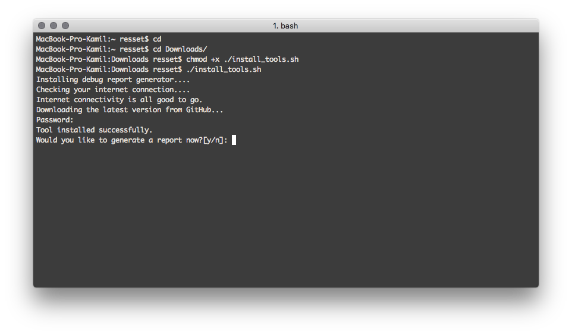
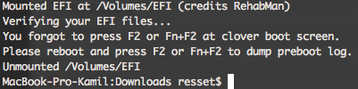
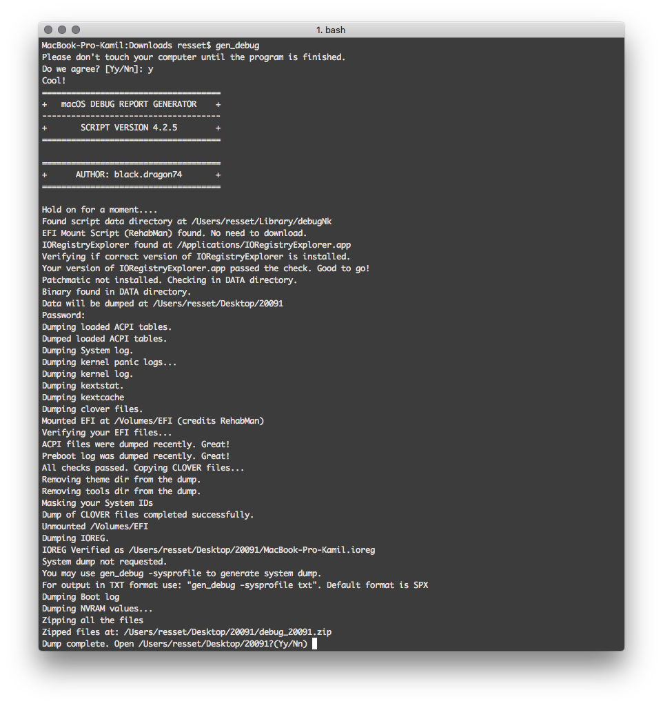

# Jak poprawnie zgłosić problem - Praktyczna notka
Jeżeli kiedykolwiek będziemy mieć problem z naszym hackintoshem to albo będziemy szukać pomocy w internecie, albo poprosimy kogoś bardziej obeznanego w temacie. Patrząc prawdzie w oczy w 90% przypadków będziemy szukać informacji u kogoś bardziej obeznanego. Warto jednak przed zadaniem pytania zabezpieczyć się w garść odpowiednich informacji o swojej aktualnej konfiguracji by osoba, która nam pomaga nie dostała tzw. Szewskiej Pasji.

Na grupie [Hackintosh Polska](https://facebook.com/groups/hackintoshpolska/), jak i również na innych stronach związanych z tematem Hackintosh, będziemy musieli udostępnić porządną garść informacji o swoim sprzęcie.

Co nam będzie potrzebne:

* [IORegistryExplorer w wersji 2.1](https://www.tonymacx86.com/threads/guide-how-to-make-a-copy-of-ioreg.58368/)
* [Aplikacja DPCIManager](https://sourceforge.net/projects/dpcimanager/)
* [Najnowszy plik binarny patchmatic](https://bitbucket.org/RehabMan/os-x-maciasl-patchmatic/downloads/)

## Specyfikacja
Najważniejszą rzeczą jest znajomość swojego komputera. Aby wykonać ten krok musimy również sporządzić jego [specyfikację](https://poradniki.hackintosh-polska.pl/prep/specs.html). Jeżeli przeszliśmy przez podstawę naszego bazowego poradnika to powinniśmy mieć spisaną specyfikację swojego komputera. Uwzględnijcie ją w poście.

## Przygotowanie tablic ACPI oraz Clover EFI
Pierwszą rzeczą będzie nam potrzebna konfiguracja Clover EFI, oraz wyciągniętych przez niego tablic ACPI. Montujemy nasze EFI z Cloverem i przechodzimy do ścieżki `EFI/CLOVER/ACPI/origin`. Usuwamy **WSZYSTKIE** pliki z katalogu, opróżniamy kosz i uruchamiamy ponownie komputer.

Podczas startu komputera w menu wyboru dysku systemu w Clover EFI naciskamy `F2`, `F4` bądź `Fn + F2`, `Fn + F4` na niektórych laptopach z odwróconą funkcjonalnością klawiatury. Spowoduje to zrzut wszystkich tablic ACPI na komputerze (F4) oraz `preboot.log` (F2).

Włączamy nasz system operacyjny, montujemy jeszcze raz EFI. Sprawdzamy w katalogu `EFI/CLOVER/ACPI/origin` czy pojawiły się nowe pliki. Jeżeli tak przystępujemy do kolejnego kroku. Jeżeli ich nie ma to powtarzamy zrzut tablic jeszcze raz.

Tworzymy na Biurku katalog *Raport* i kopiujemy tam cały folder `EFI` z naszej partycji z Cloverem. Usuwamy potem z tego katalogu folder `themes`.

## Wyciąganie zmodyfikowanych tablic ACPI poprzez patchmatic
Pobieramy ostatni plik binarny `patchmatic`. Przechodzimy do nazego katalogu *Raport* w Finderze i tworzymy tam folder o nazwie *patchmatic*. Kopiujemy tam pobrany plik.

Otwieramy terminal i przechodzimy do naszego katalogu *Raport*.

Zakładając, że nasz katalog *Raport* znajduje się na Biurku wykonujemy następujące komendy

```sh
cd
cd Desktop/Raport/patchmatic
chmod +x ./patchmatic
./patchmatic -extract
rm patchmatic

```

W katalogu powinny się pojawic nowe pliki ACPI.

## Generowanie pliku IOreg za pomocą IORegistryExplorer
Otwieramy naszą aplikację IORegistryExploerer. Wybieramy na górnym pasku *File > Save As...* i zapisujemy plik `.ioreg` w katalogu *Raport*.

## DPCIManager i informacje o urządzeniach PCI
Pobieramy plik DPCIManager z podanej strony. Jeżeli martwi Was informacja o potencjalnym malware bez obaw. Program wykonuje operacje low-level by pobrać informacje o sprzęcie. Nie ma się czego bać.

Uruchamiamy program DPCIManager i robimy zrzut ekranu karty *Main* i dodaj ten zrzut do folderu *Raport*.

Wracamy do katalogu DPCIManager i kopiujemy plik `dspci` do katalogu *Raport*.

Uruchamiamy nowe okno terminala i wpisujemy następujące komendy

```sh
cd
cd Desktop/Raport
./dspci >> dspci.txt
rm dspci
```

W katalogu powinien się pojawić plik `dspci.txt`.

## Wyciąganie dodatkowych informacji z poziomu terminala

Uruchmiamy terminal i wpisujemy następujące komendy

```sh
cd
cd Desktop/Raport
kextstat | grep -y acpiplat >> acpiplatform.txt
kextstat | grep -y appleintelcpu >> appleintelcpu.txt
kextstat | grep -y applelpc >> applelpc.txt
kextstat | grep -y applehda >> applehda.txt
pmset -g assertions >> pmset_assertions.txt
pmset -g >> pmset.txt
system_profiler SPSerialATADataType|grep TRIM >> trim.txt
sudo touch /System/Library/Extensions && sudo kextcache -u / >> kextcache.txt
```

## Skrypt All-in-One do zbierania informacji o systemie

Użytkownik [black.dragon74](https://github.com/black-dragon74) na potrzeby sceny Hackintosh stworzył świetny skrypt pozwalający na zebranie wszystkich wymaganych informacji na temat naszego systemu automatycznie. Aby go uruchomić wystarczy tylko i wyłącznie pobrać plik `install_tools.sh`, a skrypt zainstaluje odpowiedn program.

Pobieramy plik `install_tools.sh` z [tego linku](https://www.tonymacx86.com/threads/tool-generate-proper-problem-reporting-files.235953/).

Uruchamiamy terminal i wpisujemy następujące komendy

```sh
cd
cd Downloads
chmod +x ./install_tools.sh
./install_tools.sh
```



Postępujemy zgodnie z informacjami na ekranie. Program zapyta nas czy chcemy wygenerować raport. Wybieramy `y` i zatwierdzamy Enterem. Naciskamy jeszcze raz `y` i czekamy aż nasz raport się wygeneruje.

Skrypt automatycznie sprawdzi czy nasze tablice ACPI oraz preboot.log są najnowsze. Jeżeli nie to zakończy działanie i pokaże on odpowiednią informację. Musimy ponowić wtedy ekstrakcję tablic ACPI rozpisaną powyżej.



Po odpowiednim zrzucie preboot.log i tablic ACPI program zbierze wszystkie informacje i spakuje je do formatu ZIP. Wygenerowany *Raport* będzie w nowoutworzonym katalogu na Biurku.



## Raportowanie informacji

Pakujemy folder *Raport* do pliku ZIP. Jesteś gotowy do utworzenia postu związanego z pomocą. Pamiętaj aby skompresowanego folderu nie wrzuciać bezpośrednio na grupę jako plik! Wrzuć go na używaną przez Ciebie chmurę a następnie w poście udostępnij link do niego.

Pamiętaj, by **dokładnie opisać problem!** Posty bez odpowiedniej ilości informacji zwykle są ignorowane. W swoim poście uwzględnij zdjęcie bądź filmik całego ekranu które przedstawia błąd. Zdjęcie powinno być w **najwyższej dostępnej dla Ciebie jakości** aby móc bez problemu zapoznać się z jego treścią. Do przesłania filmu użyj Google Drive bądź wrzuć go na YouTube ze względu na internetowy odtwarzacz.

Uwzględnij swoją specyfikację zgodną z [poradnikiem](https://poradniki.hackintosh-polska.pl/prep/specs.html) pobierania informacji o komputerze.

Wszystkie linki wrzuć na bezpiecznym i szybkim hostingu plików, np. [Google Drive](https://www.google.com/drive/), [Microsoft OneDrive](https://onedrive.live.com/about/pl-pl/).

Powodzenia.
